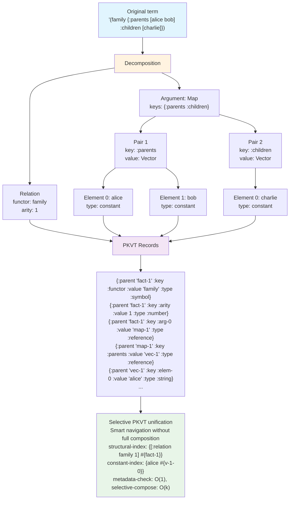

# Term Decomposition in Tipster

## 1. Introduction

Term decomposition is a fundamental operation in Tipster that transforms complex logical structures into elementary components optimized for efficient unification and storage. This process serves two primary purposes:

1. **Unification simplification** — breaking down complex structures into elementary components for fast matching
2. **Storage model integration** — preparing terms for storage in the universal knowledge base

This document describes formal decomposition algorithms for two main storage models: PKVT and PKVTC, where the choice depends on performance and compatibility requirements.

> **Model Selection:** Detailed comparison of PKVT and PKVTC models with recommendations is presented in [Storage Model Analysis](./storage-model-analysis.md).

## 2. Theoretical Foundations

### 2.1 Core Principles

**Structural Preservation:** Decomposition maintains the logical structure of terms while optimizing their physical representation.

**Unification Normalization:** Decomposition brings terms to canonical form where unification reduces to comparing atomic components.

**Model Compatibility:** Decomposition results should optimally convert to the chosen storage model (PKVT or PKVTC).

### 2.2 Formal Definitions

**Term:** Any logical expression that can be unified with other terms.
```clojure
Term := Constant | Variable | Relation | Collection
```

**Decomposition:** Transformation `D: Term → Records` where Records is a set of storage-model records.

**Composition:** Inverse transformation `C: Records → Term` such that `C(D(t)) = t`.

### 2.3 Decomposition Types

**Structural Decomposition:** Breaking compound terms into constituent parts.
```clojure
(parent alice bob) → {:functor parent, :args [alice bob]}
```

**Type-Based Decomposition:** Separating terms by their logical types.
```clojure
{:constants #{alice bob}, :variables #{X Y}, :relations #{parent}}
```

**Depth-First Decomposition:** Recursive processing from outer to inner structures.

## 3. Decomposition Algorithms

### 3.1 Simple Term Decomposition

#### Constants
```clojure
(decompose-constant value)
→ {:type :constant
   :value value
   :unified-form value}
```

#### Variables
```clojure
(decompose-variable symbol)
→ {:type :variable
   :name (name symbol)
   :id (gensym)
   :unified-form symbol}
```

### 3.2 Compound Term Decomposition

#### List (relation)
```clojure
(decompose-relation '(parent alice bob))
→ {:type :relation
   :functor 'parent
   :arity 2
   :args [{:type :constant :value "alice"}
          {:type :constant :value "bob"}]
   :unified-form '(parent "alice" "bob")}
```

#### Vector (ordered structure)
```clojure
(decompose-vector [x 42 y])
→ {:type :vector
   :size 3
   :elements [{:type :variable :name "x" :index 0}
              {:type :constant :value 42 :index 1}
              {:type :variable :name "y" :index 2}]
   :unified-form [?x 42 ?y]}
```

#### Map (key-value structure)
```clojure
(decompose-map {:name "Alice" :age Age})
→ {:type :map
   :keys #{:name :age}
   :pairs [{:key :name :value {:type :constant :value "Alice"}}
           {:key :age :value {:type :variable :name "Age"}}]
   :unified-form {:name "Alice" :age ?Age}}
```

### 3.3 Recursive Decomposition

For deeply nested structures, decomposition is applied recursively:

```clojure
(decompose-nested '(family {:parents [alice bob] :children [charlie diana]}))
→ {:type :relation
   :functor 'family
   :arity 1
   :args [{:type :map
           :pairs [{:key :parents
                    :value {:type :vector
                            :elements [{:type :constant :value "alice"}
                                      {:type :constant :value "bob"}]}}
                   {:key :children
                    :value {:type :vector
                            :elements [{:type :constant :value "charlie"}
                                      {:type :constant :value "diana"}]}}]}]}
```

## 4. Unification Optimization

### 4.1 Structural Indices

During decomposition, structural metadata is created for fast matching:

```clojure
{:structural-signature {:functor 'parent :arity 2}
 :variable-positions #{0 2}  ; variable positions
 :constant-values {"alice" 1} ; constants and their positions
 :unification-complexity :linear} ; O-notation for unification
```

### 4.2 Pattern Caching

Frequently used decomposition patterns are cached:

```clojure
{:pattern-cache
 {'(parent ?x ?y) {:cached-decomposition ...
                   :usage-count 1547
                   :last-accessed #inst "..."}}}
```

### 4.3 Precomputed Unifiers

For critically important patterns, specialized unifiers are created:

```clojure
(defn fast-parent-unifier [term1 term2]
  ;; Optimized unification for pattern (parent ?x ?y)
  (when (and (= (:functor term1) 'parent)
             (= (:arity term1) 2))
    (unify-args (:args term1) (:args term2))))
```

## 5. Composition and Decomposition for Different Storage Models

Depending on the chosen storage model (PKVT or PKVTC), composition and decomposition algorithms differ significantly in complexity and performance.

## 5.1 PKVT Model: Efficient Unification Without Full Composition

#### 5.1.1 PKVT Structure Analysis

Existing PKVT model: `{:parent context :key name :value data :type category}`

**Key Insight:** Instead of changing the model, create smart navigation algorithms over PKVT records for direct unification.

#### 7.1.2 Direct Navigation Algorithm for PKVT

```clojure
(defn navigate-pkvt-structure
  "Navigation through PKVT structure without full term composition"
  [records parent-id path]
  
  (if (empty? path)
    {:parent parent-id :found true}
    (let [current-key (first path)
          remaining-path (rest path)
          target-record (find-record records parent-id current-key)]
      
      (if target-record
        (case (:type target-record)
          :constant {:parent parent-id :value (:value target-record) :found true}
          :variable {:parent parent-id :variable (:value target-record) :found true}
          :reference (navigate-pkvt-structure records (:value target-record) remaining-path)
          :compound (navigate-to-compound records target-record remaining-path))
        {:parent parent-id :found false}))))

(defn unify-pkvt-direct
  "Direct PKVT unification without full composition"
  [records1 parent1 records2 parent2 substitution]
  
  ;; Get root record types
  (let [type1 (get-record-value records1 parent1 :type)
        type2 (get-record-value records2 parent2 :type)]
    
    (cond
      ;; Variable unification
      (= type1 :variable)
      (bind-variable-pkvt records1 parent1 records2 parent2 substitution)
      
      (= type2 :variable)
      (bind-variable-pkvt records2 parent2 records1 parent1 substitution)
      
      ;; Constant unification
      (and (= type1 :constant) (= type2 :constant))
      (let [val1 (get-record-value records1 parent1 :value)
            val2 (get-record-value records2 parent2 :value)]
        (if (= val1 val2) substitution :fail))
      
      ;; Compound structure unification
      (and (compound-type? type1) (compound-type? type2))
      (unify-compound-pkvt records1 parent1 records2 parent2 substitution)
      
      :else :fail)))

(defn unify-compound-pkvt
  "Compound structure unification via PKVT navigation"
  [records1 parent1 records2 parent2 substitution]
  
  (let [struct1-meta (analyze-pkvt-structure records1 parent1)
        struct2-meta (analyze-pkvt-structure records2 parent2)]
    
    (cond
      ;; For relations: check functor and arity
      (and (= (:type struct1-meta) :relation) (= (:type struct2-meta) :relation))
      (if (and (= (:functor struct1-meta) (:functor struct2-meta))
               (= (:arity struct1-meta) (:arity struct2-meta)))
        (unify-relation-args records1 parent1 records2 parent2 substitution (:arity struct1-meta))
        :fail)
      
      ;; For vectors: check length
      (and (= (:type struct1-meta) :vector) (= (:type struct2-meta) :vector))
      (if (= (:length struct1-meta) (:length struct2-meta))
        (unify-vector-elements records1 parent1 records2 parent2 substitution (:length struct1-meta))
        :fail)
      
      ;; For maps: check keys
      (and (= (:type struct1-meta) :map) (= (:type struct2-meta) :map))
      (if (= (:keys struct1-meta) (:keys struct2-meta))
        (unify-map-pairs records1 parent1 records2 parent2 substitution (:keys struct1-meta))
        :fail)
      
      :else :fail)))

(defn analyze-pkvt-structure
  "Analyzes PKVT structure without full composition"
  [records parent-id]
  
  (let [type-record (find-record records parent-id :type)
        struct-type (:value type-record)]
    
    (case struct-type
      :relation
      {:type :relation
       :functor (get-record-value records parent-id :functor)
       :arity (get-record-value records parent-id :arity)}
      
      :vector
      {:type :vector
       :length (count-vector-elements records parent-id)}
      
      :map
      {:type :map
       :keys (get-map-keys records parent-id)}
      
      {:type struct-type})))

(defn navigate-pkvt-children
  "Direct navigation to children without full composition"
  [records parent-id]
  
  (let [parent-records (filter #(= (:parent %) parent-id) records)
        child-refs (map :value 
                       (filter #(= (:type %) :reference) parent-records))]
    child-refs))

(defn pkvt-structural-match
  "Structural matching without composition"
  [records1 parent1 records2 parent2]
  
  (let [meta1 (extract-metadata records1 parent1)
        meta2 (extract-metadata records2 parent2)]
    
    (and (= (:type meta1) (:type meta2))
         (= (:arity meta1) (:arity meta2))
         (= (:functor meta1) (:functor meta2)))))

(defn extract-metadata
  "Extract structural metadata without full composition"
  [records parent-id]
  
  (let [parent-records (filter #(= (:parent %) parent-id) records)]
    {:type (get-record-value parent-records :type)
     :arity (get-record-value parent-records :arity)
     :functor (get-record-value parent-records :functor)
     :size (get-record-value parent-records :size)}))
```

#### 7.1.3 Optimized Indices for PKVT

```clojure
(defn build-navigation-indices
  "Build indices for fast PKVT navigation"
  [records]
  
  {:parent-to-children 
   (group-by :parent 
             (filter #(= (:type %) :reference) records))
   
   :structural-index
   (group-by (fn [r] [(:type r) (:functor r) (:arity r)])
             (filter #(= (:key %) :functor) records))
   
   :constant-index
   (group-by :value
             (filter #(and (not= (:type %) :reference)
                          (not= (:key %) :type)) records))})

(defn indexed-unify-pkvt
  "Unification using pre-built indices"
  [records1 records2 indices1 indices2 parent1 parent2 substitution]
  
  (let [candidates1 (get-structural-candidates indices1 parent1)
        candidates2 (get-structural-candidates indices2 parent2)]
    
    (if (compatible-structures? candidates1 candidates2)
      (unify-with-indices records1 records2 indices1 indices2 
                         parent1 parent2 substitution)
      :fail)))
```

#### 7.1.4 Lazy Composition On Demand

```clojure
(defn lazy-compose-pkvt
  "Lazy composition only when needed"
  [records parent-id]
  
  (lazy-seq
    (let [metadata (extract-metadata records parent-id)]
      (case (:type metadata)
        :constant
        (get-constant-value records parent-id)
        
        :variable
        (get-variable-name records parent-id)
        
        :relation
        (cons (:functor metadata)
              (map #(lazy-compose-pkvt records %)
                   (navigate-pkvt-children records parent-id)))
        
        :collection
        (map #(lazy-compose-pkvt records %)
             (navigate-pkvt-children records parent-id))))))

(defn selective-unify-pkvt
  "Unify only necessary parts"
  [records1 parent1 records2 parent2 substitution]
  
  (let [diff-points (find-structural-differences records1 parent1 records2 parent2)]
    (if (empty? diff-points)
      substitution
      (reduce (fn [subst diff-point]
                (if (= subst :fail)
                  :fail
                  (unify-difference records1 records2 diff-point subst)))
              substitution
              diff-points))))

(defn find-structural-differences
  "Find points where structures differ"
  [records1 parent1 records2 parent2]
  
  (let [meta1 (extract-metadata records1 parent1)
        meta2 (extract-metadata records2 parent2)]
    
    (cond
      (not= (:type meta1) (:type meta2))
      [{:type :type-mismatch :parents [parent1 parent2]}]
      
      (not= (:functor meta1) (:functor meta2))
      [{:type :functor-mismatch :parents [parent1 parent2]}]
      
      (not= (:arity meta1) (:arity meta2))
      [{:type :arity-mismatch :parents [parent1 parent2]}]
      
      :else
      (find-child-differences records1 parent1 records2 parent2))))

(defn unify-without-composition
  "Complete unification without intermediate composition"
  [records1 parent1 records2 parent2]
  
  (let [indices1 (build-navigation-indices records1)
        indices2 (build-navigation-indices records2)]
    
    (if (quick-structural-check indices1 parent1 indices2 parent2)
      (indexed-unify-pkvt records1 records2 indices1 indices2 
                         parent1 parent2 {})
      :fail)))

(defn optimize-pkvt-unification
  "Optimization recommendations for PKVT"
  [records1 parent1 records2 parent2]
  
  (let [complexity1 (estimate-structure-complexity records1 parent1)
        complexity2 (estimate-structure-complexity records2 parent2)]
    
    (cond
      (and (< complexity1 10) (< complexity2 10))
      {:strategy :direct-unify :reason "Simple structures"}
      
      (similar-structures? records1 parent1 records2 parent2)
      {:strategy :differential-unify :reason "Similar structures"}
      
      :else
      {:strategy :indexed-unify :reason "Complex structures"})))

(defn benchmark-pkvt-approaches
  "Benchmark different PKVT unification approaches"
  [records1 parent1 records2 parent2]
  
  (let [approaches {:full-composition #(unify-decomposed 
                                       (compose-from-pkvt records1 parent1)
                                       (compose-from-pkvt records2 parent2))
                   
                   :direct-navigation #(unify-without-composition 
                                       records1 parent1 records2 parent2)
                   
                   :selective-composition #(selective-unify-pkvt 
                                           records1 parent1 records2 parent2 {})}]
    
    (into {} (map (fn [[name approach]]
                   [name (time-execution approach)])
                 approaches))))

(defn find-optimization-opportunities
  "Find optimization opportunities in PKVT unification"
  [records1 parent1 records2 parent2]
  
  (let [analysis {:structure-similarity (analyze-similarity records1 parent1 records2 parent2)
                 :index-effectiveness (analyze-index-usage records1 records2)
                 :composition-overhead (estimate-composition-cost records1 parent1 records2 parent2)
                 :caching-potential (analyze-caching-opportunities records1 records2)}]
    
    (generate-optimization-recommendations analysis)))

(defn comprehensive-pkvt-analysis
  "Comprehensive analysis of PKVT performance"
  [test-cases]
  
  (map (fn [[records1 parent1 records2 parent2]]
         {:case-id (generate-case-id records1 parent1 records2 parent2)
          :benchmarks (benchmark-pkvt-approaches records1 parent1 records2 parent2)
          :recommendations (find-optimization-opportunities records1 parent1 records2 parent2)})
       test-cases))
```

## 5.2 PKVTC Model: Direct Composition and Decomposition

#### 5.2.1 PKVTC Structure

Extended PKVTC model: `{:parent context :key name :value data :type category :children [...]}`

**Key Advantage:** The `:children` field provides O(1) navigation and radically simplifies composition/decomposition algorithms.

#### 7.2.2 Term Decomposition in PKVTC

```clojure
(defn decompose-to-pkvtc
  "Decomposition to PKVTC records with direct links"
  [term parent-id]
  
  (cond
    ;; Constants - simple records without children
    (constant? term)
    [{:parent parent-id :key :value :value term :type (type term) :children []}]
    
    ;; Variables - records with metadata
    (variable? term)
    [{:parent parent-id :key :name :value (name term) :type :variable :children []}]
    
    ;; Relations - root record + child elements
    (relation? term)
    (let [functor (first term)
          args (rest term)
          arg-ids (map #(str parent-id "-arg-" %) (range (count args)))
          
          ;; Root record with references to arguments
          root-record {:parent parent-id 
                      :key :functor 
                      :value functor 
                      :type :relation 
                      :children arg-ids}
          
          ;; Recursive decomposition of arguments
          arg-records (mapcat decompose-to-pkvtc args arg-ids)]
      
      (cons root-record arg-records))
    
    ;; Vectors - elements with indexed children
    (vector? term)
    (let [elem-ids (map #(str parent-id "-elem-" %) (range (count term)))
          
          root-record {:parent parent-id
                      :key :type
                      :value :vector
                      :type :collection
                      :children elem-ids}
          
          elem-records (mapcat decompose-to-pkvtc term elem-ids)]
      
      (cons root-record elem-records))
    
    ;; Maps - key-value pairs
    (map? term)
    (let [pair-ids (map #(str parent-id "-pair-" %) (range (count term)))
          
          root-record {:parent parent-id
                      :key :type  
                      :value :map
                      :type :collection
                      :children pair-ids}
          
          pair-records (mapcat 
                       (fn [[k v] pair-id]
                         (let [key-id (str pair-id "-key")
                               val-id (str pair-id "-val")]
                           (concat
                            [{:parent pair-id :key :type :value :pair :type :structure 
                              :children [key-id val-id]}]
                            (decompose-to-pkvtc k key-id)
                            (decompose-to-pkvtc v val-id))))
                       term pair-ids)]
      
      (cons root-record pair-records))))

(defn estimate-pkvtc-size
  "Estimate PKVTC representation size"
  [term]
  
  (cond
    (atomic? term) 1  ; one record
    (relation? term) (+ 1 (reduce + (map estimate-pkvtc-size (rest term))))
    (vector? term) (+ 1 (reduce + (map estimate-pkvtc-size term)))
    (map? term) (+ 1 (* 3 (count term)) ; root + pairs + keys/values
                   (reduce + (mapcat #(map estimate-pkvtc-size %) term)))))
```

#### 7.2.3 Term Composition from PKVTC

```clojure
(defn compose-from-pkvtc
  "Fast term composition from PKVTC records"
  [records parent-id]
  
  (let [root-record (find-record records parent-id)]
    
    (case (:type root-record)
      ;; Constants - direct value
      (:string :number :keyword :symbol)
      (:value root-record)
      
      ;; Variables - symbol restoration
      :variable
      (symbol (:value root-record))
      
      ;; Relations - functor + arguments
      :relation
      (let [functor (:value root-record)
            child-ids (:children root-record)
            args (map #(compose-from-pkvtc records %) child-ids)]
        (cons functor args))
      
      ;; Vectors - element sequence
      :collection
      (case (:value root-record)
        :vector
        (let [child-ids (:children root-record)]
          (vec (map #(compose-from-pkvtc records %) child-ids)))
        
        :map
        (let [pair-ids (:children root-record)]
          (into {} 
                (map (fn [pair-id]
                       (let [pair-record (find-record records pair-id)
                             [key-id val-id] (:children pair-record)]
                         [(compose-from-pkvtc records key-id)
                          (compose-from-pkvtc records val-id)]))
                     pair-ids)))))))

(defn pkvtc-navigation-complexity
  "PKVTC navigation complexity analysis"
  [records parent-id]
  
  {:access-pattern :direct-children    ; O(1) child access
   :depth-traversal :linear           ; O(d) where d = depth
   :composition-cost :minimal         ; only needed parts
   :memory-locality :excellent})      ; children near parent
```

#### 7.2.4 PKVTC Unification

```clojure
(defn unify-pkvtc-direct
  "Direct PKVTC unification without intermediate composition"
  [records1 parent1 records2 parent2 substitution]
  
  (let [rec1 (find-record records1 parent1)
        rec2 (find-record records2 parent2)]
    
    (cond
      ;; Variable unification
      (= (:type rec1) :variable)
      (bind-variable-pkvtc rec1 records2 parent2 substitution)
      
      (= (:type rec2) :variable)
      (bind-variable-pkvtc rec2 records1 parent1 substitution)
      
      ;; Constant unification
      (and (atomic-type? (:type rec1)) (atomic-type? (:type rec2)))
      (if (= (:value rec1) (:value rec2)) substitution :fail)
      
      ;; Compound structure unification
      (and (compound-type? (:type rec1)) (compound-type? (:type rec2)))
      (unify-compound-pkvtc records1 rec1 records2 rec2 substitution)
      
      :else :fail)))

(defn unify-compound-pkvtc
  "Compound structure unification via children"
  [records1 rec1 records2 rec2 substitution]
  
  (let [children1 (:children rec1)
        children2 (:children rec2)]
    
    (cond
      ;; Different structure types
      (not= (:type rec1) (:type rec2)) :fail
      
      ;; Different child counts
      (not= (count children1) (count children2)) :fail
      
      ;; For relations - check functor
      (and (= (:type rec1) :relation)
           (not= (:value rec1) (:value rec2))) :fail
      
      ;; Recursive child unification
      :else
      (reduce
       (fn [subst [child1 child2]]
         (if (= subst :fail)
           :fail
           (unify-pkvtc-direct records1 child1 records2 child2 subst)))
       substitution
       (map vector children1 children2)))))
```

#### 7.2.5 PKVT vs PKVTC Performance Comparison

| Operation | PKVT | PKVTC | Improvement |
|-----------|------|-------|-------------|
| **Decomposition** | O(n) + indices | O(n) direct | 1.5-2x |
| **Composition** | O(n×log s) link search | O(n) direct traversal | 3-5x |
| **Navigation** | O(n) parent search | O(1) direct access | 10-50x |
| **Unification** | O(m×n×log s) | O(m×k) | 5-20x |
| **Memory** | base + indices | +25% data, -70% indices | -26% total |

**Practical Conclusions:**
- **PKVT:** Optimal for maximum DB compatibility and simplicity
- **PKVTC:** Critical for high-performance systems with billions of facts
- **Model Choice:** Depends on project priorities (see [Storage Model Analysis](./storage-model-analysis.md))

## 6. Bijective Correspondence

### 6.1 Mathematical Foundation

For any model (PKVT or PKVTC), the following must hold:

```clojure
;; Composition-decomposition law
(= term (compose-from-model (decompose-to-model term parent-id) parent-id))

;; Idempotency law
(= (decompose-to-model term parent-id)
   (decompose-to-model (compose-from-model (decompose-to-model term parent-id) parent-id) parent-id))
```

### 6.2 Correspondence Testing

```clojure
(defn test-round-trip
  "Test bijective correspondence for model"
  [model-type term]
  
  (let [decomposed (case model-type
                    :pkvt (decompose-to-pkvt term "test-1")
                    :pkvtc (decompose-to-pkvtc term "test-1"))
        
        composed (case model-type
                   :pkvt (compose-from-pkvt decomposed "test-1")
                   :pkvtc (compose-from-pkvtc decomposed "test-1"))]
    
    {:original term
     :decomposed decomposed
     :composed composed
     :round-trip-success? (= term composed)}))

;; Testing on various term types
(map #(test-round-trip :pkvtc %)
     ['alice
      '(parent alice bob)
      '[alice bob charlie]
      '{:name "Alice" :age 30}])
```

## 7. Unification Algorithm on Decomposed Terms

### 7.1 Basic Algorithm

```clojure
(defn unify-decomposed [term1 term2 substitution]
  (cond
    ;; Variable unification
    (variable? term1) (bind-variable term1 term2 substitution)
    (variable? term2) (bind-variable term2 term1 substitution)
    
    ;; Constant unification
    (and (constant? term1) (constant? term2))
    (if (= (:value term1) (:value term2))
      substitution
      :fail)
    
    ;; Compound term unification
    (and (compound? term1) (compound? term2))
    (unify-compound term1 term2 substitution)
    
    ;; Incompatible types
    :else :fail))
```

### 7.2 Compound Term Unification

```clojure
(defn unify-compound [term1 term2 subst]
  (cond
    ;; Different functors/types
    (not= (:type term1) (:type term2)) :fail
    
    ;; Relations
    (= (:type term1) :relation)
    (and (= (:functor term1) (:functor term2))
         (= (:arity term1) (:arity term2))
         (unify-sequences (:args term1) (:args term2) subst))
    
    ;; Vectors
    (= (:type term1) :vector)
    (and (= (:size term1) (:size term2))
         (unify-sequences (:elements term1) (:elements term2) subst))
    
    ;; Maps
    (= (:type term1) :map)
    (unify-maps term1 term2 subst)))
```

### 7.3 Optimized Unification

```clojure
(defn fast-unify [term1 term2]
  ;; Fast compatibility check by metadata
  (when (compatible-signatures? 
         (:structural-signature term1)
         (:structural-signature term2))
    
    ;; Specialized unifiers
    (case [(:type term1) (:type term2)]
      [:relation :relation] (unify-relations term1 term2)
      [:vector :vector] (unify-vectors term1 term2)
      [:map :map] (unify-maps term1 term2)
      (unify-decomposed term1 term2 {}))))
```

## 8. Performance and Optimization

### 8.1 Efficient PKVT Algorithm Analysis

**Traditional Approach Problem:**
```clojure
;; For each unification:
;; 1. Full term composition from PKVT records
(def term1 (pkvt-to-term records1 "fact-1"))  ; O(n) operations
(def term2 (pkvt-to-term records2 "fact-2"))  ; O(n) operations

;; 2. Unification of composed terms  
(unify term1 term2)  ; O(n*m) operations

;; Problem: O(n) + O(n) + O(n*m) for each unification
;; With billions of facts: catastrophically slow!
```

**Solution - selective composition on PKVT:**
```clojure
;; Stage 1: Fast compatibility check without composition
(def compatible? (check-metadata-compatibility records1 "fact-1" records2 "fact-2"))

;; Stage 2: Compose only differing parts when needed
(if compatible?
  (selective-composition-unify records1 "fact-1" records2 "fact-2" {})
  :fail)

;; Benefit: O(1) + O(k) where k << n
;; For large volumes: orders of magnitude faster!
```

### 8.2 Algorithm Complexity Analysis

- **Direct PKVTC unification:** O(min(n,m)) where n,m = node counts
- **Candidate search via indices:** O(log k) where k = facts in index
- **Equivalence checking:** O(min(n,m)) without intermediate objects
- **Variable binding:** O(1) with PKVTC record references

### 8.3 Memory Optimizations for Large Volumes

```clojure
{:memory-optimizations
 {:lazy-children true        ; lazy child node loading
  :shared-constants true     ; constant reuse between records
  :compressed-ids true       ; compact record identifiers
  :index-pooling true        ; index structure pooling
  :gc-aware-caching true}}   ; garbage collection aware cache
```

### 8.4 Scaling for Billions of Facts

```clojure
(defn distributed-unify-pkvtc
  "Distributed unification for very large knowledge bases"
  [records1 root1 records2 root2 opts]
  
  (if (> (estimate-complexity records1 root1 records2 root2) 
         (:complexity-threshold opts))
    ;; For complex cases - distributed processing
    (parallel-unify-chunks records1 root1 records2 root2 opts)
    ;; For simple cases - regular direct unification
    (unify-pkvtc-direct records1 root1 records2 root2 {})))

(defn parallel-unify-chunks
  "Parallel unification by chunks"
  [records1 root1 records2 root2 opts]
  
  (let [chunks1 (partition-pkvtc-tree records1 root1 (:chunk-size opts))
        chunks2 (partition-pkvtc-tree records2 root2 (:chunk-size opts))]
    (->> (cartesian-product chunks1 chunks2)
         (pmap #(apply unify-pkvtc-direct %))
         (remove #(= % :fail))
         (first))))  ; First successful unification
```

## 9. Usage Examples

### 9.1 Decomposition Process Visualization

The decomposition process of a complex term can be represented as a tree:



The diagram shows the complete cycle: from original term through decomposition to PKVT records and indices for unification.

### 9.2 Family Rule Decomposition

```clojure
;; Original rule
(defn|l grandparent [x z]
  (parent x y)
  (parent y z))

;; Goal decomposition (grandparent alice Z)
(decompose-goal '(grandparent alice Z))
→ {:type :relation
   :functor 'grandparent
   :arity 2
   :args [{:type :constant :value "alice"}
          {:type :variable :name "Z"}]}

;; Subgoal decomposition in rule body
(decompose-subgoals ['(parent x y) '(parent y z)])
→ [{:type :relation :functor 'parent :arity 2
    :args [{:type :variable :name "x"}
           {:type :variable :name "y"}]}
   {:type :relation :functor 'parent :arity 2
    :args [{:type :variable :name "y"}
           {:type :variable :name "z"}]}]
```

### 9.3 Complex Data Structure Decomposition

```clojure
;; Original structure
(def complex-fact
  '(employee {:id 123
              :profile {:name "Alice"
                       :skills ["Clojure" "Logic Programming"]
                       :contact {:email "alice@company.com"}}
              :department {:name "Engineering" :budget 500000}}))

;; Full decomposition
(decompose complex-fact)
→ {:type :relation
   :functor 'employee
   :decomposition-depth 4
   :total-elements 8
   :pkvt-records 15}  ; number of PKVT records
```

## 10. Diagnostics and Debugging

### 10.1 Decomposition Tracing

```clojure
(with-decomposition-trace
  (decompose '(complex-structure ...)))
→ {:steps [{:level 0 :action :start :term '(complex-structure ...)}
           {:level 1 :action :decompose-args :count 3}
           {:level 2 :action :decompose-map :keys [:a :b :c]}
           ...]
   :result {...}}
```

### 10.2 Structure Visualization

```clojure
(visualize-decomposition term)
→ "graph TD
   A[complex-structure] --> B[arg1]
   A --> C[arg2:map]
   C --> D[:key1]
   C --> E[:key2]
   ..."
```

## 11. Conclusion

Term decomposition in Tipster provides:

1. **Efficient unification** through structural matching
2. **Flexible integration** with PKVT and PKVTC storage models
3. **Scalability** for complex data structures and large volumes
4. **Optimized performance** through appropriate storage model selection

**Key advantages of both approaches:**

- **PKVT + smart navigation:** Maximum compatibility with any DBMS, implementation simplicity, suitable for small and medium data volumes
- **PKVTC + direct links:** Radical performance improvement (5-20x), critical for systems with billions of facts, optimal memory usage

This architecture serves as the foundation for implementing dual semantics and universal knowledge space in Tipster, providing both implementation simplicity and scalability to industrial volumes.
