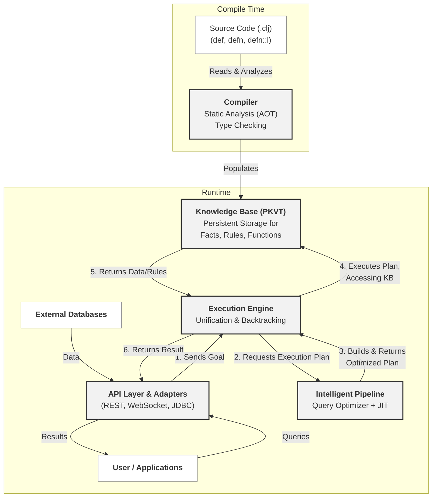

# 🏗️ Tipster Architecture

## 1. Document's Purpose: The "How" and "Why"

This document describes the **internal structure** of the Tipster platform. Its purpose is to answer the questions of **"How"** and **"Why"**:
*   **How** is the system designed?
*   What are its key components?
*   How do these components interact with each other?
*   **Why** were these specific architectural decisions made?

This document should be read in conjunction with the [Roadmap (roadmap.md)](./roadmap.md), which answers the questions of **"What"** and **"When"** (which features will be implemented and in what order).

---

## 2. High-Level Architecture Diagram

---

## 3. Key Component Descriptions

### Compiler

**Responsible for:** Transforming high-level, declarative Tipster source code into a structured, machine-readable format used for storage and execution. The compiler is the bridge between human-written code and the system's internal representation.

*   **Input:** Clojure source code files (`.clj`) containing `def`, `defn`, and `defn::l` forms.
*   **Output:** A set of records that populate the [Knowledge Base (PKVT)](#knowledge-base-pkvt).

**Architectural Rationale ("Why"):** The compiler is not a monolithic block. It is a component that **evolves** with the platform's capabilities, reflecting the strategic stages from the roadmap. This approach allows for the gradual increase of the system's complexity and intelligence.

1.  **Stage 1 (Foundation) — Translator:** In the initial stage, its main task is to parse the basic syntax (`def`, `defn::l`) and translate it into simple data structures understandable by the [Execution Engine](#execution-engine).
2.  **Stage 3 (Unification) — PKVT Constructor:** The compiler becomes more sophisticated, learning to decompose **any** definition (code, data, metadata) into the atomic `Parent-Key-Value-Type` format. This is a crucial step towards unifying code and data, allowing code to be queried as data.
3.  **Stage 5 (Intelligence) — Static Analyzer (AOT):** In its most advanced form, the compiler performs deep static analysis at load time (Ahead-Of-Time). It conducts type checking, partial evaluation, and prepares metadata for faster runtime optimization, passing the baton to the [Intelligent Pipeline](#intelligent-pipeline).

### Knowledge Base (PKVT)

**Responsible for:** The universal, transactional, and persistent storage of **all** system entities (facts, rules, functions, metadata) in a single format. It is the "heart" of the system, where code and data live together.

*   **Structure:** All data is stored as atomic records in the `Parent-Key-Value-Type` (PKVT) format.
    *   `Parent`: The context or owner (e.g., a module name).
    *   `Key`: The name of an attribute or entity.
    *   `Value`: The value.
    *   `Type`: The entity type (`:fact`, `:rule`, `:function`, etc.).
*   **Interfaces:** Provides internal APIs for the `Compiler` (writing) and the `Execution Engine` (reading).

**Architectural Rationale ("Why"):**
1.  **Code-Data Unification:** Representing everything, including code, as data (PKVT records) is a fundamental decision that enables hybrid queries (e.g., "find all functions that use table X"). It blurs the line between *what* the system knows (data) and *how* it uses that knowledge (code).
2.  **Multi-dimensional Indexing:** The PKVT structure is naturally suited for creating multi-dimensional indexes (on P, K, V, T, and their combinations). This allows for ultra-fast searches across any aspect of the knowledge without needing to design special schemas or tables.
3.  **Persistence and Transactionality:** Using an embedded storage engine (like RocksDB or LevelDB) with mechanisms such as Write-Ahead Logging (WAL) ensures ACID guarantees and reliable storage, transforming Tipster from a simple library into a full-fledged data platform.

### Execution Engine

**Responsible for:** Directly executing queries and finding all possible solutions for a given logical goal. It is the "workhorse" of the system, implementing the classic mechanisms of logic programming.

*   **Input:** A logical goal (from the [API Layer](#api-layer--adapters)) and, optionally, an optimized execution plan (from the [Intelligent Pipeline](#intelligent-pipeline)).
*   **Interaction:** Actively queries the [Knowledge Base (PKVT)](#knowledge-base-pkvt) to retrieve facts and rules needed to prove the goal.
*   **Output:** A lazy sequence of solutions, where each solution is a set of bound variables.

**Architectural Rationale ("Why"):**
1.  **A Proven Core:** The engine is based on time-tested algorithms: Robinson's unification for term matching and backtracking for traversing the solution tree. This ensures correctness and completeness of the search.
2.  **Lazy Sequences:** Returning results as lazy sequences is an idiomatic Clojure solution. It is extremely memory-efficient, allowing for the processing of potentially infinite or very large result sets without loading them all into memory at once.
3.  **Separation of "Mechanics" from "Strategy":** The engine is responsible for the *mechanics* of the search (how to unify, how to backtrack). It deliberately does not handle the *strategy* (in what order to try the goals). It delegates this task to the [Intelligent Pipeline](#intelligent-pipeline), which allows the core to remain simple and reliable, while the optimizer can be as complex as needed.

### Intelligent Pipeline

**Responsible for:** Creating the optimal strategy (plan) for executing complex queries. If the Execution Engine is the "muscle," the Intelligent Pipeline is the "brain" that decides how to use that muscle most effectively.

*   **Input:** A complex logical goal from the [Execution Engine](#execution-engine).
*   **Interaction:** Analyzes the query structure and may also query the [Knowledge Base](#knowledge-base-pkvt) for metadata and statistics (e.g., about table sizes or predicate selectivity).
*   **Output:** An optimized execution plan that is passed back to the [Execution Engine](#execution-engine).

**Architectural Rationale ("Why"):**
This is not a monolithic component but a pipeline of two interacting parts. This separation combines the power of dynamic analysis with the performance of compiled code.

1.  **Query Optimizer:** This is a dynamic (runtime) module. Its job is to analyze the query *as it arrives*. Based on heuristics, statistics, and metadata from the compiler, it decides the join order of goals, which search strategy to use, and which indexes to employ. This is a classic approach from the world of DBMS (e.g., Cost-Based Optimization), adapted for logical inference.
2.  **JIT (Just-In-Time) Compilation:** After the Optimizer has constructed the "ideal" plan, the JIT compiler takes this plan and, on the fly, turns it into highly efficient bytecode or even native code for the target platform. This avoids the overhead of interpreting the plan at every execution step, which is critical for performance in loops and recursive rules.

### API Layer & Adapters

**Responsible for:** The system's interaction with the outside world. This layer provides standardized interfaces for users, applications, and external data sources.

*   **API Layer:** Provides protocols for remote interaction.
    *   **REST API:** For synchronous requests and managing the knowledge base (CRUD operations on entities).
    *   **WebSocket API:** For asynchronous, streaming of large result sets, which is ideal for subscribing to changes or processing lazy sequences in real-time.
*   **Adapters:** Act as "translators" from the language of external systems to the language of Tipster.
    *   **Input Adapters:** Enable federated queries by transparently "connecting" external databases (e.g., via JDBC) or other data sources, presenting them as part of the unified Knowledge Base.
    *   **Output Adapters:** Can be used to broadcast changes from the Knowledge Base to external systems, such as sending notifications to Kafka or updating an Elasticsearch index.

**Architectural Rationale ("Why"):**
1.  **Separation of Core and Integration:** Moving all external interaction logic into a separate layer allows the system's core (Compiler, KB, Engine) to remain clean, protocol-agnostic, and focused on its primary task.
2.  **Extensibility:** The adapter architecture makes it easy to add support for new data sources or protocols without affecting the system's core. A new adapter can be written for any specific DBMS or API, and it will "just work" with the rest of the system.
3.  **Flexibility of Use:** Having both synchronous (REST) and asynchronous (WebSocket) APIs allows Tipster to be used for a wide range of tasks, from classic "request-response" scenarios to complex event-driven architectures.
