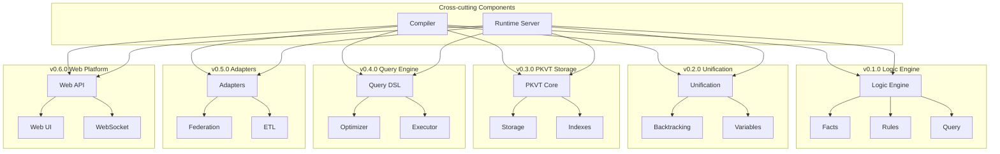

# 🏗️ Tipster Architecture

> **Detailed description of the functional-logical platform architecture with component versioning**

---

## 📋 Architecture Overview

Tipster is built on a **modular architecture** with clear separation of responsibilities between components. Each block develops independently according to versioning, ensuring incremental development and scalability.

### 🎯 Architectural Principles

1. **Dual Semantics** - each expression is both a function and a logical fact
2. **EDN-nativity** - unified data format for all components
3. **Modularity** - clear component separation with versioning
4. **Extensibility** - open architecture for integrations
5. **Scalability** - from in-memory to distributed systems

---

## 🔧 Main Architectural Blocks

| Block | Version | Status | Purpose |
|-------|---------|--------|---------|
| **Logic Engine** | v0.1.0 🚧 | In development | Unification, facts, rules |
| **Unification Core** | v0.2.0 🚧 | In development | True unification and backtracking |
| **PKVT Storage** | v0.3.0 📋 | Planned | Runtime-DBMS with universal model |
| **Query Engine** | v0.4.0 📋 | Planned | SQL-like queries with optimization |
| **External Adapters** | v0.5.0 📋 | Planned | External DBMS integration |
| **Web Platform** | v0.6.0 📋 | Planned | API and web interface |
| **Compiler** | v0.1.0+ | Cross-cutting | Parsing and code generation |
| **Runtime Server** | v0.1.0+ | Cross-cutting | Execution and management |

---

## 🧠 v0.1.0 - Logic Engine (MVP Logic Engine) 🚧

### 📐 Architectural Decisions

**Temporary constructs:**
- `deffact` - macro for declaring facts
- `defrule` - macro for defining rules  
- `query` - macro for executing queries

**Data storage:**
- In-memory Clojure collections
- Simple indexing by predicates
- Lazy sequences for results

### 🔩 v0.1.0 Components

```clojure
;; Module structure
src/tipster/
├── core.clj           ; Main macros and API
├── facts.clj          ; Facts management  
├── rules.clj          ; Logical rules
└── query.clj          ; Query system

;; Examples in project root (organized by versions)
examples/
├── v0.1.0/           ; Examples for current version
│   ├── basic.clj          ; Basic facts and queries examples
│   ├── family.clj         ; Family relationships
│   ├── rules.clj          ; Logical rules examples
│   ├── animals.clj        ; Animal classification
│   ├── math.clj           ; Mathematical examples
│   └── interactive.clj    ; Interactive demos
├── v0.2.0/           ; Unification and backtracking examples (planned)
│   ├── unification.clj     ; Robinson algorithm examples
│   ├── backtracking.clj    ; Choice points examples
│   └── variables.clj       ; Logical variables
├── v0.3.0/           ; PKVT model examples (planned)
│   ├── decomposition.clj   ; EDN → PKVT decomposition
│   ├── queries.clj         ; Pattern queries
│   └── indexing.clj        ; Multi-dimensional indexing
└── ru/               ; Russian versions of examples
    └── README.md
```

#### Facts Module
```clojure
(ns tipster.facts)

;; Global facts storage
(def ^:dynamic *facts* (atom {}))

;; Add fact
(defn add-fact! [predicate & args]
  (swap! *facts* update predicate (fnil conj #{}) args))

;; Find facts
(defn find-facts [predicate]
  (get @*facts* predicate #{}))
```

#### Rules Module
```clojure
(ns tipster.rules)

;; Rules registry
(def ^:dynamic *rules* (atom {}))

;; Register rule
(defn register-rule! [name rule-fn]
  (swap! *rules* assoc name rule-fn))

;; Apply rules
(defn apply-rules [goal]
  (mapcat (fn [[name rule]] (rule goal)) @*rules*))
```

### 🔍 v0.1.0 Limitations

- ❌ **No true unification** - simple pattern matching
- ❌ **No backtracking** - direct search only
- ❌ **Primitive indexing** - linear fact search
- ❌ **No optimization** - naive query implementation

---

## 🔧 v0.2.0 - Unification Core

### 🎯 Architectural Goals

1. **Robinson Unification** - classic unification algorithm
2. **Pluggable Search Engine** - replaceable combinatorial search machine
3. **Variable Bindings** - variable context management
4. **Lazy Evaluation** - lazy computation of multiple solutions
5. **Search Strategy Abstraction** - search strategy abstraction layer

### 🔩 v0.2.0 Components

```clojure
;; Extended structure v0.2.0
src/tipster/
├── unification/
│   ├── core.clj       ; Robinson algorithm
│   ├── bindings.clj   ; Substitution management
│   └── occurs.clj     ; Occur check
├── search/
│   ├── engine.clj     ; Abstract search machine
│   ├── protocols.clj  ; Search strategy protocols
│   ├── strategies/    ; Concrete strategies
│   │   ├── backtrack.clj    ; Classic backtracking
│   │   ├── forward.clj      ; Forward search
│   │   ├── bidirectional.clj ; Bidirectional search
│   │   ├── breadth_first.clj ; Breadth-first search
│   │   └── heuristic.clj    ; Heuristic strategies
│   ├── combinators/   ; Combinatorial models
│   │   ├── choice.clj       ; Choice points
│   │   ├── cut.clj          ; Cut operations
│   │   └── iterative.clj    ; Iterative deepening
│   └── optimization/  ; Search optimizations
│       ├── memoization.clj  ; Memoization
│       ├── tabling.clj      ; Tabling
│       └── constraints.clj  ; Constraints
└── facts/
    ├── index.clj      ; Fact indexing
    └── store.clj      ; Optimized storage
```

#### Unification Module
```clojure
(ns tipster.unification.core)

;; Main unification function
(defn unify 
  "Unifies two terms, returns substitution or nil"
  [term1 term2 bindings]
  (cond
    (= term1 term2) bindings
    (variable? term1) (bind-variable term1 term2 bindings)
    (variable? term2) (bind-variable term2 term1 bindings)
    (and (compound? term1) (compound? term2))
    (unify-compounds term1 term2 bindings)
    :else nil))

;; Apply substitution
(defn apply-substitution [term bindings]
  (walk/postwalk 
    #(if (variable? %) (get bindings % %) %) 
    term))
```

#### Search Engine Module
```clojure
(ns tipster.search.protocols)

;; Search strategy protocol
(defprotocol SearchStrategy
  (search [strategy problem space] "Executes solution search")
  (expand [strategy node] "Expands search node")
  (select [strategy frontier] "Selects next node for expansion")
  (terminate? [strategy state] "Checks termination condition"))

;; Combinatorial model protocol
(defprotocol CombinatorialModel
  (generate-choices [model context] "Generates choice points")
  (backtrack [model state] "Performs backtracking")
  (commit [model choice] "Commits choice")
  (prune [model branches] "Prunes search branches"))
```

```clojure
(ns tipster.search.engine)

;; Abstract search machine
(defrecord SearchEngine [strategy model optimizer])

;; Universal goal solving
(defn solve-goal 
  "Universal solver with pluggable strategy"
  [engine goal context]
  (let [{:keys [strategy model optimizer]} engine
        problem (build-search-problem goal context)
        space (generate-search-space model problem)]
    (->> (search strategy problem space)
         (optimize optimizer)
         (lazy-seq))))

;; Search engine factory
(defn create-engine 
  "Creates search engine with specified strategy"
  [strategy-type & options]
  (case strategy-type
    :backtrack (backtrack-engine options)
    :forward (forward-engine options)
    :bidirectional (bidirectional-engine options)
    :breadth-first (breadth-first-engine options)
    :heuristic (heuristic-engine options)))
```

#### Search Strategies
```clojure
(ns tipster.search.strategies.backtrack)

;; Classic backtracking
(defrecord BacktrackStrategy [depth-limit cut-enabled?])

(extend-protocol SearchStrategy
  BacktrackStrategy
  (search [strategy problem space]
    (depth-first-search problem space (:depth-limit strategy)))
  (expand [strategy node]
    (generate-alternatives node))
  (select [strategy frontier]
    (peek frontier))  ; LIFO for depth
  (terminate? [strategy state]
    (or (solution? state) (depth-exceeded? state strategy))))
```

```clojure
(ns tipster.search.strategies.heuristic)

;; Heuristic strategy
(defrecord HeuristicStrategy [heuristic-fn beam-width])

(extend-protocol SearchStrategy
  HeuristicStrategy
  (search [strategy problem space]
    (best-first-search problem space (:heuristic-fn strategy)))
  (select [strategy frontier]
    (best-by (:heuristic-fn strategy) frontier))
  (expand [strategy node]
    (take (:beam-width strategy) 
          (sort-by (:heuristic-fn strategy) 
                   (generate-alternatives node)))))
```

#### Combinatorial Models
```clojure
(ns tipster.search.combinators.choice)

;; Choice point model
(defrecord ChoicePointModel [branching-factor pruning-strategy])

(extend-protocol CombinatorialModel
  ChoicePointModel
  (generate-choices [model context]
    (let [alternatives (find-alternatives context)]
      (take (:branching-factor model) alternatives)))
  (backtrack [model state]
    (restore-previous-choice-point state))
  (commit [model choice]
    (eliminate-alternatives choice))
  (prune [model branches]
    (apply-pruning-strategy (:pruning-strategy model) branches)))
```

```clojure
(ns tipster.search.combinators.iterative)

;; Iterative deepening model
(defrecord IterativeDeepening [initial-depth increment max-depth])

(extend-protocol CombinatorialModel
  IterativeDeepening
  (generate-choices [model context]
    (depth-limited-choices context (:current-depth model)))
  (backtrack [model state]
    (if (depth-exhausted? state)
      (increase-depth-limit model)
      (standard-backtrack state))))
```

### 🔧 Search Engine Configuration

```clojure
;; Search engine configuration examples
(def search-engines-config
  {:engines
   {:prolog-style {:strategy :backtrack
                   :model :choice-points
                   :optimizations [:cut :tail-recursion]}
    :constraint-based {:strategy :forward
                       :model :constraint-propagation  
                       :optimizations [:arc-consistency]}
    :heuristic {:strategy :best-first
                :model :beam-search
                :heuristic :goal-distance
                :beam-width 10}
    :parallel {:strategy :breadth-first
               :model :work-stealing
               :workers 4}}})

;; Dynamic strategy switching
(defn solve-with-adaptive-strategy [goal context]
  (let [complexity (analyze-complexity goal)
        strategy (select-optimal-strategy complexity)]
    (solve-goal (create-engine strategy) goal context)))

;; Cascaded strategy application
(defn solve-with-fallback [goal context]
  (or (timeout-solve (create-engine :heuristic) goal context 1000)
      (timeout-solve (create-engine :backtrack) goal context 5000)  
      (solve-goal (create-engine :breadth-first) goal context)))
```

### 🔬 Universality of Combinatorial Machines

**Key architectural idea**: Combinatorial machines are applied for **unified knowledge search process**:

**NO SEPARATION** between "logical inference" and "database queries" - it's **the same process**:

1. **Fact search** - pattern search in PKVT knowledge space
2. **Rule search** - search for applicable rules in the same PKVT space  
3. **Function search** - search for function definitions in the same PKVT space
4. **Data search** - search for values in the same PKVT space

**Everything is stored in unified PKVT knowledge space:**
- Facts: `{:parent "fact-1" :key "employee" :value ["John" 30 "IT" 75000] :type :fact}`
- Rules: `{:parent "rule-1" :key "senior-employee" :value "(and (employee ?n ?a ?d ?s) (> ?a 30))" :type :rule}`
- Functions: `{:parent "fn-1" :key "calculate-bonus" :value "(fn [salary] (* salary 0.1))" :type :function}`
- Data: `{:parent "data-1" :key "department" :value "IT" :type :data}`

**Combinatorial machines work with unified space:**
- Choice of search strategy (indexes vs scanning)
- Choice of rule application order
- Choice of optimizations (caching, parallelization)
- Choice of execution plans

### 🔬 Architectural Advantages

- **Universality**: Same protocols for all types of search
- **Modularity**: Complete separation of search algorithms and combinatorial models
- **Extensibility**: Easy addition of new strategies through protocols
- **Reusability**: Combinations of strategies and models across domains
- **Testability**: Isolated testing of each component
- **Performance**: Specialized optimizations for each strategy
- **Fault tolerance**: Cascaded strategy application on failures
```

### 📊 v0.2.0 Performance Metrics

- ⚡ **Unification**: 1000+ operations/sec
- 🔄 **Search strategies**: adaptive selection per task
- 📈 **Indexing**: subcubic search complexity
- 💾 **Memory**: efficient substitution management
- 🔧 **Extensibility**: easy addition of new algorithms

---

## 🗄️ v0.3.0 - PKVT Storage (Runtime-DBMS)

### 🎯 Innovative PKVT Idea

**Parent-Key-Value-Type** model - universal representation of any data:

- **Parent** - owner/container (document, object, collection)
- **Key** - attribute/index (field name, list position)  
- **Value** - value (primitive, reference, nested structure)
- **Type** - type and metadata (primitive, collection, reference)

### 🔩 v0.3.0 Components

```clojure
;; PKVT architecture
src/tipster/
├── pkvt/
│   ├── core.clj       ; Basic PKVT operations
│   ├── decompose.clj  ; EDN → PKVT quads
│   ├── compose.clj    ; PKVT → EDN structures
│   └── types.clj      ; Type system
├── storage/
│   ├── memory.clj     ; In-memory storage
│   ├── persist.clj    ; Persistent storage
│   └── cluster.clj    ; Distributed storage
├── indexes/
│   ├── multi.clj      ; Multi-dimensional indexes
│   ├── composite.clj  ; Composite indexes
│   └── stats.clj      ; Usage statistics
└── query/
    ├── pattern.clj    ; Pattern matching
    ├── optimize.clj   ; Query optimization
    └── plan.clj       ; Execution plans
```

#### PKVT Core Module
```clojure
(ns tipster.pkvt.core)

;; PKVT quad
(defrecord Quad [parent key value type])

;; Create quad
(defn create-quad 
  "Creates PKVT quad with auto type inference"
  [parent key value]
  (->Quad parent key value (infer-type value)))

;; Decompose EDN to quads
(defn decompose-edn 
  "Decomposes EDN structure to PKVT quads"
  [edn-obj parent-id]
  (mapcat 
    (fn [[k v]] 
      (if (complex? v)
        (cons (create-quad parent-id k (uuid v))
              (decompose-edn v (uuid v)))
        [(create-quad parent-id k v)]))
    edn-obj))
```

#### Storage Module (Universal Combinatorial Architecture)
```clojure
(ns tipster.storage.distributed)

;; Distributed storage with pluggable search engines
(defrecord DistributedStorage [
  cluster-nodes     ; List of cluster nodes
  sharding-strategy ; Sharding strategy (consistent-hashing)
  replication-factor ; Replication factor (default 3)
  parent-indexes    ; Parent → shard-mapping
  global-key-index  ; Global index by Key
  bloom-filters     ; Bloom filters for fast existence checks
  quad-store-shards ; Sharded quad storage
  consistency-level ; Consistency level (eventual/strong)
  search-engine])   ; Pluggable search engine

;; Universal search through combinatorial machines
(defn universal-query-pattern 
  "Search by P-K-V-T pattern using combinatorial strategies"
  [storage parent key value type]
  (let [search-problem (build-db-search-problem parent key value type)
        search-space (generate-db-search-space storage search-problem)
        engine (:search-engine storage)]
    (solve-goal engine search-problem search-space)))

;; Adaptive DB search strategy selection
(defn adaptive-db-search
  "Selects optimal search strategy based on query characteristics"
  [storage query-pattern]
  (let [complexity (analyze-query-complexity query-pattern)
        data-distribution (analyze-data-distribution storage query-pattern)
        optimal-strategy (select-db-search-strategy complexity data-distribution)]
    (create-engine optimal-strategy)))
```

#### Combinatorial Models for Database Search
```clojure
(ns tipster.storage.combinatorial-models)

;; Distributed search model
(defrecord DistributedSearchModel [shard-strategy parallel-factor])

(extend-protocol CombinatorialModel
  DistributedSearchModel
  (generate-choices [model context]
    (let [target-shards (determine-target-shards context (:shard-strategy model))]
      (partition-search-space target-shards (:parallel-factor model))))
  (backtrack [model state]
    (redistribute-failed-shards state))
  (commit [model choice]
    (consolidate-shard-results choice))
  (prune [model branches]
    (eliminate-empty-shards branches)))

;; Index search model
(defrecord IndexSearchModel [index-selection-strategy bloom-filter-threshold])

(extend-protocol CombinatorialModel
  IndexSearchModel
  (generate-choices [model context]
    (let [available-indexes (get-available-indexes context)
          optimal-indexes (select-optimal-indexes (:index-selection-strategy model) 
                                                  available-indexes)]
      (generate-index-scan-choices optimal-indexes)))
  (prune [model branches]
    (apply-bloom-filter-pruning branches (:bloom-filter-threshold model))))

;; Cache-aware search model
(defrecord CacheAwareSearchModel [cache-levels eviction-strategy])

(extend-protocol CombinatorialModel
  CacheAwareSearchModel
  (generate-choices [model context]
    (let [cache-hits (check-cache-levels context (:cache-levels model))
          cache-misses (identify-cache-misses context cache-hits)]
      (prioritize-cache-hits cache-hits cache-misses)))
  (commit [model choice]
    (update-cache-with-results choice (:eviction-strategy model))))
```

#### Specialized Database Search Strategies
```clojure
(ns tipster.storage.search-strategies)

;; Parallel scan strategy
(defrecord ParallelScanStrategy [worker-count chunk-size])

(extend-protocol SearchStrategy
  ParallelScanStrategy
  (search [strategy problem space]
    (parallel-scan-execution problem space 
                            (:worker-count strategy) 
                            (:chunk-size strategy)))
  (expand [strategy node]
    (partition-scan-range node (:chunk-size strategy)))
  (select [strategy frontier]
    (select-least-loaded-worker frontier)))

;; Index seek strategy
(defrecord IndexSeekStrategy [index-preference cost-threshold])

(extend-protocol SearchStrategy
  IndexSeekStrategy
  (search [strategy problem space]
    (index-seek-execution problem space (:index-preference strategy)))
  (expand [strategy node]
    (expand-via-indexes node (:index-preference strategy)))
  (terminate? [strategy state]
    (or (solution-found? state) 
        (exceeds-cost-threshold? state (:cost-threshold strategy)))))

;; Hybrid search strategy (indexes + scanning)
(defrecord HybridSearchStrategy [index-threshold scan-fallback?])

(extend-protocol SearchStrategy
  HybridSearchStrategy
  (search [strategy problem space]
    (if (should-use-indexes? problem (:index-threshold strategy))
      (index-based-search problem space)
      (when (:scan-fallback? strategy)
        (fallback-to-scan problem space)))))
```

#### Database Search Engine Configuration
```clojure
(def db-search-engines-config
  {:engines
   {:oltp-workload {:strategy :index-seek
                    :model :cache-aware
                    :optimizations [:bloom-filters :hot-data-cache]}
    :olap-workload {:strategy :parallel-scan  
                    :model :distributed-search
                    :optimizations [:compression :columnar-scan]}
    :mixed-workload {:strategy :hybrid
                     :model :adaptive-caching
                     :fallback-chain [:index-seek :parallel-scan]}
    :real-time {:strategy :memory-first
                :model :cache-aware
                :latency-target "1ms"}}})

;; Automatic strategy selection based on query characteristics
(defn select-db-search-strategy [query-characteristics data-distribution]
  (cond
    (high-selectivity? query-characteristics) :index-seek
    (large-result-set? query-characteristics) :parallel-scan
    (complex-joins? query-characteristics) :hybrid
    (real-time-requirement? query-characteristics) :memory-first
    :else :adaptive))
```

### 🚀 PKVT Model Advantages

1. **Universality** - any data structures without schema
2. **Flexibility** - dynamic structure changes
3. **Performance** - multi-dimensional indexing for billions of records
4. **Compatibility** - relational, document, graph approaches
5. **Scalability** - horizontal partitioning by Parent across thousands of nodes
6. **Fault tolerance** - replication and automatic recovery
7. **Linear scaling** - adding nodes increases performance proportionally

### 🔧 Automatic Composition/Decomposition

**EDN Decomposition:**
```clojure
;; Original structure
{:document "Invoice #123"
 :date "2024-01-15"
 :items [{:product "Milk" :price 50}
         {:product "Bread" :price 30}]}

;; Automatic PKVT decomposition
[{:parent "doc-1" :key "document" :value "Invoice #123" :type :string}
 {:parent "doc-1" :key "date" :value "2024-01-15" :type :string}
 {:parent "doc-1" :key "items" :value "list-1" :type :list-ref}
 {:parent "list-1" :key 0 :value "item-1" :type :map-ref}
 {:parent "list-1" :key 1 :value "item-2" :type :map-ref}
 {:parent "item-1" :key "product" :value "Milk" :type :string}
 {:parent "item-1" :key "price" :value 50 :type :number}
 {:parent "item-2" :key "product" :value "Bread" :type :string}
 {:parent "item-2" :key "price" :value 30 :type :number}]
```

---

## 📊 v0.4.0 - Query Engine

### 🎯 SQL-like Declarativeness

Creating powerful query system with:
- Declarative EDN syntax
- Automatic optimization
- Integration with logical rules

### 🔩 v0.4.0 Components

```clojure
;; Query Engine architecture  
src/tipster/
├── query/
│   ├── dsl.clj        ; Query DSL
│   ├── parser.clj     ; Query parsing
│   └── validator.clj  ; Query validation
├── optimizer/
│   ├── rules.clj      ; Optimization rules
│   ├── cost.clj       ; Cost estimation
│   └── plan.clj       ; Execution plans
├── execution/
│   ├── engine.clj     ; Execution engine
│   ├── joins.clj      ; Join processing
│   └── aggregates.clj ; Aggregations and grouping
└── integration/
    ├── logic.clj      ; Logic integration
    └── functions.clj  ; User functions
```

#### Dual Semantics Engine
```clojure
(ns tipster.query.dual-semantics)

;; Dual semantics: functions as queries
(defn customer [id name region])
(defn order [id customer-id total date])

;; Same syntax for computations and queries
(->> (order ?order-id ?customer-id ?total ?date)
     (filter #(and (> (:total %) 1000)
                   (>= (:date %) "2024-01-01")))
     (map #(customer (:customer-id %) ?name ?region))
     (group-by :region)
     (map (fn [[region orders]]
            [region (reduce + (map :total orders))]))
     (sort-by second >))

;; Composable logical rules
(defn large-order [order-id customer-id total date]
  (and (order order-id customer-id total date)
       (> total 1000)))

;; Rules integration in queries
(->> (large-order ?id ?cust-id ?total ?date)
     (map #(customer (:cust-id %) ?name ?region))
     (sort-by :name))
```

#### Query Optimizer
```clojure
(ns tipster.optimizer.rules)

;; Optimization rule: predicate pushdown
(defn push-down-predicates [query-tree]
  (transform query-tree
    [:where pred [:join & tables]]
    (if (single-table-predicate? pred tables)
      [:join (apply-where (first tables) pred) (rest tables)]
      [:where pred [:join & tables]])))

;; Index selection
(defn select-indexes [query available-indexes]
  (let [predicates (extract-predicates query)
        costs (map #(estimate-cost % predicates) available-indexes)]
    (min-key second (map vector available-indexes costs))))
```

### 📈 Query Engine Capabilities

1. **Declarativeness** - SQL-like syntax in EDN
2. **Optimization** - automatic execution plan selection
3. **Composability** - integration with Clojure functions
4. **Extensibility** - custom aggregates and functions

---

## 🔌 v0.5.0 - External Adapters

### 🎯 Universal Integration

Transparent work with any external DBMS through unified interface:

### 🔩 v0.5.0 Components

```clojure
;; Adapters architecture
src/tipster/
├── adapters/
│   ├── core.clj       ; Base adapter
│   ├── sql/           ; SQL adapters
│   │   ├── postgres.clj
│   │   ├── mysql.clj
│   │   └── sqlite.clj
│   ├── nosql/         ; NoSQL adapters  
│   │   ├── mongodb.clj
│   │   ├── redis.clj
│   │   └── elastic.clj
│   └── graph/         ; Graph databases
│       ├── neo4j.clj
│       └── datomic.clj
├── federation/
│   ├── query.clj      ; Federated queries
│   ├── join.clj       ; Cross-database joins
│   └── cache.clj      ; Caching
├── mapping/
│   ├── schema.clj     ; Schema mapping
│   ├── types.clj      ; Type conversion
│   └── relations.clj  ; Inter-DB relations
└── etl/
    ├── import.clj     ; Data import
    ├── export.clj     ; Data export
    └── sync.clj       ; Synchronization
```

#### Universal Adapter Protocol
```clojure
(ns tipster.adapters.core)

;; Adapter protocol
(defprotocol DatabaseAdapter
  (connect [adapter config] "Connect to DB")
  (disconnect [adapter] "Disconnect from DB") 
  (translate-query [adapter tipster-query] "Translate query")
  (execute-native [adapter native-query] "Execute native query")
  (map-result [adapter native-result] "Map result to EDN"))

;; PostgreSQL adapter
(defrecord PostgresAdapter [connection schema-mapping]
  DatabaseAdapter
  (translate-query [this query]
    (tipster-query->sql query schema-mapping))
  (execute-native [this sql]
    (jdbc/query connection sql))
  (map-result [this rows]
    (map row->edn rows)))
```

#### Federation Engine
```clojure
(ns tipster.federation.query)

;; Federated query
(defn federated-query 
  "Executes query across multiple DBMS"
  [sources query]
  (let [subqueries (partition-query query sources)
        results (pmap #(execute-on-source %) subqueries)]
    (merge-results results query)))

;; Cross-database JOIN
(defn cross-join 
  "Joins data from different DBMS"
  [left-source left-key right-source right-key]
  (let [left-data (fetch-keyed-data left-source left-key)
        right-data (fetch-keyed-data right-source right-key)]
    (join-on-key left-data right-data left-key right-key)))
```

---

## 🌐 v0.6.0 - Web Platform

### 🎯 Modern Web Interface

Full-featured web platform for knowledge base work:

### 🔩 v0.6.0 Components

```clojure
;; Web Platform architecture
src/tipster/
├── web/
│   ├── api/           ; REST API
│   │   ├── routes.clj
│   │   ├── handlers.clj  
│   │   └── middleware.clj
│   ├── websocket/     ; WebSocket support
│   │   ├── handlers.clj
│   │   └── streaming.clj
│   └── graphql/       ; GraphQL API
│       ├── schema.clj
│       └── resolvers.clj
├── ui/                ; Web interface (ClojureScript)
│   ├── components/    ; React components
│   │   ├── query_editor.cljs
│   │   ├── results_viewer.cljs
│   │   └── knowledge_browser.cljs
│   ├── pages/         ; Application pages
│   └── state/         ; State management
├── security/
│   ├── auth.clj       ; Authentication
│   ├── authz.clj      ; Authorization
│   └── audit.clj      ; Operation audit
└── monitoring/
    ├── metrics.clj    ; Metrics
    ├── logging.clj    ; Logging
    └── health.clj     ; Health checks
```

#### REST API
```clojure
(ns tipster.web.api.routes)

(defroutes api-routes
  ;; Facts management
  (GET "/api/facts" [] (get-all-facts))
  (POST "/api/facts" [fact] (add-fact! fact))
  (DELETE "/api/facts/:id" [id] (remove-fact! id))
  
  ;; Query execution
  (POST "/api/query" [query] (execute-query query))
  (GET "/api/query/:id/explain" [id] (explain-query id))
  
  ;; Rules management
  (GET "/api/rules" [] (get-all-rules))
  (POST "/api/rules" [rule] (add-rule! rule))
  
  ;; Monitoring
  (GET "/api/health" [] (health-check))
  (GET "/api/metrics" [] (get-metrics)))
```

#### WebSocket Streaming
```clojure
(ns tipster.web.websocket.streaming)

;; Stream large results
(defn stream-query-results 
  "Streams query results via WebSocket"
  [query ws-channel batch-size]
  (go-loop [results (execute-query-lazy query)
            batch-num 0]
    (when-let [batch (take batch-size results)]
      (>! ws-channel {:type :data 
                      :batch batch-num
                      :data batch
                      :has-more (seq (drop batch-size results))})
      (recur (drop batch-size results) (inc batch-num)))))
```

---

## 🔄 Cross-cutting Components

### 🎯 Compiler

**Evolves in all versions** - processes expanding syntax:

```clojure
;; Compiler architecture
src/tipster/
├── compiler/
│   ├── parser.clj     ; Source code parsing
│   ├── analyzer.clj   ; Semantic analysis
│   ├── optimizer.clj  ; Optimizations
│   └── codegen.clj    ; Code generation
├── ast/
│   ├── nodes.clj      ; AST nodes
│   ├── transforms.clj ; AST transformations
│   └── validation.clj ; AST validation
└── targets/
    ├── jvm.clj        ; JVM bytecode
    ├── js.clj         ; JavaScript
    └── native.clj     ; Native code
```

#### Compilation stages by versions:

- **v0.1.0**: `deffact`, `defrule`, `query` macros
- **v0.2.0**: Automatic logical construct recognition
- **v0.3.0**: PKVT storage optimization
- **v0.4.0**: Query optimizer integration
- **v0.5.0**: External DB adapter generation
- **v0.6.0**: Web component compilation

### 🎯 Runtime Server

**Central component** of all versions - manages execution:

```clojure
;; Runtime Server architecture
src/tipster/
├── runtime/
│   ├── server.clj     ; Main server
│   ├── scheduler.clj  ; Task scheduler
│   └── lifecycle.clj  ; Lifecycle management
├── execution/
│   ├── context.clj    ; Execution context
│   ├── isolation.clj  ; Query isolation
│   └── resources.clj  ; Resource management
└── integration/
    ├── repl.clj       ; REPL integration
    ├── ide.clj        ; IDE support
    └── external.clj   ; External integrations
```

---

## 📈 Architecture Evolution

### 🔄 Version Compatibility

| Component | v0.1.0 | v0.2.0 | v0.3.0 | v0.4.0 | v0.5.0 | v0.6.0 |
|-----------|--------|--------|--------|--------|--------|--------|
| **Logic Engine** | ✅ Basic | 🔄 Extended | ↗️ Integrated | ↗️ | ↗️ | ↗️ |
| **Storage** | In-memory | ↗️ Indexes | ✅ PKVT | ↗️ | ↗️ | ↗️ |
| **Query System** | Simple | ↗️ | ↗️ Patterns | ✅ SQL-like | ↗️ | ↗️ |
| **External APIs** | - | - | - | - | ✅ Adapters | ↗️ |
| **Web Interface** | - | - | - | - | - | ✅ Full |
| **Compiler** | ✅ Macros | 🔄 AST | 🔄 Optimizations | 🔄 | 🔄 | 🔄 |
| **Runtime** | ✅ Basic | 🔄 Backtracking | 🔄 PKVT | 🔄 Queries | 🔄 Federation | 🔄 Web |

**Legend:**
- ✅ New component
- 🔄 Major changes  
- ↗️ Backward-compatible extensions

### 🔧 Migration Strategy

1. **Incremental development** - each version extends the previous
2. **Backward compatibility** - old code works in new versions
3. **Clear API boundaries** - stable interfaces between components
4. **Gradual replacement** - temporary solutions replaced by full ones

---

## 🎯 Key Architectural Decisions

### 💡 Innovative Approaches

1. **PKVT model** - universal data representation
2. **Dual semantics** - functions as logical facts
3. **Federated queries** - transparent work with different DBMS
4. **Versioned architecture** - phased component development

### ⚖️ Architectural Trade-offs

| Decision | Advantage | Trade-off |
|----------|-----------|-----------|
| **Custom compiler** | Full semantic control | Development complexity |
| **PKVT model** | Universal storage | Decomposition overhead |
| **Versioning** | Incrementality | Compatibility complexity |
| **EDN-nativity** | Clojure integration | Ecosystem specificity |

---

## 🚀 Architecture Scaling

### 📊 Horizontal Scaling

```clojure
;; Cluster architecture (v0.3.0+)
{:cluster {
  :nodes [{:id "node-1" :role [:storage :compute]}
          {:id "node-2" :role [:storage :compute]}  
          {:id "node-3" :role [:query :gateway]}]
  :sharding {:strategy :parent-based
             :replication-factor 2}
  :load-balancer {:type :consistent-hashing}}}
```

### 🔧 Vertical Scaling

1. **Memory optimization** - efficient data structures
2. **CPU optimization** - parallel query processing
3. **Storage optimization** - compression and indexing
4. **Network optimization** - batch operations and caching

---

## 🔗 Component Diagram



---

> **🎯 Result**: Modular, versioned architecture ensuring evolution from simple logic engine to universal intelligent data platform.
