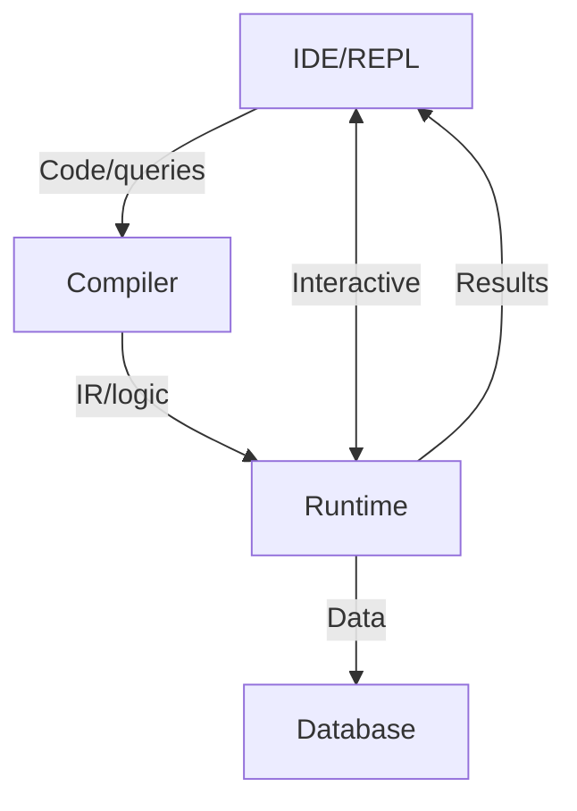

# General Description of the `tipster` Language

## Introduction

**Tipster** is a language and open programming environment born out of a real engineering need: automating the management of a sprawling food enterprise uniting manufacturing, warehouses, offices, a fleet, a network of canteens, and retail stores. In a landscape where business processes were maintained by a variety of incompatible programs and databases, producing reports and achieving coordinated management became extremely labor-intensive. Setting up accounting and aligning it with evolving technological processes and business rules proved to be a major challenge. Updating dozens of programs demanded effort to integrate them into a single system. Tipster was created as a universal, open tool to address the core conceptual problems of automation, allowing you to focus on the essence of business logic and knowledge management.

**Tipster** combines the declarative power of logic languages (in the spirit of Prolog) with the procedural and functional flexibility of Clojure/EDN. The key feature of Tipster is its **unified syntax and dual semantics for expressions**, enabling both database queries and pure computations with the same notation:

* Any predicate expression (such as `(integer? 42)`) is simultaneously a standard Clojure function call (with immediate evaluation) and a logical fact that can be included in a knowledge base or used in inference.
* This approach enables the creation of flexible and expressive rules (including business rules), combining logic and functionality without code duplication, and leverages the entire Clojure standard library as a source of "logical facts" for Tipster.
* Database queries are indistinguishable from using functions or predicates, e.g., `("Purchase Invoice" {"Number" _, "Date" _, "Amount" (>= S 200)})`, which blurs the lines between SQL/no-SQL databases and direct data access.
* As a result, you can develop in the spirit of domain-oriented platforms, focusing on the project's core rather than technical complexities of integrating diverse technologies.
* A side effect is the ability to automatically generate documents for certification under the **ISO 9001:2015** series standards—still widely used as a basis for quality management systems worldwide—directly from Tipster business rules.

**In summary**, programming in Tipster is always a balance between functional and logical paradigms, where every expression can be both a computation and an assertion about the world.

Main idea:

* **If you process a classical Clojure program with Tipster**, the result will be identical to the output of the standard Clojure compiler. Tipster fully preserves and extends the functional paradigm: pure functions, recursion, higher-order functions, macros, and the whole ecosystem.
* **If you process a logic program (for example, code ported from Prolog) with the Tipster compiler**, the result is equivalent to classic logic inference: a solution to a logic programming problem with unification, backtracking, and declarative facts + rules.

Thus, **Tipster** is a language with two poles:

* **Pure functional programming**: 100% Clojure-compatible, does not add new forms, does not impose alternative semantics.
* **Pure logic programming**: allows you to express knowledge and rules in the spirit of Prolog, but with pure EDN/Clojure syntax, making logic inference and fact processing a "native" part of the Clojure ecosystem.

In practice, programming in Tipster typically falls **somewhere between these extremes**. You can combine declarative logic rules with functional abstractions, achieving the optimal balance of expressiveness and control—the core strength and uniqueness of Tipster.

**Tipster is not just a syntactic extension or transpiler, but a truly universal tool that naturally supports both paradigms.** Its compiler transparently transforms Clojure code into regular functional bytecode, and logic constructs into efficient inference schemes and runtime queries, enabling functions, logic inference, and SQL-style data processing within a single project.

To understand the essence, let's take a look at languages like `Prolog`, `Lisp`, and `SQL`, since Tipster incorporates features of all these languages.

---

### Prolog

**Prolog (Programming in Logic)** is a homoiconic, declarative logic programming language where a program is described as a set of **facts and rules**, and computation is reduced to **unification of terms** and systematic **backtracking search** to prove queries; used mainly for knowledge inference, expert systems, and constraint programming.

Prolog uses first-order logic, implying a constructive approach to proof; thus, programming in Prolog always carries the risk of encountering goals only solvable by **inductive steps** or that are fundamentally unsolvable—a deep mathematical issue. Add to this technological, economic, organizational, and other limitations, and Prolog remains a tool for specialists. Nevertheless, it is still the best tool where the **source model** is already formulated as **facts + rules**.
Prolog's main niches are:

* **CLP / CP solvers** — ECLiPSe, SICStus, B-Prolog: planning, scheduling, logistics, typical combinatorial optimizations (TSP, bin-packing, allocation)
* **Compilers and language processors** — DCG parsers, code generators, AST transformers (SWI-Prolog, Logtalk)
* **Static analysis and formal verification** — ProB, UML/CFG analyzers, model checking, property-based testing
* **Embedded rule engines** — Drools/BRMS, Amzi Logic Server, logic plugins for PostgreSQL, IBM Watson core; business rules and expert systems
* **NLP and semantic knowledge** — DCG grammars, parsers, SWRL/Datalog reasoning on OWL/RDF
* **Research and education** — theorem proving demonstrations, academic courses on logic programming, experimental DSLs

It is clear why Prolog was never widely commercialized and remains a specialist tool.

---

### SQL

**SQL (Structured Query Language)** is a declarative language for creating, modifying, and managing data in **relational databases (RDBMS)**, where the user specifies **what data** is needed and the DBMS determines the **optimal way** to retrieve it, based on the **query plan**; used everywhere for structured data storage, processing, and analytics.

SQL is based on **relational algebra** and **relational calculus**, giving it a rigorous mathematical foundation and enabling efficient operations on **tabular data (relations)**. Its declarative style relieves developers from describing low-level data access. However, this may result in inefficient queries if developers do not understand the **DBMS internals** and **query optimization principles**. Differences in SQL dialects between vendors and challenges working with non-relational or weakly-structured data (despite growing JSON/XML support) mean effective SQL use demands deep knowledge. Still, it remains the best tool when the **data model** naturally fits **related tables**.

Key systemic SQL limitations to consider:

* **Three-valued logic (`NULL`)** complicates equivalent transformations and creates brittle predicates (`NULL ≠ NULL`).
* **Impedance mismatch** between imperative code and declarative model (lack of loops, type mismatches, transactional nuances) spawns ORM frameworks and stored procedures.
* **Departure from 1NF** (JSON, arrays, graphs) leads to dialect extensions and reduced portability; SQL:2023 partly addresses this gap.
* **Complex queries**—recursive CTEs, window functions, large JOIN graphs—may be exponentially costly, with cardinalities not always predicted by the optimizer.

SQL occupies stable and varied niches:

* **OLTP databases** — PostgreSQL, MySQL, Oracle, SQL Server: transactional systems, finance, CRM/ERP.
* **Columnar and MPP stores (OLAP/DWH)** — Snowflake, BigQuery, Redshift, ClickHouse: analytics, reporting, ad-hoc queries.
* **Stream engines** — Flink SQL, ksqlDB, Materialize: near-real-time event processing, CDC, online monitoring.
* **Embedded solutions** — SQLite, DuckDB: mobile/desktop apps, edge analytics, local experiments.
* **BI/self-service analytics** — Looker, Superset, Power BI: visualization, dashboards, interactive lakehouse queries.
* **Data engineering/ELT** — dbt, Apache Spark SQL, Airbyte: transformations, cleaning, pipeline orchestration.
* **Extended domains** — PostGIS (GIS), TimescaleDB (time-series), PGVector/Milvus (vector search), hybrid graph extensions (Cypher-, GQL-subsets).
* **Standardization and education** — ISO/IEC 9075-:2023, courses on relational theory, query optimization/formal verification research.

SQL is a rare example of a declarative language fully commercialized and an industry standard for data access. Its ecosystem's maturity and scalability compensate for historical compromises, but require discipline: clear schemas, sensible normalization, good indexing, and strict separation (query ↔ app). This engineering rigor makes SQL the fundamental tool for organizing enterprise and cloud data.

---

### Lisp

**Lisp (List Processing)** is a multi-paradigm (often functional) programming language where programs and data are represented as **list structures (S-expressions)**, and computation reduces to **expression reduction** and **function application** with heavy use of **recursion** and the **REPL (Read-Eval-Print Loop)**; widely used for **symbolic computation**, AI, prototyping, and creating **DSLs (domain-specific languages)**.

Lisp, with its **homoiconicity** (code as data) and powerful **macro system**, lets programmers effectively extend the language and create **DSLs** ideally suited for specific tasks. This unique power enables elegant solutions to complex problems with high abstraction. However, this flexibility, a steep learning curve (especially macros/functional style), and a reputation as an "academic" language or one "with too many parentheses" have limited mainstream adoption. Despite this, many Lisp concepts—garbage collection, conditionals, REPL—have become mainstream. Lisp remains unmatched for **rapid prototyping of complex systems**, **deep metaprogramming**, or **symbolic data processing**.

Lisp (and its dialects: Common Lisp, Scheme, Clojure, Emacs Lisp) found its niches in:

* **AI and symbolic computation** — ACL2 (formal theorem verification), Cyc (knowledge representation), Maxima/Reduce (computer algebra), early expert systems.
* **DSL and extensible system creation** — Racket (language-oriented programming), Emacs (editor extensible via Emacs Lisp), AutoCAD (AutoLISP for CAD automation).
* **Rapid prototyping and development** — Common Lisp, Scheme, Clojure for complex, flexible apps.
* **Web and server apps (modern dialects)** — Clojure (high-performance, concurrent systems, data processing), some Common Lisp frameworks (e.g., Hunchentoot).
* **Education and research** — teaching fundamental programming concepts (SICP in Scheme), new paradigms and language design.
* **Graphics, music, and art** — OpenMusic, PWGL (Common Lisp-based visual programming for algorithmic composition), generative art.
* **Financial analytics and trading systems** — some companies use Lisp/dialects for proprietary data analysis and trading systems due to expressiveness and adaptability.

High entry barriers, niche tasks, and dialect fragmentation kept Lisp from the mainstream like Java or Python, making it a tool for enthusiasts and specialists who value its unique power.

---

## Tipster: An EDN-Dialect for Functional-Logic Programming Based on Clojure

---

### 1. Facts: The Foundation of Tipster’s Logic Knowledge

In **Tipster**, a **fact** is a data assertion written as a predicate (function) call with arguments in S-expression form:

```clojure
(integer? 42)        ; asserts: "42 is an integer"
(person "Alice")     ; asserts: "Alice is a person"
(parent john mary)   ; asserts: "John is Mary’s parent"
```

> **Key feature:**
> Each predicate expression in Tipster has **dual semantics**:
>
> * **Functional** — called as a normal Clojure function and returns a computed result (e.g., Boolean).
> * **Logical** — treated as a fact, usable in inference or stored in the knowledge base.

**Primitive values** (`42`, `"hello"`, `true`, `nil`) are not facts themselves—they are just data. Only a predicate expression over them, such as `(integer? 42)`, becomes a fact.

**Important principles:**

* **Standard Clojure predicate functions** (e.g., `integer?`, `string?`, `odd?`) can be directly used as logical facts. No need for separate Tipster-specific analogues.
* If a Clojure predicate returns `true`, this is interpreted as a true fact for the current value.
* For complex relationships between objects, write your own predicates as regular functions.

**Example:**

```clojure
;; Primitive property — fact via standard predicate
(integer? 42)         ; true, fact: "42 is an integer"

;; Custom fact
(person "Alice")      ; assertion: "Alice is a person"

;; Use in logic rules
(defn only-integers [x]
  (when (integer? x)
    ;; ... further logic ...
  ))
```

* In Tipster, a fact is always a predicate (function) call.
* The same expression can be both a computation and a logical assertion.
* This leverages the full power of the Clojure standard library for logic knowledge without duplicating entities.

All logic models are built on facts—the next step is **rules** that determine how new knowledge is inferred from facts.

---

### 2. Rules: Building New Knowledge from Facts

A **rule** in Tipster is a function that defines how to infer new assertions from existing facts. If facts are the knowledge base, rules are the “inference engine,” creating complex logical links and answering queries.

#### Core Idea

* A **fact** is an assertion about concrete data (e.g., `(person "Alice")`).
* A **rule** is a pattern/function describing how new facts are derived if certain conditions are met. In Tipster, as in Prolog, rules are based on Horn clauses. Any rule is representable as a set of its true concretizations, which in Tipster are lazy sequences.

In Tipster syntax, rules are regular Clojure functions (`defn`). Inside, you can:

* Use other facts and rules (via appropriate function or logic calls),
* Use standard Clojure constructs (`for`, `when`, `filter`, wrappers for data structures),
* Describe how new results are produced from existing facts.

#### Simple Rule Example

```clojure
(defn parent-older
  "Finds (parent, child) pairs where the parent is older than the child."
  [parent child]
  (and
    (parent parent child)
    (>
      (age parent p-age)
      (age child c-age))
    [parent child]))
```

Prolog notation for this example:

```prolog
parent_older(Parent, Child) :-
    parent(Parent, Child),
    age(Parent, P_age),
    age(Child, C_age),
    P_age > C_age.
```

* Here, the rule finds all pairs where `(parent parent child)` is true, both ages are known, and the parent is older than the child.
* The result is a sequence of `[parent child]` pairs meeting the condition.

#### Dual Semantics and Working with Rules

**Important:**

* A rule in Tipster is always a function that returns a (usually lazy) sequence of new facts or structures.
* In functional style, you can do anything you would in Clojure: filter, combine, process lists.
* In logic style, you build inference chains to answer complex “knowledge” queries.

##### Using Standard and Custom Predicates

You can freely combine:

* **Standard Clojure predicates** — for checking properties and filtering data (e.g., `(integer? x)`, `(> a b)`).
* **Custom predicates and facts** — to extend your domain logic.

##### Examples

**all adult parents**

```clojure
(defn adult-parent [x]
  (and
    (parent x y)
    (age x age)
    (>= age 18)))
```

Prolog equivalent:

```prolog
adult_parent(X) :-
    parent(X, _Y),
    age(X, Age),
    Age >= 18.
```

**structuring results**

```clojure
;; Option 1: return a map
(defn adult-parent [x y]
  (and
    (parent x y)
    (age x age)
    (>= age 18)
    (allowed x)
    {:parent x
     :child y
     :age age}))

;; Option 2: return a vector
(defn adult-parent [x y]
  (and
    (parent x y)
    (age x age)
    (>= age 18)
    (allowed x)
    [x y age]))
```

The last expression in `and` returns the desired structure.
Result:
a sequence of structures like
`{:parent anna :child ivan :age 40}`
or vectors like `[:anna :ivan 40]`

Prolog equivalents:

```prolog
% Option 1: return a structured term
adult_parent(struct(Parent, Child, Age)) :-
    parent(Parent, Child),
    age(Parent, Age),
    Age >= 18,
    allowed(Parent).

% Option 2: return a tuple (list)
adult_parent([Parent, Child, Age]) :-
    parent(Parent, Child),
    age(Parent, Age),
    Age >= 18,
    allowed(Parent).
```

Result:
`struct(anna, ivan, 40)`
or `[anna, ivan, 40]`

* **In Tipster**: just return the desired structure as the last expression (map, vector, record, etc.).
* **In Prolog**: use a compound term or list in the rule “head.”

---

#### Summary

* A **rule** in Tipster is a function describing how to derive new knowledge from existing facts and other rules.
* You can use both standard Clojure predicates and custom logical relations.
* Rule results are new sequences (sets) of facts or structures, usable in further inference or other rules.

---

### 3. Result of Logic Inference

* **Type**: lazy EDN sequence (vectors, maps, other structures).
* **Ready data**: all fields are concrete, no “unfilled” variables.

---

### 5. Architecture: Compiler and Runtime Server

Tipster's architecture is split into two key components—compiler and runtime server.

#### 5.1. Tipster Compiler

* **Parsing**
  Processes Clojure/EDN source code, recognizes fact, rule, and function definitions.
* **Analysis and Transformation**
  Separates functional and logical constructs, builds intermediate representation (AST).
* **Code Generation**

  * Functional sections: standard Clojure/JVM bytecode (or JS/CLR as needed).
  * Logic rules: special structures for inference and unification.
* **Ecosystem Integration**

  * REPL/IDE support: direct code execution, hot


knowledge reload, fast debugging.

* External libraries, macros, and extensions.
* **Interfaces**

  * CLI compiler, REST/gRPC API, web interface for module loading and project management.

#### 5.2. Tipster Runtime Server

* **Fact and rule storage**

  * Internal knowledge base (in-memory, optionally persistent/distributed).
  * Indexing for fast lookup and unification.
* **Query processing**

  * Applies rules to facts, implements unification, backtracking, lazy inference.
  * Performance optimizations: subexpression caching, parallelism, dependency tracking.
* **Security and version control**

  * Change logging, integrity control, knowledge history and versioning.
* **Extensibility and integration**

  * External adapters (SQL/NoSQL, graph DBs).
  * API for external services (logic queries from Python, Java, Web, etc.).
* **Visualization and debugging tools**

  * Inference tracing, logic chain visualization, user explanations.

#### 5.3. Data Flows and Component Interaction



#### 5.4. Extensibility

* Plugins and adapters: add new data sources, third-party DBs, user extensions.
* SDK and API: build custom tools on Tipster, integrate with external systems.

---

### 6. Comparison with Prolog

| Feature             | Prolog                                                     | Tipster                                                                |
| ------------------- | ---------------------------------------------------------- | ---------------------------------------------------------------------- |
| **Paradigm**        | Declarative logic programming                              | Hybrid: declarative logic + functional (based on Clojure/EDN)          |
| **Syntax**          | Horn clause style (facts, rules, prefix calls, infix ops)  | Pure Clojure/EDN (S-expressions, namespaces, nested structures)        |
| **Function calls**  | Only through predicates, procedural extensions are limited | Regular Clojure functions + any logic/procedural calls                 |
| **Data structures** | Terms, lists, limited nesting                              | EDN: maps, lists, any structure, recursive nesting                     |
| **I/O**             | Special predicates or external extensions                  | Full Clojure/JVM standard library                                      |
| **Modularity**      | Minimal, primitive namespace management                    | Namespaces, full Clojure module support                                |
| **Extensibility**   | Difficult to integrate with external libs/services         | All JVM/JS/CLR libraries available "out of the box"                    |
| **DB integration**  | Heterogeneous, via plugins or FFI                          | Built-in SQL/NoSQL support, adapters for hybrid DBs                    |
| **Debugging/tools** | Limited tools, weak IDE support                            | Full-featured: REPL, IDE, profiling, inference tracing                 |
| **Scalability**     | Hard for large systems, monolithic knowledge base          | Architectural scalability, supports large and distributed projects     |
| **Learning curve**  | High for developers without logic background               | Low for any Clojure/Lisp developer, logic as needed                    |
| **Code porting**    | Requires rewriting, hard to integrate with modern systems  | Direct porting from Prolog, Clojure, SQL with no loss of functionality |

---

**Notes:**

* *Tipster* not only implements all logic schemes available in Prolog, but also enriches them with functional and procedural code and seamless business infrastructure integration.
* Porting from Prolog is usually just “translating” facts and rules to Clojure style, after which logic works seamlessly with any functions and modules.

---

### 7. Advantages and Tradeoffs

| Advantages                                                    | Tradeoffs                                         |
| ------------------------------------------------------------- | ------------------------------------------------- |
| ✔️ Pure Clojure/EDN — no new forms or prefixes                | ✖️ Requires custom compiler and separate runtime  |
| ✔️ Built-in backtracking and unification, no explicit control | ✖️ Debugging generated code needs IDE tools       |
| ✔️ Procedural extensions: macros, I/O, higher-order functions | ✖️ "Predicate purity" conventions may be required |
| ✔️ Lazy `seq` simplifies Clojure ecosystem integration        |                                                   |

---

### 8. Full Module Example

```clojure
(ns tipster.examples.family
  (:require [tipster.engine :as logic]))

;; 1. Facts (kinship knowledge), optional for optimization
(logic/fact! parent)

;; 2. Rule: ancestor
(defn ancestor
  "True if x is an ancestor of y."
  [x y]
  (or
    (parent x y)            ; x is y's direct parent
    (and (parent x z)       ; x is parent of z
         (ancestor z y)))   ; z is y's ancestor
  z)                        ; output format of the inferred fact

;; 3. Rule: siblings
(defn siblings
  "True if x and y are siblings (share one parent, x ≠ y)."
  [x y]
  (and
    (and (parent p x)
         (parent p y))
    (not= x y))
    [x y])             ; output format of the inferred fact

;; 4. Logic queries (REPL examples)

;; Who is Bob's ancestor?
;; (ancestor _ :bob)
;; => (:mary :john)

;; All sibling pairs
;; (siblings _ _)
;; => ([:john :mary] [:john :sue] [:mary :john] [:mary :sue] [:sue :john] [:sue :mary])
```

---

### Conclusion

Tipster provides a **homogeneous** Clojure/EDN syntax for logic programming, hiding the complexity of unification and backtracking behind the compiler and runtime server. You get the declarative expressiveness of Prolog and the procedural flexibility of Lisp, while maintaining architectural integrity and scalability.

---

## Tipster: An EDN-Dialect for Working with Databases (DBMS)

**Tipster** is not just a logic programming language, but a powerful tool for integrating with various database management systems (DBMS)—both relational (SQL) and non-relational (NoSQL, graph, document-oriented). Tipster is built on an EDN-dialect, describing and processing data in a unified format, erasing barriers between code and storage.

### 1. Unified Data Description Format

In Tipster, data, facts, and rules are represented as **EDN structures** (Extensible Data Notation)—the standard for Clojure and compatible platforms. This allows:

* Uniform data handling regardless of source (SQL table, MongoDB document, graph DB record, etc.)
* Describing complex nested structures (documents with nested collections, trees, graphs) in the application's natural format—not just tables or relations.
* Saving and loading any knowledge/facts as plain EDN files—convenient for export, migration, and versioning.

### 2. Declarative Data Access

**Queries and operations** in Tipster are described declaratively as predicate function calls with arguments—similar to SQL or Datalog queries, but with full Clojure syntax/semantics:

```clojure
(purchase-invoice {"Number" number, "Date" date, "Amount" (>= amount 1000)})
```

This means: find all "purchase invoice" documents with number, date, and amount not less than 1000—regardless of physical storage: PostgreSQL table, MongoDB collection, or local file.

### 3. Integration with External DBMS

Tipster acts as a **“middleware”** between business logic and actual data sources:

* Drivers/adapters connect any SQL/NoSQL DBs—Tipster queries are translated to the native DBMS.
* For relational DBs, a “thin mapping layer” maps EDN structures to relational schemas and back.
* For NoSQL/document/graph DBs, “hybrid” operation is possible: some logic runs in Tipster, some “pushed” to storage.

### 4. No "Impedance Mismatch"

Traditional architectures always suffer from “impedance mismatch” between code and DBMS—type conversions, ORM layers, and syncing logic/schema. In Tipster:

* **No explicit ORM:** Any EDN object can be stored, retrieved, and processed with no intermediate layers.
* **Logic and queries unified:** Business rules, filters, calculations are implemented directly in the language, without “jumping” between SQL, Java/Python, and DB schemas.
* **Works with heterogeneous sources:** Queries can combine data from several DBMS or files; Tipster logic builds the result set on the fly.

### 5. Porting Queries and Logic from SQL

Tipster allows both DB integration and **migrating business logic from SQL**:

* Simple SELECT/WHERE → Tipster predicates/rules.
* JOINs → rules with multiple conditions.
* Aggregations, sorts, groupings → standard Clojure collection functions.

Example — SQL query:

```sql
SELECT name, amount FROM payments WHERE amount >= 1000;
```

In Tipster:

```clojure
(and (payment {:amount (>= _ 1000)})
     [name payment])
```

Tipster logic engine queries can use in-memory or external DBs—the result is always in EDN structure.

### 6. Extensibility and Flexibility

* **Adding new sources:** Connect new DBMS via adapters and declarative mapping.
* **Work with “live” and “archive” data:** Tipster can merge active and archive DBs, maintaining logic integrity.
* **History and version control:** Knowledge, facts, and query structures can be versioned, exported, and migrated between instances/organizations.

### 7. Analysis and Migration Tools

* **Schema/dependency visualization:** Build entity relationship maps from EDN/rules; analyze even distributed data structures.
* **Tracing and audit:** All queries/results are logged; decisions can be explained “by chain” down to fact/source level.

---

**Summary:**
*Tipster as an EDN dialect is a universal “meta-language” for integrating, analyzing, and migrating data across DBMS, building a transparent, extensible knowledge management architecture—without enforcing its own DBMS or splitting logic between programming language and storage.*

---

## Tipster: Runtime Database (Runtime-DB)

Modern logic languages such as **Prolog** implement their own “runtime engine” for storing, searching, and unifying facts/rules. Such a **runtime DB** efficiently finds elements by signature (name/arity/structure), supports fast backtracking, and optimizes logic inference.

**Tipster** advances this idea with a high-performance knowledge base tightly integrated with the logic engine. It is not just a “storage,” but the core inference system, providing instant access to facts, rules, and computation results.

### 1. Tipster-DB Architecture

Tipster-DB is based on a **flexible data model** using four elements (PKVT):

* **Parent (owner):** Parent entity or owner (e.g., document, object, collection).
* **Key:** Key or attribute (field name, list index, property name).
* **Value:** Value (primitive, reference to another object, or nested structure).
* **Type:** Value type (primitive, collection, structure, reference, external object ref, etc.).

Any knowledge, fact, or structured DB record in Tipster is represented as a **set of 4-tuples (parent, key, value, type)**. This is a universal building block, enabling structures of any complexity (tables, documents, graphs, trees, nested collections, etc.)—with no rigid schema as in relational DBs.

### 2. Manipulation and Search: “Live” Index

* When adding a fact or structure, the engine **automatically decomposes** all nesting into primitive PKVT quadruples and indexes them.
* For search, the engine can **assemble the required structure** in real time from related quadruples matching a pattern (e.g., “all invoices over 1000 in April”).
* This model supports fast pattern-matching and unification, like Prolog engines, but without limits on nesting depth or structure types.

### 3. Embedded and External DB

**Tipster-DB** supports two modes:

* **Embedded (in-memory):** Optimal for small/medium projects, local computation, REPL, embedding in other apps. All data in RAM—maximal access and inference speed.
* **External (persistent/distributed):** For large-scale/corporate tasks, the DB may be moved to a separate server or distributed system—offering persistence, scalability, handling big knowledge, and versioning.

Switching modes is transparent—logic for facts/rules does not change.

### 4. Composition and Decomposition of Structures

* **Composition:** Users can describe data in natural, nested form (EDN structures, maps, lists, documents)—the engine decomposes to minimal PKVT elements and saves.
* **Decomposition:** On queries or inference, Tipster DB “assembles” the result structure from quadruples on demand—restoring original objects, structures, documents, and nesting.

This lets you build any storage schema, maintain flexible/mutable structures, merge relational, document, and graph approaches—all under the hood, with no manual schema design or migrations.

### 5. Logic Inference Optimization

* Fast search by key, value, type provides **efficient unification**—critical for logic query performance.
* Indexes are built on most-used patterns, enabling quick fact lookup even in large knowledge bases.
* **Versioning** and change history are built-in—changes are tracked, essential for business apps and analytics.

### 6. Usage Example

**Adding a structure:**

```clojure
;; Add a "Purchase Invoice" document
(purchase-invoice {:number 123
                   :date "2024-05-30"
                   :items [{:product "Milk" :qty 20}
                           {:product "Bread" :qty 15}]
                   :amount 5000})
```

*The engine decomposes the structure to PKVT quadruples, indexes all links, and enables fast queries by number, item composition, or any nested info.*

**Selection query:**

```clojure
;; All invoices over 1000 containing "Milk"
(purchase-invoice {"Amount" (>= ?amount 1000)
                   "items" (some #(= (:product %) "Milk"))})
```

*The engine finds matching quadruples, reassembles the original structures, and returns results in standard Clojure format.*

---

**Summary:**
*Tipster's runtime DB is not just a “fact store,” but a highly adaptive and scalable knowledge base, optimized for inference, complex structures, and integration with external systems. The PKVT model enables universal storage, flexible data composition, and transparent logic operations—from individual tasks to distributed corporate systems.*

---

