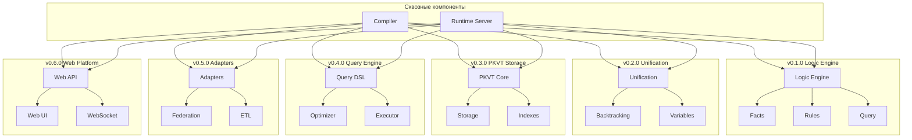

# 🏗️ Архитектура Tipster

> **Подробное описание архитектуры функционально-логической платформы с версионированием компонентов**

---

## 📋 Обзор архитектуры

Tipster построен на **модульной архитектуре** с четким разделением ответственности между компонентами. Каждый блок развивается независимо в соответствии с версионированием, что обеспечивает инкрементальную разработку и масштабируемость.

### 🎯 Архитектурные принципы

1. **Двойная семантика** - каждое выражение одновременно функция и логический факт
2. **EDN-нативность** - единый формат данных для всех компонентов
3. **Модульность** - четкое разделение компонентов с версионированием
4. **Расширяемость** - открытая архитектура для интеграций
5. **Масштабируемость** - от in-memory до распределенных систем

---

## 🔧 Основные архитектурные блоки

| Блок | Версия | Статус | Назначение |
|------|--------|--------|------------|
| **Logic Engine** | v0.1.0 🚧 | В разработке | Унификация, факты, правила |
| **Unification Core** | v0.2.0 🚧 | В разработке | Настоящая унификация и бэктрекинг |
| **PKVT Storage** | v0.3.0 📋 | Планируется | Runtime-СУБД с универсальной моделью |
| **Query Engine** | v0.4.0 📋 | Планируется | SQL-подобные запросы с оптимизацией |
| **External Adapters** | v0.5.0 📋 | Планируется | Интеграция с внешними СУБД |
| **Web Platform** | v0.6.0 📋 | Планируется | API и веб-интерфейс |
| **Compiler** | v0.1.0+ | Сквозной | Парсинг и генерация кода |
| **Runtime Server** | v0.1.0+ | Сквозной | Выполнение и управление |

---

## 🧠 v0.1.0 - Logic Engine (MVP логический движок) 🚧

### 📐 Архитектурные решения

**Временные конструкции:**
- `deffact` - макрос для объявления фактов
- `defrule` - макрос для определения правил  
- `query` - макрос для выполнения запросов

**Хранение данных:**
- In-memory коллекции Clojure
- Простейшая индексация по предикатам
- Ленивые последовательности для результатов

### 🔩 Компоненты v0.1.0

```clojure
;; Структура модулей
src/tipster/
├── core.clj           ; Основные макросы и API
├── facts.clj          ; Управление фактами  
├── rules.clj          ; Логические правила
└── query.clj          ; Система запросов

;; Примеры в корне проекта (организованы по версиям)
examples/
├── v0.1.0/           ; Примеры для текущей версии
│   ├── basic.clj          ; Базовые примеры фактов и запросов
│   ├── family.clj         ; Семейные отношения
│   ├── rules.clj          ; Логические правила
│   ├── animals.clj        ; Классификация животных
│   ├── math.clj           ; Математические примеры
│   └── interactive.clj    ; Интерактивные демо
├── v0.2.0/           ; Примеры унификации и бэктрекинга (планируется)
│   ├── unification.clj     ; Алгоритм Robinson
│   ├── backtracking.clj    ; Примеры с choice points
│   └── variables.clj       ; Логические переменные
├── v0.3.0/           ; Примеры PKVT модели (планируется)
│   ├── decomposition.clj   ; EDN → PKVT декомпозиция
│   ├── queries.clj         ; Паттерн-запросы
│   └── indexing.clj        ; Многомерная индексация
└── ru/               ; Русские версии примеров
    └── README.md
```

#### Модуль Facts (Факты)
```clojure
(ns tipster.facts)

;; Глобальное хранилище фактов
(def ^:dynamic *facts* (atom {}))

;; Добавление факта
(defn add-fact! [predicate & args]
  (swap! *facts* update predicate (fnil conj #{}) args))

;; Поиск фактов
(defn find-facts [predicate]
  (get @*facts* predicate #{}))
```

#### Модуль Rules (Правила)
```clojure
(ns tipster.rules)

;; Реестр правил
(def ^:dynamic *rules* (atom {}))

;; Регистрация правила
(defn register-rule! [name rule-fn]
  (swap! *rules* assoc name rule-fn))

;; Применение правил
(defn apply-rules [goal]
  (mapcat (fn [[name rule]] (rule goal)) @*rules*))
```

### 🔍 Ограничения v0.1.0

- ❌ **Нет настоящей унификации** - простое сопоставление образцов
- ❌ **Нет бэктрекинга** - только прямой поиск
- ❌ **Примитивная индексация** - линейный поиск по фактам
- ❌ **Отсутствие оптимизации** - наивная реализация запросов

---

## 🔧 v0.2.0 - Unification Core (Ядро унификации)

### 🎯 Архитектурные цели

1. **Robinson Unification** - классический алгоритм унификации
2. **Pluggable Search Engine** - подменяемая машина комбинаторного поиска
3. **Variable Bindings** - управление контекстом переменных
4. **Lazy Evaluation** - ленивое вычисление множественных решений
5. **Search Strategy Abstraction** - абстракция стратегий поиска

### 🔩 Компоненты v0.2.0

```clojure
;; Расширенная структура v0.2.0
src/tipster/
├── unification/
│   ├── core.clj       ; Алгоритм Robinson
│   ├── bindings.clj   ; Управление подстановками
│   └── occurs.clj     ; Occur check
├── search/
│   ├── engine.clj     ; Абстрактная машина поиска
│   ├── protocols.clj  ; Протоколы для стратегий поиска
│   ├── strategies/    ; Конкретные стратегии
│   │   ├── backtrack.clj    ; Классический бэктрекинг
│   │   ├── forward.clj      ; Прямой поиск
│   │   ├── bidirectional.clj ; Двунаправленный поиск
│   │   ├── breadth_first.clj ; Поиск в ширину
│   │   └── heuristic.clj    ; Эвристические стратегии
│   ├── combinators/   ; Комбинаторные модели
│   │   ├── choice.clj       ; Точки выбора
│   │   ├── cut.clj          ; Отсечения
│   │   └── iterative.clj    ; Итеративное углубление
│   └── optimization/  ; Оптимизации поиска
│       ├── memoization.clj  ; Мемоизация
│       ├── tabling.clj      ; Табулирование
│       └── constraints.clj  ; Ограничения
└── facts/
    ├── index.clj      ; Индексация фактов
    └── store.clj      ; Хранилище с оптимизацией
```

#### Модуль Unification
```clojure
(ns tipster.unification.core)

;; Основная функция унификации
(defn unify 
  "Унифицирует два терма, возвращает подстановку или nil"
  [term1 term2 bindings]
  (cond
    (= term1 term2) bindings
    (variable? term1) (bind-variable term1 term2 bindings)
    (variable? term2) (bind-variable term2 term1 bindings)
    (and (compound? term1) (compound? term2))
    (unify-compounds term1 term2 bindings)
    :else nil))

;; Применение подстановки
(defn apply-substitution [term bindings]
  (walk/postwalk 
    #(if (variable? %) (get bindings % %) %) 
    term))
```

#### Модуль Search Engine (Поисковая машина)
```clojure
(ns tipster.search.protocols)

;; Протокол стратегии поиска
(defprotocol SearchStrategy
  (search [strategy problem space] "Выполняет поиск решений")
  (expand [strategy node] "Расширяет узел поиска")
  (select [strategy frontier] "Выбирает следующий узел для расширения")
  (terminate? [strategy state] "Проверяет условие завершения"))

;; Протокол комбинаторной модели
(defprotocol CombinatorialModel
  (generate-choices [model context] "Генерирует точки выбора")
  (backtrack [model state] "Выполняет откат")
  (commit [model choice] "Фиксирует выбор")
  (prune [model branches] "Отсекает ветви поиска"))
```

```clojure
(ns tipster.search.engine)

;; Абстрактная поисковая машина
(defrecord SearchEngine [strategy model optimizer])

;; Универсальное решение целей
(defn solve-goal 
  "Универсальный решатель с подменяемой стратегией"
  [engine goal context]
  (let [{:keys [strategy model optimizer]} engine
        problem (build-search-problem goal context)
        space (generate-search-space model problem)]
    (->> (search strategy problem space)
         (optimize optimizer)
         (lazy-seq))))

;; Фабрика поисковых машин
(defn create-engine 
  "Создает поисковую машину с заданной стратегией"
  [strategy-type & options]
  (case strategy-type
    :backtrack (backtrack-engine options)
    :forward (forward-engine options)
    :bidirectional (bidirectional-engine options)
    :breadth-first (breadth-first-engine options)
    :heuristic (heuristic-engine options)))
```

#### Стратегии поиска
```clojure
(ns tipster.search.strategies.backtrack)

;; Классический бэктрекинг
(defrecord BacktrackStrategy [depth-limit cut-enabled?])

(extend-protocol SearchStrategy
  BacktrackStrategy
  (search [strategy problem space]
    (depth-first-search problem space (:depth-limit strategy)))
  (expand [strategy node]
    (generate-alternatives node))
  (select [strategy frontier]
    (peek frontier))  ; LIFO для глубины
  (terminate? [strategy state]
    (or (solution? state) (depth-exceeded? state strategy))))
```

```clojure
(ns tipster.search.strategies.heuristic)

;; Эвристическая стратегия
(defrecord HeuristicStrategy [heuristic-fn beam-width])

(extend-protocol SearchStrategy
  HeuristicStrategy
  (search [strategy problem space]
    (best-first-search problem space (:heuristic-fn strategy)))
  (select [strategy frontier]
    (best-by (:heuristic-fn strategy) frontier))
  (expand [strategy node]
    (take (:beam-width strategy) 
          (sort-by (:heuristic-fn strategy) 
                   (generate-alternatives node)))))
```

#### Комбинаторные модели
```clojure
(ns tipster.search.combinators.choice)

;; Модель точек выбора
(defrecord ChoicePointModel [branching-factor pruning-strategy])

(extend-protocol CombinatorialModel
  ChoicePointModel
  (generate-choices [model context]
    (let [alternatives (find-alternatives context)]
      (take (:branching-factor model) alternatives)))
  (backtrack [model state]
    (restore-previous-choice-point state))
  (commit [model choice]
    (eliminate-alternatives choice))
  (prune [model branches]
    (apply-pruning-strategy (:pruning-strategy model) branches)))
```

```clojure
(ns tipster.search.combinators.iterative)

;; Модель итеративного углубления
(defrecord IterativeDeepening [initial-depth increment max-depth])

(extend-protocol CombinatorialModel
  IterativeDeepening
  (generate-choices [model context]
    (depth-limited-choices context (:current-depth model)))
  (backtrack [model state]
    (if (depth-exhausted? state)
      (increase-depth-limit model)
      (standard-backtrack state))))
```

### 🔧 Конфигурация поисковых машин

```clojure
;; Примеры конфигураций поисковых машин
(def search-engines-config
  {:engines
   {:prolog-style {:strategy :backtrack
                   :model :choice-points
                   :optimizations [:cut :tail-recursion]}
    :constraint-based {:strategy :forward
                       :model :constraint-propagation  
                       :optimizations [:arc-consistency]}
    :heuristic {:strategy :best-first
                :model :beam-search
                :heuristic :goal-distance
                :beam-width 10}
    :parallel {:strategy :breadth-first
               :model :work-stealing
               :workers 4}}})

;; Динамическое переключение стратегий
(defn solve-with-adaptive-strategy [goal context]
  (let [complexity (analyze-complexity goal)
        strategy (select-optimal-strategy complexity)]
    (solve-goal (create-engine strategy) goal context)))

;; Каскадное применение стратегий
(defn solve-with-fallback [goal context]
  (or (timeout-solve (create-engine :heuristic) goal context 1000)
      (timeout-solve (create-engine :backtrack) goal context 5000)  
      (solve-goal (create-engine :breadth-first) goal context)))
```

### 🔬 Универсальность комбинаторных машин

**Ключевая архитектурная идея**: Комбинаторные машины применяются для **единого процесса поиска знаний**:

**НЕТ РАЗДЕЛЕНИЯ** между "логическим выводом" и "запросами к БД" - это **один и тот же процесс**:

1. **Поиск фактов** - поиск по паттерну в PKVT пространстве
2. **Поиск правил** - поиск применимых правил в том же PKVT пространстве  
3. **Поиск функций** - поиск определений функций в том же PKVT пространстве
4. **Поиск данных** - поиск значений в том же PKVT пространстве

**Все хранится в едином PKVT пространстве знаний:**
- Факты: `{:parent "fact-1" :key "employee" :value ["John" 30 "IT" 75000] :type :fact}`
- Правила: `{:parent "rule-1" :key "senior-employee" :value "(and (employee ?n ?a ?d ?s) (> ?a 30))" :type :rule}`
- Функции: `{:parent "fn-1" :key "calculate-bonus" :value "(fn [salary] (* salary 0.1))" :type :function}`
- Данные: `{:parent "data-1" :key "department" :value "IT" :type :data}`

**Комбинаторные машины работают с единым пространством:**
- Выбор стратегии поиска (индексы vs сканирование)
- Выбор порядка применения правил
- Выбор оптимизаций (кэширование, распараллеливание)
- Выбор планов выполнения

### 🔬 Архитектурные преимущества

- **Универсальность**: Одни и те же протоколы для всех видов поиска
- **Модульность**: Полное разделение алгоритмов поиска и комбинаторных моделей
- **Расширяемость**: Простое добавление новых стратегий через протоколы
- **Переиспользование**: Комбинации стратегий и моделей между доменами
- **Тестируемость**: Изолированное тестирование каждого компонента
- **Производительность**: Специализированные оптимизации для каждой стратегии
- **Отказоустойчивость**: Каскадное применение стратегий при сбоях

### 📊 Метрики производительности v0.2.0

- ⚡ **Унификация**: 1000+ операций/сек
- 🔄 **Поисковые стратегии**: адаптивный выбор под задачу
- 📈 **Индексация**: субкубическая сложность поиска
- 💾 **Память**: эффективное управление подстановками
- 🔧 **Расширяемость**: легкое добавление новых алгоритмов

---

## 🗄️ v0.3.0 - PKVT Storage (Runtime-СУБД)

### 🎯 Инновационная идея PKVT

**Parent-Key-Value-Type** модель - универсальное представление любых данных:

- **Parent** - владелец/контейнер (документ, объект, коллекция)
- **Key** - атрибут/индекс (имя поля, позиция в списке)  
- **Value** - значение (примитив, ссылка, вложенная структура)
- **Type** - тип и метаданные (примитив, коллекция, ссылка)

### 🔩 Компоненты v0.3.0

```clojure
;; PKVT архитектура
src/tipster/
├── pkvt/
│   ├── core.clj       ; Базовые операции PKVT
│   ├── decompose.clj  ; EDN → PKVT четверки
│   ├── compose.clj    ; PKVT → EDN структуры
│   └── types.clj      ; Система типов
├── storage/
│   ├── memory.clj     ; In-memory хранилище
│   ├── persist.clj    ; Персистентное хранилище
│   └── cluster.clj    ; Распределенное хранилище
├── indexes/
│   ├── multi.clj      ; Многомерные индексы
│   ├── composite.clj  ; Композитные индексы
│   └── stats.clj      ; Статистика использования
└── query/
    ├── pattern.clj    ; Паттерн-матчинг
    ├── optimize.clj   ; Оптимизация запросов
    └── plan.clj       ; Планы выполнения
```

#### Модуль PKVT Core
```clojure
(ns tipster.pkvt.core)

;; Четверка PKVT
(defrecord Quad [parent key value type])

;; Создание четверки
(defn create-quad 
  "Создает PKVT четверку с автоопределением типа"
  [parent key value]
  (->Quad parent key value (infer-type value)))

;; Декомпозиция EDN в четверки
(defn decompose-edn 
  "Разлагает EDN-структуру на PKVT четверки"
  [edn-obj parent-id]
  (mapcat 
    (fn [[k v]] 
      (if (complex? v)
        (cons (create-quad parent-id k (uuid v))
              (decompose-edn v (uuid v)))
        [(create-quad parent-id k v)]))
    edn-obj))
```

#### Модуль Storage (Универсальная комбинаторная архитектура)
```clojure
(ns tipster.storage.distributed)

;; Распределенное хранилище с подключаемыми поисковыми машинами
(defrecord DistributedStorage [
  cluster-nodes     ; Список узлов кластера
  sharding-strategy ; Стратегия шардирования (consistent-hashing)
  replication-factor ; Фактор репликации (по умолчанию 3)
  parent-indexes    ; Parent → shard-mapping
  global-key-index  ; Глобальный индекс по Key
  bloom-filters     ; Bloom filters для быстрой проверки существования
  quad-store-shards ; Шардированное хранилище четверок
  consistency-level ; Уровень консистентности (eventual/strong)
  search-engine])   ; Подключаемая поисковая машина

;; Универсальный поиск через комбинаторные машины
(defn universal-query-pattern 
  "Поиск по паттерну P-K-V-T с использованием комбинаторных стратегий"
  [storage parent key value type]
  (let [search-problem (build-db-search-problem parent key value type)
        search-space (generate-db-search-space storage search-problem)
        engine (:search-engine storage)]
    (solve-goal engine search-problem search-space)))

;; Адаптивный выбор стратегии поиска в БД
(defn adaptive-db-search
  "Выбирает оптимальную стратегию поиска на основе характеристик запроса"
  [storage query-pattern]
  (let [complexity (analyze-query-complexity query-pattern)
        data-distribution (analyze-data-distribution storage query-pattern)
        optimal-strategy (select-db-search-strategy complexity data-distribution)]
    (create-engine optimal-strategy)))
```

#### Комбинаторные модели для поиска в БД
```clojure
(ns tipster.storage.combinatorial-models)

;; Модель распределенного поиска
(defrecord DistributedSearchModel [shard-strategy parallel-factor])

(extend-protocol CombinatorialModel
  DistributedSearchModel
  (generate-choices [model context]
    (let [target-shards (determine-target-shards context (:shard-strategy model))]
      (partition-search-space target-shards (:parallel-factor model))))
  (backtrack [model state]
    (redistribute-failed-shards state))
  (commit [model choice]
    (consolidate-shard-results choice))
  (prune [model branches]
    (eliminate-empty-shards branches)))

;; Модель индексного поиска
(defrecord IndexSearchModel [index-selection-strategy bloom-filter-threshold])

(extend-protocol CombinatorialModel
  IndexSearchModel
  (generate-choices [model context]
    (let [available-indexes (get-available-indexes context)
          optimal-indexes (select-optimal-indexes (:index-selection-strategy model) 
                                                  available-indexes)]
      (generate-index-scan-choices optimal-indexes)))
  (prune [model branches]
    (apply-bloom-filter-pruning branches (:bloom-filter-threshold model))))

;; Модель кэш-aware поиска
(defrecord CacheAwareSearchModel [cache-levels eviction-strategy])

(extend-protocol CombinatorialModel
  CacheAwareSearchModel
  (generate-choices [model context]
    (let [cache-hits (check-cache-levels context (:cache-levels model))
          cache-misses (identify-cache-misses context cache-hits)]
      (prioritize-cache-hits cache-hits cache-misses)))
  (commit [model choice]
    (update-cache-with-results choice (:eviction-strategy model))))
```

#### Специализированные стратегии поиска в БД
```clojure
(ns tipster.storage.search-strategies)

;; Стратегия параллельного сканирования
(defrecord ParallelScanStrategy [worker-count chunk-size])

(extend-protocol SearchStrategy
  ParallelScanStrategy
  (search [strategy problem space]
    (parallel-scan-execution problem space 
                            (:worker-count strategy) 
                            (:chunk-size strategy)))
  (expand [strategy node]
    (partition-scan-range node (:chunk-size strategy)))
  (select [strategy frontier]
    (select-least-loaded-worker frontier)))

;; Стратегия индексного поиска
(defrecord IndexSeekStrategy [index-preference cost-threshold])

(extend-protocol SearchStrategy
  IndexSeekStrategy
  (search [strategy problem space]
    (index-seek-execution problem space (:index-preference strategy)))
  (expand [strategy node]
    (expand-via-indexes node (:index-preference strategy)))
  (terminate? [strategy state]
    (or (solution-found? state) 
        (exceeds-cost-threshold? state (:cost-threshold strategy)))))

;; Стратегия гибридного поиска (индексы + сканирование)
(defrecord HybridSearchStrategy [index-threshold scan-fallback?])

(extend-protocol SearchStrategy
  HybridSearchStrategy
  (search [strategy problem space]
    (if (should-use-indexes? problem (:index-threshold strategy))
      (index-based-search problem space)
      (when (:scan-fallback? strategy)
        (fallback-to-scan problem space)))))
```

#### Конфигурация поисковых машин для БД
```clojure
(def db-search-engines-config
  {:engines
   {:oltp-workload {:strategy :index-seek
                    :model :cache-aware
                    :optimizations [:bloom-filters :hot-data-cache]}
    :olap-workload {:strategy :parallel-scan  
                    :model :distributed-search
                    :optimizations [:compression :columnar-scan]}
    :mixed-workload {:strategy :hybrid
                     :model :adaptive-caching
                     :fallback-chain [:index-seek :parallel-scan]}
    :real-time {:strategy :memory-first
                :model :cache-aware
                :latency-target "1ms"}}})

;; Автоматический выбор стратегии на основе характеристик запроса
(defn select-db-search-strategy [query-characteristics data-distribution]
  (cond
    (high-selectivity? query-characteristics) :index-seek
    (large-result-set? query-characteristics) :parallel-scan
    (complex-joins? query-characteristics) :hybrid
    (real-time-requirement? query-characteristics) :memory-first
    :else :adaptive))
```

### 🚀 Преимущества PKVT модели

1. **Универсальность** - любые структуры данных без схемы
2. **Гибкость** - динамические изменения структуры
3. **Производительность** - многомерная индексация для миллиардов записей
4. **Совместимость** - реляционные, документные, графовые подходы
5. **Масштабируемость** - горизонтальное разделение по Parent на тысячи узлов
6. **Отказоустойчивость** - репликация и автоматическое восстановление
7. **Линейное масштабирование** - добавление узлов увеличивает производительность

### 🔧 Автоматическая композиция/декомпозиция

**Декомпозиция EDN:**
```clojure
;; Исходная структура
{:документ "Накладная №123"
 :дата "2024-01-15"
 :позиции [{:товар "Молоко" :цена 50}
           {:товар "Хлеб" :цена 30}]}

;; Автоматическая декомпозиция в PKVT
[{:parent "doc-1" :key "документ" :value "Накладная №123" :type :string}
 {:parent "doc-1" :key "дата" :value "2024-01-15" :type :string}
 {:parent "doc-1" :key "позиции" :value "list-1" :type :list-ref}
 {:parent "list-1" :key 0 :value "item-1" :type :map-ref}
 {:parent "list-1" :key 1 :value "item-2" :type :map-ref}
 {:parent "item-1" :key "товар" :value "Молоко" :type :string}
 {:parent "item-1" :key "цена" :value 50 :type :number}
 {:parent "item-2" :key "товар" :value "Хлеб" :type :string}
 {:parent "item-2" :key "цена" :value 30 :type :number}]
```

---

## 📊 v0.4.0 - Query Engine (Движок запросов)

### 🎯 SQL-подобная декларативность

Создание мощной системы запросов с:
- Декларативным EDN-синтаксисом
- Автоматической оптимизацией
- Интеграцией с логическими правилами

### 🔩 Компоненты v0.4.0

```clojure
;; Query Engine архитектура  
src/tipster/
├── query/
│   ├── dsl.clj        ; DSL для запросов
│   ├── parser.clj     ; Парсинг запросов
│   └── validator.clj  ; Валидация запросов
├── optimizer/
│   ├── rules.clj      ; Правила оптимизации
│   ├── cost.clj       ; Оценка стоимости
│   └── plan.clj       ; Планы выполнения
├── execution/
│   ├── engine.clj     ; Движок выполнения
│   ├── joins.clj      ; Обработка соединений
│   └── aggregates.clj ; Агрегации и группировки
└── integration/
    ├── logic.clj      ; Интеграция с логикой
    └── functions.clj  ; Пользовательские функции
```

#### Dual Semantics Engine
```clojure
(ns tipster.query.dual-semantics)

;; Двойная семантика: функции как запросы
(defn customer [id name region])
(defn order [id customer-id total date])

;; Тот же синтаксис для вычислений и запросов
(->> (order ?order-id ?customer-id ?total ?date)
     (filter #(and (> (:total %) 1000)
                   (>= (:date %) "2024-01-01")))
     (map #(customer (:customer-id %) ?name ?region))
     (group-by :region)
     (map (fn [[region orders]]
            [region (reduce + (map :total orders))]))
     (sort-by second >))

;; Композируемые логические правила
(defn large-order [order-id customer-id total date]
  (and (order order-id customer-id total date)
       (> total 1000)))

;; Интеграция правил в запросы
(->> (large-order ?id ?cust-id ?total ?date)
     (map #(customer (:cust-id %) ?name ?region))
     (sort-by :name))
```

#### Query Optimizer
```clojure
(ns tipster.optimizer.rules)

;; Правило оптимизации: проталкивание предикатов
(defn push-down-predicates [query-tree]
  (transform query-tree
    [:where pred [:join & tables]]
    (if (single-table-predicate? pred tables)
      [:join (apply-where (first tables) pred) (rest tables)]
      [:where pred [:join & tables]])))

;; Выбор индексов
(defn select-indexes [query available-indexes]
  (let [predicates (extract-predicates query)
        costs (map #(estimate-cost % predicates) available-indexes)]
    (min-key second (map vector available-indexes costs))))
```

### 📈 Возможности Query Engine

1. **Декларативность** - SQL-подобный синтаксис в EDN
2. **Оптимизация** - автоматический выбор планов выполнения
3. **Композируемость** - интеграция с Clojure функциями
4. **Расширяемость** - пользовательские агрегаты и функции

---

## 🔌 v0.5.0 - External Adapters (Внешние адаптеры)

### 🎯 Универсальная интеграция

Прозрачная работа с любыми внешними СУБД через единый интерфейс:

### 🔩 Компоненты v0.5.0

```clojure
;; Adapters архитектура
src/tipster/
├── adapters/
│   ├── core.clj       ; Базовый адаптер
│   ├── sql/           ; SQL адаптеры
│   │   ├── postgres.clj
│   │   ├── mysql.clj
│   │   └── sqlite.clj
│   ├── nosql/         ; NoSQL адаптеры  
│   │   ├── mongodb.clj
│   │   ├── redis.clj
│   │   └── elastic.clj
│   └── graph/         ; Графовые БД
│       ├── neo4j.clj
│       └── datomic.clj
├── federation/
│   ├── query.clj      ; Федеративные запросы
│   ├── join.clj       ; Cross-database joins
│   └── cache.clj      ; Кеширование
├── mapping/
│   ├── schema.clj     ; Маппинг схем
│   ├── types.clj      ; Преобразование типов
│   └── relations.clj  ; Отношения между БД
└── etl/
    ├── import.clj     ; Импорт данных
    ├── export.clj     ; Экспорт данных
    └── sync.clj       ; Синхронизация
```

#### Universal Adapter Protocol
```clojure
(ns tipster.adapters.core)

;; Протокол адаптера
(defprotocol DatabaseAdapter
  (connect [adapter config] "Подключение к БД")
  (disconnect [adapter] "Отключение от БД") 
  (translate-query [adapter tipster-query] "Трансляция запроса")
  (execute-native [adapter native-query] "Выполнение нативного запроса")
  (map-result [adapter native-result] "Маппинг результата в EDN"))

;; PostgreSQL адаптер
(defrecord PostgresAdapter [connection schema-mapping]
  DatabaseAdapter
  (translate-query [this query]
    (tipster-query->sql query schema-mapping))
  (execute-native [this sql]
    (jdbc/query connection sql))
  (map-result [this rows]
    (map row->edn rows)))
```

#### Federation Engine
```clojure
(ns tipster.federation.query)

;; Федеративный запрос
(defn federated-query 
  "Выполняет запрос по нескольким СУБД"
  [sources query]
  (let [subqueries (partition-query query sources)
        results (pmap #(execute-on-source %) subqueries)]
    (merge-results results query)))

;; Cross-database JOIN
(defn cross-join 
  "Соединяет данные из разных СУБД"
  [left-source left-key right-source right-key]
  (let [left-data (fetch-keyed-data left-source left-key)
        right-data (fetch-keyed-data right-source right-key)]
    (join-on-key left-data right-data left-key right-key)))
```

---

## 🌐 v0.6.0 - Web Platform (Веб-платформа)

### 🎯 Современный веб-интерфейс

Полноценная веб-платформа для работы с базой знаний:

### 🔩 Компоненты v0.6.0

```clojure
;; Web Platform архитектура
src/tipster/
├── web/
│   ├── api/           ; REST API
│   │   ├── routes.clj
│   │   ├── handlers.clj  
│   │   └── middleware.clj
│   ├── websocket/     ; WebSocket поддержка
│   │   ├── handlers.clj
│   │   └── streaming.clj
│   └── graphql/       ; GraphQL API
│       ├── schema.clj
│       └── resolvers.clj
├── ui/                ; Веб-интерфейс (ClojureScript)
│   ├── components/    ; React компоненты
│   │   ├── query_editor.cljs
│   │   ├── results_viewer.cljs
│   │   └── knowledge_browser.cljs
│   ├── pages/         ; Страницы приложения
│   └── state/         ; Управление состоянием
├── security/
│   ├── auth.clj       ; Аутентификация
│   ├── authz.clj      ; Авторизация
│   └── audit.clj      ; Аудит операций
└── monitoring/
    ├── metrics.clj    ; Метрики
    ├── logging.clj    ; Логирование
    └── health.clj     ; Health checks
```

#### REST API
```clojure
(ns tipster.web.api.routes)

(defroutes api-routes
  ;; Управление фактами
  (GET "/api/facts" [] (get-all-facts))
  (POST "/api/facts" [fact] (add-fact! fact))
  (DELETE "/api/facts/:id" [id] (remove-fact! id))
  
  ;; Выполнение запросов
  (POST "/api/query" [query] (execute-query query))
  (GET "/api/query/:id/explain" [id] (explain-query id))
  
  ;; Управление правилами
  (GET "/api/rules" [] (get-all-rules))
  (POST "/api/rules" [rule] (add-rule! rule))
  
  ;; Мониторинг
  (GET "/api/health" [] (health-check))
  (GET "/api/metrics" [] (get-metrics)))
```

#### WebSocket Streaming
```clojure
(ns tipster.web.websocket.streaming)

;; Стриминг больших результатов
(defn stream-query-results 
  "Стримит результаты запроса через WebSocket"
  [query ws-channel batch-size]
  (go-loop [results (execute-query-lazy query)
            batch-num 0]
    (when-let [batch (take batch-size results)]
      (>! ws-channel {:type :data 
                      :batch batch-num
                      :data batch
                      :has-more (seq (drop batch-size results))})
      (recur (drop batch-size results) (inc batch-num)))))
```

---

## 🔄 Сквозные компоненты

### 🎯 Compiler (Компилятор)

**Развивается во всех версиях** - обрабатывает расширяющийся синтаксис:

```clojure
;; Архитектура компилятора
src/tipster/
├── compiler/
│   ├── parser.clj     ; Парсинг исходного кода
│   ├── analyzer.clj   ; Семантический анализ
│   ├── optimizer.clj  ; Оптимизации
│   └── codegen.clj    ; Генерация кода
├── ast/
│   ├── nodes.clj      ; Узлы AST
│   ├── transforms.clj ; Трансформации AST
│   └── validation.clj ; Валидация AST
└── targets/
    ├── jvm.clj        ; JVM байткод
    ├── js.clj         ; JavaScript
    └── native.clj     ; Native код
```

#### Этапы компиляции по версиям:

- **v0.1.0**: Макросы `deffact`, `defrule`, `query`
- **v0.2.0**: Автоматическое распознавание логических конструкций
- **v0.3.0**: Оптимизация для PKVT хранилища
- **v0.4.0**: Интеграция с query optimizer
- **v0.5.0**: Генерация адаптеров для внешних БД
- **v0.6.0**: Компиляция веб-компонентов

### 🎯 Runtime Server (Runtime-сервер)

**Центральный компонент** всех версий - управляет выполнением:

```clojure
;; Runtime Server архитектура
src/tipster/
├── runtime/
│   ├── server.clj     ; Основной сервер
│   ├── scheduler.clj  ; Планировщик задач
│   └── lifecycle.clj  ; Управление жизненным циклом
├── execution/
│   ├── context.clj    ; Контекст выполнения
│   ├── isolation.clj  ; Изоляция между запросами
│   └── resources.clj  ; Управление ресурсами
└── integration/
    ├── repl.clj       ; REPL интеграция
    ├── ide.clj        ; IDE поддержка
    └── external.clj   ; Внешние интеграции
```

---

## 📈 Эволюция архитектуры

### 🔄 Версионная совместимость

| Компонент | v0.1.0 | v0.2.0 | v0.3.0 | v0.4.0 | v0.5.0 | v0.6.0 |
|-----------|--------|--------|--------|--------|--------|--------|
| **Logic Engine** | ✅ Базовый | 🔄 Расширенный | ↗️ Интегрированный | ↗️ | ↗️ | ↗️ |
| **Storage** | In-memory | ↗️ Индексы | ✅ PKVT | ↗️ | ↗️ | ↗️ |
| **Query System** | Простой | ↗️ | ↗️ Паттерны | ✅ SQL-like | ↗️ | ↗️ |
| **External APIs** | - | - | - | - | ✅ Адаптеры | ↗️ |
| **Web Interface** | - | - | - | - | - | ✅ Полный |
| **Compiler** | ✅ Макросы | 🔄 AST | 🔄 Оптимизации | 🔄 | 🔄 | 🔄 |
| **Runtime** | ✅ Базовый | 🔄 Бэктрекинг | 🔄 PKVT | 🔄 Запросы | 🔄 Федерация | 🔄 Веб |

**Легенда:**
- ✅ Новый компонент
- 🔄 Значительные изменения  
- ↗️ Обратно-совместимые расширения

### 🔧 Стратегия миграции

1. **Инкрементальная разработка** - каждая версия расширяет предыдущую
2. **Обратная совместимость** - старый код работает в новых версиях
3. **Четкие API границы** - стабильные интерфейсы между компонентами
4. **Постепенная замена** - временные решения заменяются полноценными

---

## 🎯 Ключевые архитектурные решения

### 💡 Инновационные подходы

1. **PKVT модель** - универсальное представление данных
2. **Двойная семантика** - функции как логические факты
3. **Федеративные запросы** - прозрачная работа с разными СУБД
4. **Версионированная архитектура** - поэтапное развитие компонентов

### ⚖️ Архитектурные компромиссы

| Решение | Преимущество | Компромисс |
|---------|-------------|------------|
| **Кастомный компилятор** | Полный контроль семантики | Сложность разработки |
| **PKVT модель** | Универсальность хранения | Overhead на декомпозицию |
| **Версионирование** | Инкрементальность | Сложность совместимости |
| **EDN-нативность** | Clojure интеграция | Специфичность экосистемы |

---

## 🚀 Масштабирование архитектуры

### 📊 Горизонтальное масштабирование

```clojure
;; Кластерная архитектура (v0.3.0+)
{:cluster {
  :nodes [{:id "node-1" :role [:storage :compute]}
          {:id "node-2" :role [:storage :compute]}  
          {:id "node-3" :role [:query :gateway]}]
  :sharding {:strategy :parent-based
             :replication-factor 2}
  :load-balancer {:type :consistent-hashing}}}
```

### 🔧 Вертикальное масштабирование

1. **Memory optimization** - эффективные структуры данных
2. **CPU optimization** - параллельная обработка запросов
3. **Storage optimization** - компрессия и индексация
4. **Network optimization** - batch операции и кеширование

---

## 🔗 Диаграмма компонентов



---

> **🎯 Результат**: Модульная, версионированная архитектура, обеспечивающая эволюцию от простого логического движка до универсальной интеллектуальной платформы данных.
