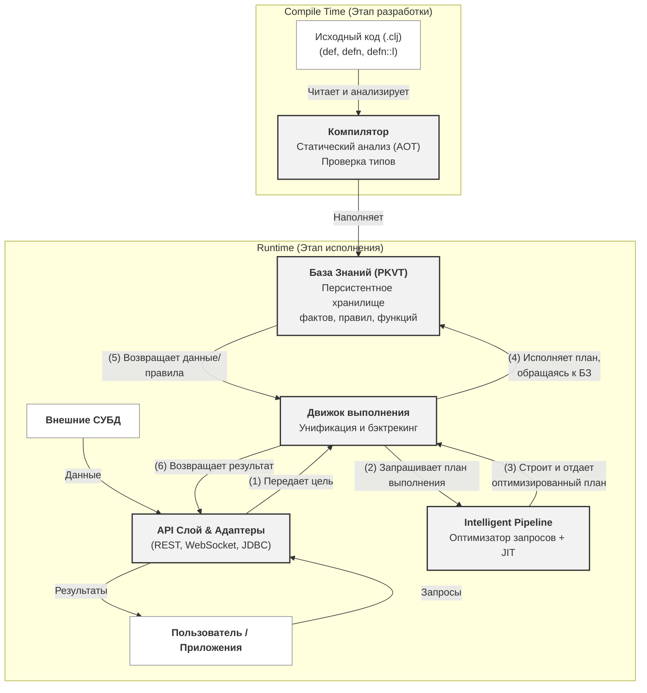

# 🏗️ Архитектура Tipster

## 1. Назначение документа: "Как" и "Почему"

Этот документ описывает **внутреннее устройство** платформы Tipster. Его цель — ответить на вопросы **"Как"** и **"Почему"**:
*   **Как** система спроектирована?
*   Из каких ключевых компонентов она состоит?
*   Как эти компоненты взаимодействуют друг с другом?
*   **Почему** были выбраны именно такие архитектурные решения?

Этот документ следует читать в паре с [Дорожной картой (roadmap.md)](./roadmap.md), которая отвечает на вопросы **"Что"** и **"Когда"** (какие функции и в каком порядке будут реализованы).

---

## 2. Высокоуровневая диаграмма архитектуры

---

## 3. Описание ключевых компонентов

### Компилятор

**Отвечает за:** Преобразование высокоуровневого, декларативного исходного кода Tipster в структурированный, машиночитаемый формат, который используется для хранения и выполнения. Компилятор — это мост между кодом, написанным человеком, и внутренним представлением системы.

*   **Вход:** Файлы исходного кода Clojure (`.clj`), содержащие формы `def`, `defn` и `defn::l`.
*   **Выход:** Набор записей, наполняющих [Базу Знаний (PKVT)](#база-знаний-pkvt).

**Архитектурное решение ("Почему"):** Компилятор не является монолитным блоком. Это компонент, который **эволюционирует** вместе с возможностями платформы, отражая стратегические этапы из дорожной карты. Такой подход позволяет постепенно наращивать сложность и интеллект системы.

1.  **Этап 1 (Foundation) — Транслятор:** На начальном этапе его основная задача — парсить базовый синтаксис (`def`, `defn::l`) и транслировать его в простые структуры данных, понятные для [Движка выполнения](#движок-выполнения).
2.  **Этап 3 (Unification) — Конструктор PKVT:** Компилятор усложняется и учится декомпозировать **любые** определения (код, данные, метаданные) в атомарный формат `Parent-Key-Value-Type`. Это ключевой шаг к унификации кода и данных, позволяющий обращаться к коду как к данным.
3.  **Этап 5 (Intelligence) — Статический анализатор (AOT):** В своей наиболее продвинутой форме компилятор выполняет глубокий статический анализ на этапе загрузки (Ahead-Of-Time). Он проводит проверку типов, частичные вычисления и готовит метаданные для более быстрой оптимизации во время выполнения, передавая эстафету [Intelligent Pipeline](#intelligent-pipeline).

### База Знаний (PKVT)

**Отвечает за:** Универсальное, транзакционное и персистентное хранение **всех** сущностей системы (фактов, правил, функций, метаданных) в едином формате. Это "сердце" системы, где код и данные живут вместе.

*   **Структура:** Все данные хранятся в виде атомарных записей формата `Parent-Key-Value-Type` (PKVT).
    *   `Parent`: Контекст или владелец (например, имя модуля).
    *   `Key`: Имя атрибута или сущности.
    *   `Value`: Значение.
    *   `Type`: Тип сущности (`:fact`, `:rule`, `:function`, etc.).
*   **Интерфейсы:** Предоставляет внутренние API для `Компилятора` (запись) и `Движка выполнения` (чтение).

**Архитектурное решение ("Почему"):**
1.  **Унификация кода и данных:** Представление всего, включая код, в виде данных (записей PKVT) — это фундаментальное решение, которое позволяет выполнять гибридные запросы (например, "найти все функции, использующие таблицу X"). Оно стирает грань между тем, *что* система знает (данные) и *как* она это использует (код).
2.  **Многомерное индексирование:** Структура PKVT естественным образом подходит для создания многомерных индексов (по P, K, V, T и их комбинациям). Это обеспечивает сверхбыстрый поиск по любым аспектам знаний без необходимости проектировать специальные схемы или таблицы.
3.  **Персистентность и транзакционность:** Использование встроенного хранилища (например, RocksDB или LevelDB) с механизмами вроде Write-Ahead Logging (WAL) позволяет обеспечить ACID-гарантии и надежное хранение, превращая Tipster из простой библиотеки в полноценную платформу данных.

### Движок выполнения

**Отвечает за:** Непосредственное исполнение запросов и нахождение всех возможных решений для заданной логической цели. Это "рабочая лошадка" системы, которая реализует классические механизмы логического программирования.

*   **Вход:** Логическая цель (от [API слоя](#api-слой-и-адаптеры)) и, опционально, оптимизированный план выполнения (от [Intelligent Pipeline](#intelligent-pipeline)).
*   **Взаимодействие:** Активно обращается к [Базе Знаний (PKVT)](#база-знаний-pkvt) для получения фактов и правил, необходимых для доказательства цели.
*   **Выход:** Ленивая последовательность решений, где каждое решение — это набор связанных переменных.

**Архитектурное решение ("Почему"):**
1.  **Проверенное ядро:** В основе движка лежат десятилетиями проверенные алгоритмы: унификация Робинсона для сопоставления термов и бэктрекинг (поиск с возвратом) для обхода дерева решений. Это обеспечивает корректность и полноту поиска.
2.  **Ленивые последовательности:** Возврат результатов в виде ленивых (lazy) последовательностей — это идиоматичное для Clojure решение. Оно крайне эффективно по памяти, так как позволяет обрабатывать потенциально бесконечные или очень большие наборы решений, не загружая их все в память сразу.
3.  **Отделение "механики" от "стратегии":** Движок отвечает за *механику* поиска (как унифицировать, как сделать шаг назад). Он намеренно не занимается *стратегией* (в каком порядке перебирать цели). Эту задачу он делегирует [Intelligent Pipeline](#intelligent-pipeline), что позволяет ядру оставаться простым и надежным, в то время как оптимизатор может быть сколь угодно сложным.

### Intelligent Pipeline

**Отвечает за:** Создание оптимальной стратегии (плана) выполнения для сложных запросов. Если Движок выполнения — это "мускулы", то Intelligent Pipeline — это "мозг", который решает, как этими мускулами пользоваться наиболее эффективно.

*   **Вход:** Сложная логическая цель от [Движка выполнения](#движок-выполнения).
*   **Взаимодействие:** Анализирует структуру запроса, а также может обращаться к [Базе Знаний](#база-знаний-pkvt) за метаданными и статистикой (например, о размере таблиц или селективности предикатов).
*   **Выход:** Оптимизированный план выполнения, который передается обратно [Движку выполнения](#движок-выполнения).

**Архитектурное решение ("Почему"):**
Это не монолитный компонент, а конвейер из двух взаимодействующих частей. Такое разделение позволяет сочетать мощь динамического анализа с производительностью скомпилированного кода.

1.  **Оптимизатор запросов (Query Optimizer):** Это динамический (runtime) модуль. Его задача — анализировать запрос *в момент его поступления*. На основе эвристик, статистики и метаданных от компилятора он решает, в каком порядке соединять цели, какую стратегию поиска выбрать, и какие индексы использовать. Это классический подход из мира СУБД (например, Cost-Based Optimization), адаптированный для логического вывода.
2.  **JIT-компиляция (Just-In-Time):** После того как Оптимизатор построил "идеальный" план, JIT-компилятор берет этот план и "на лету" превращает его в высокоэффективный байт-код или даже нативный код для целевой платформы. Это позволяет избежать накладных расходов на интерпретацию плана на каждом шаге выполнения, что критически важно для производительности в циклах и рекурсивных правилах.

### API Слой и Адаптеры

**Отвечает за:** Взаимодействие системы с внешним миром. Этот слой предоставляет стандартизированные интерфейсы для пользователей, приложений и внешних источников данных.

*   **API Слой:** Предоставляет протоколы для удаленного взаимодействия.
    *   **REST API:** Для синхронных запросов и управления базой знаний (CRUD-операции над сущностями).
    *   **WebSocket API:** Для асинхронной, потоковой передачи больших объемов результатов, что идеально подходит для подписки на изменения или обработки ленивых последовательностей в реальном времени.
*   **Адаптеры:** Являются "переводчиками" с языка внешних систем на язык Tipster.
    *   **Входные адаптеры (Input):** Позволяют выполнять федеративные запросы, прозрачно "подключая" внешние СУБД (через JDBC, например) или другие источники данных, представляя их как часть единой Базы Знаний.
    *   **Выходные адаптеры (Output):** Могут использоваться для трансляции изменений в Базе Знаний во внешние системы, например, для отправки уведомлений в Kafka или обновления поискового индекса Elasticsearch.

**Архитектурное решение ("Почему"):**
1.  **Разделение ядра и интеграции:** Вынесение всей логики взаимодействия с внешним миром в отдельный слой позволяет ядру системы (Компилятор, БЗ, Движок) оставаться чистым, агностичным к протоколам и сфокусированным на своей основной задаче.
2.  **Расширяемость:** Архитектура адаптеров позволяет легко добавлять поддержку новых источников данных или протоколов, не затрагивая ядро системы. Можно написать новый адаптер для любой специфической СУБД или API, и он "просто заработает" с остальной системой.
3.  **Гибкость использования:** Наличие как синхронного (REST), так и асинхронного (WebSocket) API позволяет использовать Tipster для широкого спектра задач: от классических "запрос-ответ" сценариев до сложных event-driven архитектур.
