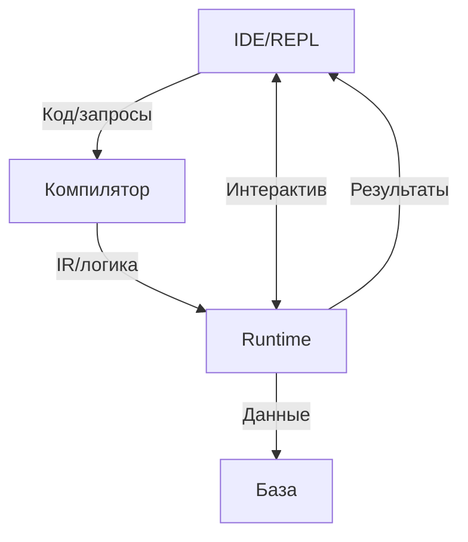

# Общее описание языка `tipster`

## Введение

**Tipster** — это язык и открытая среда программирования, которая родилась из реального инженерного запроса по автоматизации управления разветвлённым пищевым предприятием, объединяющим производство, склады, офисы, автопарк, сеть столовых и магазинов. В условиях, когда бизнес-процессы поддерживались разнородными, несовместимыми программами и базами данных, формирование отчётов и согласованное управление становились крайне трудоёмкими. Выстроить учет и согласовать его с развивающимися технологическими процессами и меняющимися бизнес-правилами было крайне затруднительно. Обновление множества программ требовало усилий по их объединению в систему. Tipster был создан как универсальный открытый инструмент, который снимает концептуальные проблемы автоматизации и позволяет сосредоточиться на сути бизнес-логики и управления знаниями.

**Tipster** совмещающает декларативную мощь логических языков (в духе Пролога) с процедурной и функциональной гибкостью Clojure/EDN. Главная особенность Tipster — **единый синтаксис и двойная семантика выражений**, которая позволяет в едином ключе как обращаться к базе данных так и производить чисто вычислительные действия:

* Любое выражение-предикат (например, `(integer? 42)`) одновременно является и обычным вызовом функции Clojure (с немедленным вычислением значения), и логическим фактом, который может быть включён в базу знаний или использован в логическом выводе.
* Такой подход позволяет строить гибкие и выразительные правила (в том числе бизнес-правила), совмещая логику и функционал без дублирования кода, а также использовать всю стандартную библиотеку Clojure как источник “логических фактов” для Tipster.
* Запросы к базе данных не отличаются от использования функций или предикатов, например `("Приходная накладная" {"Номер" _, "Дата" _, "Сумма" (>= S 200)})`, что позволяет не только скрыть различия между SQL и no-SQL базами данных но и прямые обращения к данным.
* Как следствие появляется возможность вести разработку в духе предметно-ориентированных платформ, где основной фокус удерживается на сути проекта, а не на технических сложностях совмещения различных технологий и инфраструктур.
* Как побочный эффект при построении бизнес-правил на Tipster появляется возможность автоматической генерации документов для сертификации по стандартам серии **ISO 9001:2015**, которые остаются актуальными и широко применяются как основа для систем менеджмента качества в организациях по всему миру.

**В результате**, программирование на Tipster — это всегда баланс между функциональной и логической парадигмами, где каждое выражение может быть и вычислением, и утверждением знания о мире.

Главная идея:

* **Если обработать на Tipster классическую Clojure-программу**, результат будет идентичен выводу стандартного Clojure-компилятора. То есть, Tipster полностью сохраняет и развивает функциональную парадигму — с чистыми функциями, рекурсией, высшими функциями, макросами и всей экосистемой.
* **Если же взять логическую программу (например, код, портированный с Prolog) и обработать её Tipster-компилятором**, то результат будет эквивалентен классическому логическому выводу: на выходе — решение задачи логического программирования с унификацией, бэктрекингом и декларативной формулировкой знаний в виде "фактов + правил".

Таким образом, **Tipster** — это язык с двумя полюсами:

* **Крайность в сторону функционального программирования**: 100% совместим с Clojure, не добавляет новых форм, не навязывает иной семантики.
* **Крайность в сторону логического программирования**: позволяет описывать знания и правила в духе Prolog, но на чистом синтаксисе EDN/Clojure, делая логический вывод и работу с фактами "родной" частью экосистемы Clojure.

На практике программирование на Tipster обычно находится **где-то между этими крайностями**. Вы можете совмещать декларативные логические правила с функциональными абстракциями, добиваясь оптимального баланса выразительности и управляемости — именно в этом проявляется сила и уникальность языка Tipster.

**Tipster — это не просто синтаксическая надстройка или транспайлер, а новый универсальный инструмент, который одинаково естественно поддерживает обе парадигмы**. Его компилятор прозрачно превращает Clojure-код в обычный функциональный байткод, а логические конструкции — в эффективные логические схемы и runtime-запросы, реализуя в едином проекте и функции, и логический вывод, и работу с данными в стиле SQL.

Для того, чтобы понять суть, проведем некоторый экскурс в такие языки как `Prolog`, `Lisp` и `SQL` потому, что типстер обладает свойствами всех перечисленных языков.

### Prolog

**Prolog (Programming in Logic)** — гомоиконный декларативный логический язык программирования, где программа описывается набором **фактов и правил**, а вычисление сводится к **унификации термов** и систематическому **поиску с возвратом** для вывода истинности запросов; применяется прежде всего в задачах логического вывода знаний, экспертных системах и ограниченном программировании.

Пролог, использует логику первого порядка, которая подразумевает конструктивный подход к доказательству, поэтому все программирование на этом языке находится в состоянии постоянного риска натолкнуться на цель, которая достижима только при использовании **индукционного перехода** либо вообще не достижима -- это фундаментальная математическая проблема. Если к этому прибавить технологические ограничения, экономические, организационные и прочие факторы, то Пролог стал уделом узких специалистов, но все же он остаётся лучшим инструментом, когда **исходная модель** уже формулируется в виде **фактов + правил**.
В итоге пролог закрепился в следующих нишах:  
* **CLP / CP-решатели** — ECLiPSe, SICStus, B-Prolog: планирование, расписания, логистика, а также типовые комбинаторные оптимизации (TSP, bin-packing, allocation)   
* **Компиляторы и языковые процессоры** — DCG-парсеры, генераторы кода и трансформации AST (SWI-Prolog, Logtalk)   
* **Статический анализ и формальная верификация** — ProB, специализированные анализаторы UML/CFG, model-checking и property-based-тесты   
* **Встроенные rule-движки** — Drools/BRMS, Amzi Logic Server, логические плагины PostgreSQL, ядро IBM Watson; бизнес-правила и экспертные системы   
* **NLP и семантические знания** — DCG-грамматики, парсеры, SWRL/Datalog reasoning поверх OWL/RDF   
* **Исследования и обучение** — демонстрация теорем, академические курсы логического программирования, экспериментальные DSL.

На мой взгляд очевидно, почему Prolog так и не был коммерциолизирован и, соответственно, остался уделом узких специалистов.

### SQL

**SQL (Structured Query Language)** — декларативный язык запросов, предназначенный для создания, модификации и управления данными в **реляционных базах данных (РБД)**, где пользователь описывает **какие данные** ему нужны, а система управления базами данных (СУБД) самостоятельно определяет **оптимальный способ** их извлечения на основе **плана запроса**; применяется повсеместно для хранения, обработки и анализа структурированных данных.

SQL основан на **реляционной алгебре** и **реляционном исчислении**, что обеспечивает ему строгую математическую базу и позволяет эффективно работать с **данными, представленными в виде таблиц (отношений)**. Его декларативность избавляет разработчика от необходимости описывать низкоуровневые процедуры доступа к данным. Однако, это же может приводить к неоптимальным запросам, если разработчик не до конца понимает **внутренние механизмы работы СУБД** и принципы **оптимизации запросов**. Если к этому добавить различия в диалектах SQL у разных вендоров и сложность работы с нереляционными или слабоструктурированными данными (хотя JSON/XML поддержка расширяется), то эффективное использование SQL требует глубоких знаний. Тем не менее, он остаётся лучшим инструментом, когда **исходная модель данных** естественным образом представляется в виде **таблиц со связями**.

SQL несёт в себе ряд системных ограничений, которые приходится учитывать архитекторам и разработчикам:

* **Трёхзначная логика `NULL`** осложняет эквивалентные преобразования и вызывает «ломкие» предикаты (`NULL ≠ NULL`).
* **Impedance mismatch** между императивным кодом и декларативной моделью (отсутствие циклов, различие типов, нюансы транзакций) порождает целые классы ORM-фреймворков и хранимых процедур.
* **Выход за 1-нормальную форму** (JSON, массивы, графы) приводит к диалектным расширениям и снижению переносимости; стандарт SQL:2023 только частично нивелирует расхождение.
* **Сложные запросы** — рекурсивные CTE, оконные функции, большие `JOIN`-графы — могут иметь экспоненциальную стоимость, а кардинальности не всегда прогнозируемы оптимизатором.

В результате SQL занял устойчивые и разноформатные ниши:

* **OLTP-СУБД** — PostgreSQL, MySQL, Oracle, SQL Server: транзакционные системы, финучёт, CRM/ERP.
* **Колонковые и MPP-хранилища (OLAP/DWH)** — Snowflake, BigQuery, Redshift, ClickHouse: аналитические витрины, отчётность, ad-hoc-запросы.
* **Потоковые движки** — Flink SQL, ksqlDB, Materialize: near-real-time обработка событий, CDC, онлайн-мониторинг.
* **Встроенные решения** — SQLite, DuckDB: мобильные и desktop-приложения, edge-аналитика, локальные эксперименты.
* **BI / self-service-аналитика** — Looker, Superset, Power BI: визуализация, дашборды, интерактивные запросы поверх lakehouse.
* **Data-engineering / ELT** — dbt, Apache Spark SQL, Airbyte: трансформации, очистка данных, оркестрация пайплайнов.
* **Расширенные домены** — PostGIS (GIS-аналитика), TimescaleDB (time-series), PGVector / Milvus (векторный поиск), гибридные графовые расширения (Cypher-, GQL-подмножества).
* **Стандартизация и обучение** — ISO/IEC 9075-:2023, курсы реляционной теории, исследовательские проекты по оптимизации планов и формальной верификации.

На мой взгляд, SQL — редкий пример декларативного языка, который полностью коммерциализирован и стал отраслевым стандартом доступа к данным. Масштабируемость и зрелость экосистемы компенсируют его исторические компромиссы, но требуют дисциплины: чёткой схемы, разумной нормализации, продуманной индексации и строгого разделения слоёв (запрос ↔ приложение). Именно эта инженерная строгость позволяет опираться на SQL как на базовый инструмент организации корпоративных и облачных данных.

### Lisp

**Lisp (List Processing)** — мультипарадигменный (часто функциональный) язык программирования, где программа и данные представляются в виде **списочных структур (S-выражений)**, а вычисление сводится к **редукции выражений** и **применению функций** с активным использованием **рекурсии** и **REPL (Read-Eval-Print Loop)**; применяется прежде всего в задачах **символьных вычислений**, искусственного интеллекта, прототипирования и создания **DSL (предметно-ориентированных языков)**.

Lisp, с его **гомоиконностью** (код как данные) и мощной **макросистемой**, позволяет программисту эффективно расширять язык и создавать **предметно-ориентированные языки (DSL)**, идеально подходящие для конкретной задачи. Эта уникальная мощь позволяет решать сложные проблемы элегантно и с высокой степенью абстракции. Однако, эта же гибкость, высокий порог вхождения для освоения всех возможностей (особенно макросов и функционального стиля), а также исторически сложившаяся репутация "языка для академиков" или "языка со слишком большим количеством скобок" привели к тому, что Lisp, несмотря на свою мощь и влияние (многие его концепции, такие как сборка мусора, условные выражения, REPL, вошли в мейнстрим), остался инструментом для энтузиастов и специалистов в определенных областях. Тем не менее, Lisp остаётся непревзойденным, когда требуется **быстрое прототипирование сложных систем**, **глубокая метапрограммная настройка** или **обработка символьной информации**.

В итоге Lisp (и его диалекты, такие как Common Lisp, Scheme, Clojure, Emacs Lisp) закрепился в следующих нишах:
*   **AI и символьные вычисления** — ACL2 (формальная верификация теорем), Cyc (представление знаний), Maxima/Reduce (системы компьютерной алгебры), ранние экспертные системы.
*   **Создание DSL и расширяемых систем** — Racket (языково-ориентированное программирование), Emacs (текстовый редактор и среда, расширяемая на Emacs Lisp), AutoCAD (AutoLISP для автоматизации проектирования).
*   **Быстрое прототипирование и разработка** — Common Lisp, Scheme, Clojure для создания сложных приложений, где важна гибкость и скорость итераций.
*   **Веб-разработка и серверные приложения (современные диалекты)** — Clojure (высокопроизводительные, конкурентные системы, работа с данными), некоторые фреймворки на Common Lisp (например, Hunchentoot).
*   **Образование и исследования** — Преподавание фундаментальных концепций программирования (SICP на Scheme), исследование новых парадигм и языковых конструкций.
*   **Графика, музыка и искусство** — OpenMusic, PWGL (визуальные языки программирования на базе Common Lisp для алгоритмической композиции), генеративное искусство.
*   **Финансовый анализ и торговые системы** — некоторые компании используют Lisp и его диалекты для разработки проприетарных систем анализа данных и алгоритмической торговли благодаря его выразительности и способности к быстрой адаптации.

На мой взгляд, именно высокий порог вхождения, специфичность задач, где его мощь раскрывается в полной мере, и фрагментация на множество диалектов не позволили Lisp стать таким же мейнстримом, как, например, Java или Python, оставив его уделом энтузиастов и специалистов в своих нишах, ценящих его уникальные возможности.


## Tipster: EDN-диалект функционально-логического программирования на базе Clojure

---

### 1. Факты: основа логических знаний Tipster

В **Tipster** **факт** — это утверждение о данных, записанное как вызов предиката (функции) с аргументами в виде S-выражения:

```clojure
(целое-число 42)        ; утверждение: "42 — это целое число"
(человек "Алиса")       ; утверждение: "Алиса — человек"
(родитель джон мэри)    ; утверждение: "Джон — родитель Мэри"
```

> **Ключевая особенность:**
> Каждое выражение-предикат в Tipster обладает **двойной семантикой**:
>
> * **Функциональной** — вызывается как обычная функция Clojure и возвращает результат вычисления (например, булево значение).
> * **Логической** — трактуется как факт, который может использоваться в логическом выводе или храниться в базе знаний.

**Примитивные значения** (`42`, `"hello"`, `true`, `nil`) сами по себе не являются фактами — это просто данные.
Фактом становится только выражение предиката над этими данными, например `(integer? 42)`.

**Важные принципы:**

* **Стандартные функции-предикаты Clojure** (например, `integer?`, `string?`, `odd?`) можно использовать непосредственно как логические факты. Не требуется создавать их аналоги или альтернативы специально для Tipster.
* Если Clojure-предикат возвращает `true`, это трактуется как истинный факт для текущего значения.
* Для сложных отношений между объектами используйте собственные предикаты, написанные как обычные функции.

**Пример:**

```clojure
;; Примитивное свойство — факт через стандартный предикат
(integer? 42)         ; true, факт "42 — целое число"

;; Пользовательский факт
(человек "Алиса")     ; утверждение: "Алиса — человек"

;; Использование в логических правилах
(defn только-целые [x]
  (when (integer? x)
    ;; ... дальнейшая логика ...
  ))
```

---

* В Tipster факт всегда оформляется как вызов предиката (функции).
* Одно и то же выражение может выступать и как вычисление, и как логическое утверждение.
* Это позволяет использовать всю мощь стандартной библиотеки Clojure для построения логических знаний без дублирования сущностей.

На базе фактов строится вся логическая модель — следующим шагом являются **правила**, которые определяют, как из фактов выводить новые знания.

---

### 2. Правила: построение новых знаний из фактов

**Правило** в Tipster — это функция, которая определяет, как на основе существующих фактов выводить новые утверждения. Если факты — это база знаний, то правила — это “движок вывода”, позволяющий строить сложные логические связи и находить ответы на вопросы.

#### Основная идея

* **Факт** — это утверждение о конкретных данных (например, `(человек "Алиса")`).
* **Правило** — это шаблон/функция, описывающая, каким образом можно получить новые факты, если выполнены определённые условия. В Типстер как и в Прологе для задания правил используются фразы Хорна. Любое правило всегда представимо в виде множества его истинных конкретизаций, которые в Типстер представляются в виде ленивой последовательности.

В синтаксисе Tipster правила записываются как обычные Clojure-функции (`defn`). Внутри функции вы можете:

* Использовать другие факты и правила (через вызовы соответствующих функций или логических запросов),
* Применять стандартные конструкции Clojure (`for`, `when`, `filter`, обертки в структуры данных),
* Описывать, как из набора существующих фактов получается новый вывод.

#### Пример простого правила

```clojure
(defn родитель-старше
  "Определяет пары (родитель, ребёнок), где возраст родителя больше возраста ребёнка."
  [parent child]
  (and
    (родитель parent child)
    (>
      (возраст parent p-age)
      (возраст child c-age))
    [parent child]))
```
В нотации Пролог этот пример может выглядеть так:
```prolog
родитель_старше(Parent, Child) :-
    родитель(Parent, Child),
    возраст(Parent, P_age),
    возраст(Child, C_age),
    P_age > C_age.
```

* Здесь правило ищет все такие пары, где есть факт `(родитель parent child)`, известен возраст обоих, и родитель старше ребёнка.
* Результат — последовательность пар `[parent child]`, соответствующих условию.

#### Двойная семантика и работа с правилами

**Важный момент:**

* Правило в Tipster — всегда функция, которая возвращает последовательность (обычно — ленивую) новых фактов или структур.
* Используя функциональный стиль, вы можете делать всё, что привыкли делать в Clojure: фильтровать, комбинировать, обрабатывать списки.
* Используя логическую семантику, вы строите цепочки вывода, которые позволяют получать ответы на сложные вопросы “по знаниям”.

##### Использование стандартных и пользовательских предикатов

Вы можете свободно комбинировать:

* **Стандартные предикаты Clojure** — для проверки свойств и фильтрации данных (например, `(integer? x)`, `(> a b)`).
* **Пользовательские предикаты и факты** — для расширения логики собственной предметной области.

##### Примеры
**вывод всех совершеннолетних родителей**  

```clojure
(defn совершеннолетний-родитель [x]
  (and
    (родитель x y)
    (возраст x age)
    (>= age 18)))
```
и, соответственно, на Прологе:
```prolog
совершеннолетний_родитель(X) :-
    родитель(X, _Y),
    возраст(X, Age),
    Age >= 18.
```

**структурирование результата**  

```clojure
;; Вариант 1: возврат мапы
(defn совершеннолетний-родитель [x y]
  (and
    (родитель x y)
    (возраст x age)
    (>= age 18)
    (разрешённый x)
    {:родитель x
     :ребёнок y
     :возраст age})) ;; <- итоговая структура вместо просто [x y]

;; Вариант 2: возврат векторов
(defn совершеннолетний-родитель [x y]
  (and
    (родитель x y)
    (возраст x age)
    (>= age 18)
    (разрешённый x)
    [x y age])) ;; кортеж (вектор)
```
Здесь последним выражением в теле and возвращается структура с нужными полями.  
Результат:
последовательность структур вида  
`{:родитель anna :ребёнок ivan :возраст 40}`.  
или последовательность векторов вида `[:анна :иван 40]`

Соответственно, на Прологе:  
```prolog
% Вариант 1: возврат сложного терма
совершеннолетний_родитель(структ(Родитель, Ребёнок, Возраст)) :-
    родитель(Родитель, Ребёнок),
    возраст(Родитель, Возраст),
    Возраст >= 18,
    разрешённый(Родитель).

% Вариант 2: возврат кортежа (списка)
совершеннолетний_родитель([Родитель, Ребёнок, Возраст]) :-
    родитель(Родитель, Ребёнок),
    возраст(Родитель, Возраст),
    Возраст >= 18,
    разрешённый(Родитель).
```
Результат:  
`структ(anna, ivan, 40)`
или `[anna, ivan, 40]`  

* **В Tipster**: достаточно вернуть нужную структуру как последнее выражение в теле правила (map, vector, record и др.).
* **В Прологе**: используется составной терм или список в “голове” правила.

---

#### Сводка

* **Правило** в Tipster — это функция, описывающая, как выводить новые знания из уже существующих фактов и других правил.
* Можно использовать как стандартные Clojure-предикаты, так и пользовательские логические отношения.
* Результаты правил — это новые последовательности (множества) фактов или структур, которые могут быть использованы далее в логических выводах или в других правилах.

---

### 3. Результат логического вывода

* **Тип**: ленивый `seq` EDN-структур (векторов, карт, и других структур).
* **Готовые данные**: все поля конкретны, без «незаполненных» переменных.

---

### 5. Архитектура: компилятор и runtime-сервер

Архитектура Tipster разделена на два ключевых компонента -- компилятор и Runtime-сервер.

#### 5.1. Компилятор Tipster

- **Парсинг**  
  Обрабатывает исходный код на Clojure/EDN, распознаёт определения фактов, правил, пользовательских функций.
- **Анализ и преобразование**  
  Выделяет функциональные и логические конструкции, строит промежуточное представление (AST).
- **Генерация кода**  
  - Для функциональных участков — стандартный байткод Clojure/JVM (или JS/CLR при необходимости).
  - Для логических правил — специальные структуры, пригодные для логического вывода и унификации.
- **Интеграция с экосистемой**  
  - Поддержка REPL/IDE: прямое выполнение кода, "горячая" загрузка новых знаний, быстрая отладка.
  - Подключение внешних библиотек, макросов и расширений.
- **Интерфейсы**  
  - CLI-компилятор, REST/gRPC API, Web-интерфейс для загрузки модулей и управления проектом.

#### 5.2. Runtime-сервер Tipster

- **Хранение фактов и правил**  
  - Внутренняя база знаний (in-memory, опционально — персистентная/распределённая).
  - Индексация для ускорения поиска и унификации.
- **Обработка запросов**
  - Применение правил к базе фактов, реализация унификации, бэктрекинга, ленивого вывода.
  - Оптимизация выполнения: кеширование подвыражений, параллелизм, отслеживание зависимостей.
- **Безопасность и контроль версий**
  - Логирование изменений, контроль целостности, поддержка истории и версионирования знаний.
- **Расширяемость и интеграция**
  - Встраивание сторонних адаптеров (SQL/NoSQL, графовые БД).
  - API для внешних сервисов (вызов логических запросов из Python, Java, Web и др.).
- **Инструменты визуализации и отладки**
  - Трассировка вывода, отображение логических цепочек, объяснения решений для пользователя.

#### 5.3. Потоки данных и взаимодействие компонентов



#### 5.4. Расширяемость
* Плагины и адаптеры: возможно добавление новых источников данных, сторонних БД, поддержка пользовательских расширений.

* SDK и API: создание собственных инструментов на базе Tipster, интеграция с внешними системами.

---

### 6. Сравнение с Прологом

| Характеристика        | Prolog                                                             | Tipster                                                                      |
| --------------------- | ------------------------------------------------------------------ | ---------------------------------------------------------------------------- |
| **Парадигма**         | Декларативное логическое программирование                          | Гибрид: декларативное логическое + функциональное (на базе Clojure/EDN)                    |
| **Синтаксис**         | Специальный для фраз Хорна (факты, правила, префиксные вызовы, infix-операции)    | Полностью Clojure/EDN (S-выражения, пространства имён, вложенные структуры)  |
| **Вызов функций**     | Только через предикаты, процедурные расширения ограничены          | Обычные функции Clojure + любые логические/процедурные вызовы                |
| **Структуры данных**  | Термы, списки, ограниченные возможности вложения                   | EDN: мапы, списки, любые структуры, рекурсивная вложенность                  |
| **Работа с I/O**      | Через специальные предикаты или внешние расширения                 | Через всю стандартную библиотеку Clojure/JVM                                 |
| **Модульность**       | Почти отсутствует, namespace-менеджмент примитивен                 | Пространства имён, полноценная поддержка модулей Clojure                     |
| **Расширяемость**     | Сложно интегрируется с внешними библиотеками и сервисами           | Любые JVM/JS/CLR-библиотеки доступны “из коробки”                            |
| **Интеграция с БД**   | Неоднородная, через плагины или FFI                                | Встроенная поддержка SQL/NoSQL, адаптеры для гибридных БД                    |
| **Отладка, tooling**  | Ограниченные средства, слабая IDE-поддержка                        | Полноценные средства: REPL, IDE, профилировка, трассировка вывода            |
| **Масштабируемость**  | Сложна для крупных систем, монолитная база знаний                  | Архитектурная масштабируемость, поддержка крупных и распределённых проектов  |
| **Порог вхождения**   | Высокий для разработчиков без логического образования              | Низкий для любого clojure/lisp-разработчика, логика по мере необходимости    |
| **Портирование кода** | Требует переписывания, сложная интеграция с современными системами | Прямое портирование кода из Prolog, Clojure, SQL без потери функциональности |

---

**Примечания:**

* *Tipster* позволяет не только реализовать все логические схемы, доступные в Prolog, но и обогатить их функциональным и процедурным кодом, а также органично интегрировать с инфраструктурой современного бизнеса.
* Портирование программ из Prolog зачастую сводится к “переводу” фактов и правил на Clojure-стиль, после чего логическая составляющая seamlessly работает совместно с любыми функциями и модулями проекта.

---

### 7. Преимущества и компромиссы

| Плюсы                                                            | Компромиссы                                              |
| ---------------------------------------------------------------- | -------------------------------------------------------- |
| ✔️ Полная нативность Clojure/EDN — нет новых форм и приставок    | ✖️ Необходим кастомный компилятор и отдельный runtime    |
| ✔️ Встроенный бэктрекинг и унификация, без явного управления     | ✖️ Отладка генерированного кода требует инструментов IDE |
| ✔️ Процедурные расширения: макросы, I/O, функции высшего порядка | ✖️ Может потребоваться соглашения о «чистоте» предикатов |
| ✔️ Ленивый `seq` упрощает интеграцию с экосистемой Clojure       |                                                          |

---

### 8. Пример полного модуля

```clojure
(ns tipster.examples.family
  (:require [tipster.engine :as logic]))

;; 1. Факты (знания о родстве) опционально для оптимизации
(logic/fact! parent)

;; 2. Правило: предок (ancestor)
(defn ancestor
  "Истинно, если x — предок y."
  [x y]
  (or
    (parent x y)             ; x — непосредственный родитель y
    (and (parent x z)        ; x — родитель некоего z
         (ancestor z y)))    ; z — предок y
  z)                         ; формат факта, выведенного из правила

;; 3. Правило: братья/сёстры (siblings)
(defn siblings
  "Истинно, если x и y — братья/сёстры (один общий родитель, x ≠ y)."
  [x y]
  (and
    (and (parent p x)
         (parent p y))
    (not= x y))
    [x y])             ; формат факта, выведенного из правила

;; 4. Логические запросы (REPL-примеры)

;; Кто является предком Боба?
;; (ancestor _ :bob)
;; => (:mary :john)

;; Все пары братьев/сестёр
;; (siblings _ _)
;; => ([:john :mary] [:john :sue] [:mary :john] [:mary :sue] [:sue :john] [:sue :mary])
```

---

### Заключение

Tipster предоставляет **однородный** синтаксис Clojure/EDN для логического программирования, скрывая сложность унификации и бэктрекинга за компилятором и runtime-сервером. Вы получаете декларативную выразительность Пролога и процедурную гибкость Lisp, сохраняя архитектурную целостность и масштабируемость.

---

## Tipster: EDN-диалект для работы с СУБД

**Tipster** — это не только язык логического программирования, но и мощный инструмент интеграции с различными системами управления базами данных (СУБД), как реляционными (SQL), так и нереляционными (NoSQL, графовые, документо-ориентированные). В основе Tipster лежит EDN-диалект, который позволяет описывать и обрабатывать данные в едином формате, снимая барьеры между кодом и хранилищем.

### 1. Единый формат описания данных

В Tipster данные, факты и правила представляются в виде **EDN-структур** (Extensible Data Notation) — стандартного для Clojure и совместимых платформ формата. Это позволяет:

* Унифицировать работу с данными вне зависимости от источника (таблица в SQL, документ в MongoDB, запись в графовой БД и т.д.)
* Описывать сложные вложенные структуры (например, документы с вложенными коллекциями, деревья, графы) в естественном для приложения виде, а не только в терминах таблиц или реляций.
* Сохранять и загружать любые знания и факты как обычные EDN-файлы — удобно для экспорта, миграции и версионирования.

### 2. Декларативный доступ к данным

**Запросы и операции** в Tipster описываются декларативно, в виде вызовов функций-предикатов с аргументами — аналогично SQL- или Datalog-запросам, но с возможностью использовать весь синтаксис и семантику Clojure:

```clojure
(приходная-накладная {"Номер" номер, "Дата" дата, "Сумма" (>= сумма 1000)})
```

Здесь выражение указывает: найти все документы типа "приходная накладная" с номером, датой и суммой не менее 1000 — неважно, где физически хранятся эти данные: в таблице PostgreSQL, коллекции MongoDB или локальном файле.

### 3. Интеграция с внешними СУБД

Tipster выступает как **“прослойка”** между языком бизнес-логики и реальными источниками данных:

* Драйверы и адаптеры позволяют подключать любые SQL/NoSQL базы — Tipster-запросы транслируются в запросы к физической СУБД.
* Для реляционных БД реализуется “тонкий слой отображения”: EDN-структуры сопоставляются с реляционными схемами и обратно.
* Для NoSQL/документо-ориентированных/графовых БД возможна “гибридная” работа: часть логики вычисляется в Tipster, часть “проталкивается” в хранилище.

### 4. Нет "impedance mismatch"

В традиционной архитектуре между программным кодом и СУБД всегда существует “разрыв” (impedance mismatch) — необходимость синхронизировать типы, преобразовывать структуры, писать ORM-слои, поддерживать согласованность между логикой и схемой данных. В Tipster:

* **Нет явного ORM:** любой EDN-объект может быть сохранён, извлечён и обработан без промежуточных слоёв.
* **Логика и запросы объединены:** бизнес-правила, фильтры, расчёты можно реализовывать прямо в языке, не “прыгая” между SQL, Java/Python и схемой БД.
* **Работа с разнородными источниками:** запросы могут объединять данные из нескольких СУБД или файлов, логика Tipster строит результирующее множество на лету.

### 5. Портирование запросов и логики из SQL

Tipster позволяет не только интегрироваться с существующими СУБД, но и **мигрировать бизнес-логику из SQL**:

* Простые запросы SELECT/WHERE → предикаты и правила Tipster.
* JOIN-ы → правила с несколькими условиями (см. выше).
* Агрегации, сортировки, группировки → стандартные функции коллекций Clojure.

Пример — SQL-запрос:

```sql
SELECT name, amount FROM payments WHERE amount >= 1000;
```

В Tipster:

```clojure
(and (платёж {Сумма (>= _ 1000)})
     [Имя Платеж])
```

Запрос к логическому движку Tipster может использовать как собственные in-memory базы, так и внешние СУБД — результат всегда будет в виде EDN-структуры.

### 6. Расширяемость и гибкость

* **Добавление новых источников**: подключение новых СУБД реализуется через адаптеры и декларативные описания маппинга.
* **Работа с “живыми” и “архивными” данными**: Tipster позволяет объединять активные и архивные базы, не теряя целостности логики.
* **История и контроль версий**: знания, факты, структуры запросов можно версионировать, экспортировать и переносить между инстансами/организациями.

### 7. Инструменты для анализа и миграции

* **Визуализация схемы и зависимостей**: на базе EDN и правил строится карта связей между сущностями, легко анализировать структуру даже распределённых данных.
* **Трассировка и аудит**: все запросы и их результаты логируются, можно объяснять любые решения “по цепочке” на уровне фактов и источников.

---

**Вывод:**
*Tipster как EDN-диалект — это универсальный “язык надстройка” для интеграции, анализа и миграции данных между различными СУБД, позволяющий строить однородную, прозрачную и расширяемую архитектуру управления знаниями, при этом не навязывая собственную СУБД и не “разрывая” логику между языком программирования и системами хранения.*

---

## Tipster: runtime-СУБД

Современные логические языки, такие как **Пролог**, реализуют свой собственный “runtime-движок” для хранения, поиска и унификации фактов и правил. Такая **runtime-СУБД** позволяет эффективно находить нужные элементы по сигнатурам (имя/арность/структура), проводить быстрый backtracking и оптимизировать логический вывод.

**Tipster** развивает эту идею и строит собственную высокоэффективную базу знаний, тесно интегрированную с логическим движком. Это не просто “база для хранения” — это ядро всей системы вывода, которая обеспечивает мгновенный доступ к фактам, правилам и результатам вычислений.

### 1. Архитектура Tipster-БД

В основе Tipster-БД лежит **гибкая модель данных** на базе четырёх элементов (PKVT):

* **Parent (owner)** — родительская сущность или владелец (например, документ, объект, коллекция).
* **Key** — ключ или атрибут (например, имя поля, индекс в списке, имя свойства).
* **Value** — значение (может быть примитивом, ссылкой на другой объект или вложенной структурой).
* **Type** — тип значения (примитив, коллекция, структура, ссылка, ссылка на внешний объект и т.д.).

Любое знание, факт или структурированная запись в базе данных Tipster представляется в виде **набора 4-к (parent, key, value, type)**. Это универсальный строительный блок, позволяющий собирать структуры любой сложности (таблицы, документы, графы, деревья, вложенные коллекции и т.д.) без необходимости жёсткой схемы, как в реляционных БД.

### 2. Манипуляция и поиск: “живой” индекс

* При добавлении факта или новой структуры **движок автоматически декомпозирует** всю вложенность на примитивные PKVT-четверки и индексирует их.
* Для поиска движок может в реальном времени **собрать нужную структуру** из связанных четверок, удовлетворяющих заданному паттерну (например, “все накладные с суммой больше 1000 за апрель”).
* Такая модель поддерживает быстрый паттерн-матчинг и унификацию, аналогично тому, как это реализовано в движках Пролога, но без ограничений на глубину вложенности или типы структур.

### 3. Встроенная и внешняя СУБД

**Tipster-БД** может работать в двух режимах:

* **Встроенная (in-memory)** — оптимально для небольших и средних проектов, локальных вычислений, тестирования, интерактивной работы через REPL или встраивания в сторонние приложения. Все данные находятся в оперативной памяти, максимальная скорость доступа и вывода.
* **Внешняя (persistent/distributed)** — для масштабных задач и корпоративных систем база может быть вынесена в отдельный сервер или распределённую систему, что обеспечивает сохранность, масштабируемость, работу с большими объёмами знаний и поддержку версионности.

Переход между режимами прозрачен для пользователя — логика работы с фактами и правилами не меняется.

### 4. Композиция и декомпозиция структур

* **Композиция**: Пользователь может описывать данные в естественной, вложенной форме (EDN-структуры, карты, списки, документы) — движок сам разложит их на минимальные PKVT-элементы и сохранит.
* **Декомпозиция**: При запросе или логическом выводе СУБД Tipster “собирает” итоговую структуру из набора четверок по запросу — то есть восстанавливает оригинальные объекты, структуры, документы, вложенности.

Этот механизм позволяет строить любые схемы хранения, поддерживать гибкие, изменяемые структуры, объединять реляционный, документо- и графо-ориентированный подходы — и всё это под капотом, без необходимости ручного проектирования схемы или написания миграций.

### 5. Оптимизация логического вывода

* Быстрый поиск по ключам, значениям и типам обеспечивает **эффективную работу унификации** — критическую для производительности логических запросов.
* Индексы строятся по наиболее часто используемым паттернам, что позволяет быстро находить подходящие факты даже в больших базах знаний.
* **Версионирование** и история изменений поддерживаются на уровне базовой модели — любые изменения отслеживаются, что важно для бизнес-приложений и анализа.

### 6. Пример использования

**Добавление структуры:**

```clojure
;; Добавляем документ "Приходная накладная"
(приходная-накладная {:номер 123
                      :дата "2024-05-30"
                      :позиции [{:товар "Молоко" :кол-во 20}
                                {:товар "Хлеб" :кол-во 15}]
                      :сумма 5000})
```

*Движок разложит эту структуру на PKVT-четверки, проиндексирует все связи и позволит выполнять быстрые запросы как по номеру, так и по составу позиций или любой вложенной информации.*

**Запрос на выборку:**

```clojure
;; Все накладные с суммой больше 1000, где есть "Молоко"
(приходная-накладная {"Сумма" (>= ?сумма 1000)
                      "позиции" (some #(= (:товар %) "Молоко"))})
```

*Движок соберёт нужные факты из индекса четверок, воссоздаст исходные структуры и вернёт результат в привычном для Clojure виде.*

---

**Вывод:**
*Runtime-СУБД Tipster — это не просто “хранилище фактов”, а высокоадаптивная и масштабируемая база знаний, оптимизированная для логических выводов, сложных структур и интеграции с внешними системами. Благодаря модели PKVT обеспечивается универсальность хранения, гибкость композиции данных и прозрачность логических операций — от индивидуальных задач до распределённых корпоративных систем.*

---
