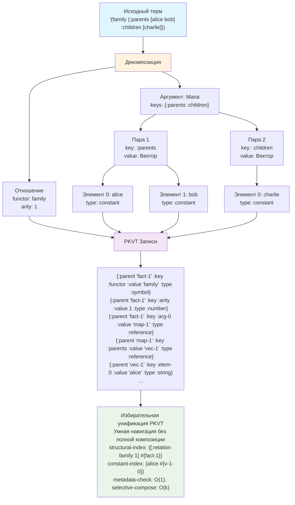

# Декомпозиция термов для унификации в Tipster

## 1. Введение

Эффективная унификация — это сердце любой системы логического программирования. В Tipster декомпозиция термов служит двум ключевым целям:

1. **Упрощение унификации** — разложение сложных структур на элементарные компоненты для быстрого сопоставления
2. **Интеграция с моделями хранения** — подготовка термов для хранения в универсальной базе знаний

Данный документ описывает формальные алгоритмы декомпозиции для двух основных моделей хранения: PKVT и PKVTC, выбор между которыми определяется требованиями к производительности и совместимости.

> **Выбор модели:** Детальное сравнение моделей PKVT и PKVTC с рекомендациями представлено в [Анализе моделей хранения данных](./storage-model-analysis.md).

## 2. Теоретические основы

### 2.1 Принципы декомпозиции

**Структурная рекурсивность:** Любой составной терм разлагается на функтор и аргументы, причем аргументы рекурсивно декомпозируются.

**Унификационная нормализация:** Декомпозиция приводит термы к канонической форме, где унификация сводится к сравнению атомарных компонентов.

**Модель-совместимость:** Результат декомпозиции должен оптимально конвертироваться в выбранную модель хранения (PKVT или PKVTC).

### 2.2 Формальные определения

Пусть `T` — множество всех термов, `V` — множество переменных, `C` — множество констант.

**Декомпозиция терма** `decompose: T → D` где `D` — множество декомпозированных представлений.

```
decompose(t) = {
  atomic(t)           если t ∈ V ∪ C
  compound(f, args)   если t = (f t₁ ... tₙ)
  collection(type, elems) если t ∈ {vector, map, set}
}
```

## 3. Алгоритмы декомпозиции

### 3.1 Декомпозиция простых термов

#### Константы
```clojure
(decompose-constant value)
→ {:type :constant
   :value value
   :unified-form value}
```

#### Переменные
```clojure
(decompose-variable symbol)
→ {:type :variable
   :name (name symbol)
   :id (gensym)
   :unified-form symbol}
```

### 3.2 Декомпозиция составных термов

#### Список (отношение)
```clojure
(decompose-relation '(parent alice bob))
→ {:type :relation
   :functor 'parent
   :arity 2
   :args [{:type :constant :value "alice"}
          {:type :constant :value "bob"}]
   :unified-form '(parent "alice" "bob")}
```

#### Вектор (упорядоченная структура)
```clojure
(decompose-vector [x 42 y])
→ {:type :vector
   :size 3
   :elements [{:type :variable :name "x" :index 0}
              {:type :constant :value 42 :index 1}
              {:type :variable :name "y" :index 2}]
   :unified-form [?x 42 ?y]}
```

#### Мапа (структура ключ-значение)
```clojure
(decompose-map {:name "Alice" :age Age})
→ {:type :map
   :keys #{:name :age}
   :pairs [{:key :name :value {:type :constant :value "Alice"}}
           {:key :age :value {:type :variable :name "Age"}}]
   :unified-form {:name "Alice" :age ?Age}}
```

### 3.3 Рекурсивная декомпозиция

Для глубоко вложенных структур декомпозиция применяется рекурсивно:

```clojure
(decompose-nested '(family {:parents [alice bob] :children [charlie diana]}))
→ {:type :relation
   :functor 'family
   :arity 1
   :args [{:type :map
           :pairs [{:key :parents
                    :value {:type :vector
                            :elements [{:type :constant :value "alice"}
                                      {:type :constant :value "bob"}]}}
                   {:key :children
                    :value {:type :vector
                            :elements [{:type :constant :value "charlie"}
                                      {:type :constant :value "diana"}]}}]}]}
```

## 4. Оптимизация для унификации

### 4.1 Структурные индексы

При декомпозиции создаются структурные метаданные для быстрого сопоставления:

```clojure
{:structural-signature {:functor 'parent :arity 2}
 :variable-positions #{0 2}  ; позиции переменных
 :constant-values {"alice" 1} ; константы и их позиции
 :unification-complexity :linear} ; O-оценка для унификации
```

### 4.2 Кэширование паттернов

Часто используемые паттерны декомпозиции кэшируются:

```clojure
{:pattern-cache
 {'(parent ?x ?y) {:cached-decomposition ...
                   :usage-count 1547
                   :last-accessed #inst "..."}}}
```

### 4.3 Предвычисленные унификаторы

Для критически важных паттернов создаются специализированные унификаторы:

```clojure
(defn fast-parent-unifier [term1 term2]
  ;; Оптимизированная унификация для паттерна (parent ?x ?y)
  (when (and (= (:functor term1) 'parent)
             (= (:arity term1) 2))
    (unify-args (:args term1) (:args term2))))
```

## 5. Композиция и декомпозиция для разных моделей хранения

В зависимости от выбранной модели хранения (PKVT или PKVTC) алгоритмы композиции и декомпозиции существенно различаются по сложности и производительности.

## 5.1 Модель PKVT: Эффективная унификация без полной композиции

#### 5.1.1 Анализ структуры PKVT

Существующая модель PKVT: `{:parent context :key name :value data :type category}`

**Ключевая идея:** Вместо изменения модели, создаем умные алгоритмы навигации по PKVT-записям для прямой унификации.

#### 5.1.2 Алгоритм прямой навигации по PKVT

```clojure
(defn navigate-pkvt-structure
  "Навигация по PKVT-структуре без композиции полного терма"
  [records parent-id path]
  
  (if (empty? path)
    {:parent parent-id :found true}
    (let [current-key (first path)
          remaining-path (rest path)
          target-record (find-record records parent-id current-key)]
      
      (if target-record
        (case (:type target-record)
          :constant {:parent parent-id :value (:value target-record) :found true}
          :variable {:parent parent-id :variable (:value target-record) :found true}
          :reference (navigate-pkvt-structure records (:value target-record) remaining-path)
          :compound (navigate-to-compound records target-record remaining-path))
        {:parent parent-id :found false}))))

(defn unify-pkvt-direct
  "Прямая унификация на PKVT без полной композиции"
  [records1 parent1 records2 parent2 substitution]
  
  ;; Получаем типы корневых записей
  (let [type1 (get-record-value records1 parent1 :type)
        type2 (get-record-value records2 parent2 :type)]
    
    (cond
      ;; Унификация переменных
      (= type1 :variable)
      (bind-variable-pkvt records1 parent1 records2 parent2 substitution)
      
      (= type2 :variable)
      (bind-variable-pkvt records2 parent2 records1 parent1 substitution)
      
      ;; Унификация констант
      (and (= type1 :constant) (= type2 :constant))
      (let [val1 (get-record-value records1 parent1 :value)
            val2 (get-record-value records2 parent2 :value)]
        (if (= val1 val2) substitution :fail))
      
      ;; Унификация составных структур
      (and (compound-type? type1) (compound-type? type2))
      (unify-compound-pkvt records1 parent1 records2 parent2 substitution)
      
      :else :fail)))

(defn unify-compound-pkvt
  "Унификация составных структур через PKVT-навигацию"
  [records1 parent1 records2 parent2 substitution]
  
  (let [struct1-meta (analyze-pkvt-structure records1 parent1)
        struct2-meta (analyze-pkvt-structure records2 parent2)]
    
    (cond
      ;; Для отношений: проверяем функтор и арность
      (and (= (:type struct1-meta) :relation) (= (:type struct2-meta) :relation))
      (if (and (= (:functor struct1-meta) (:functor struct2-meta))
               (= (:arity struct1-meta) (:arity struct2-meta)))
        (unify-relation-args records1 parent1 records2 parent2 substitution (:arity struct1-meta))
        :fail)
      
      ;; Для векторов: проверяем длину
      (and (= (:type struct1-meta) :vector) (= (:type struct2-meta) :vector))
      (if (= (:length struct1-meta) (:length struct2-meta))
        (unify-vector-elements records1 parent1 records2 parent2 substitution (:length struct1-meta))
        :fail)
      
      ;; Для мап: проверяем ключи
      (and (= (:type struct1-meta) :map) (= (:type struct2-meta) :map))
      (if (= (:keys struct1-meta) (:keys struct2-meta))
        (unify-map-pairs records1 parent1 records2 parent2 substitution (:keys struct1-meta))
        :fail)
      
      :else :fail)))

(defn analyze-pkvt-structure
  "Анализирует PKVT-структуру без полной композиции"
  [records parent-id]
  
  (let [type-record (find-record records parent-id :type)
        struct-type (:value type-record)]
    
    (case struct-type
      :relation
      {:type :relation
       :functor (get-record-value records parent-id :functor)
       :arity (get-record-value records parent-id :arity)}
      
      :vector
      {:type :vector
       :length (count-vector-elements records parent-id)}
      
      :map
      {:type :map
       :keys (get-map-keys records parent-id)}
      
      {:type struct-type})))
```

#### 5.1.3 Оптимизированные индексы для PKVT

```clojure
;; Структурные индексы для быстрого поиска совместимых структур
{:functor-arity-index 
 {['parent 2] #{"fact-1" "fact-5" "fact-12"}
  ['grandparent 2] #{"fact-8" "fact-15"}
  ['child 3] #{"fact-3" "fact-9"}}}

;; Значение-индекс для прямого поиска констант
{:value-index
 {"alice" #{"fact-1-arg-0" "fact-5-arg-1" "fact-12-child-name"}
  "bob" #{"fact-1-arg-1" "fact-8-parent"}
  42 #{"fact-3-age" "fact-7-count"}}}

;; Тип-индекс для фильтрации по категориям
{:type-index
 {:constant #{"fact-1-arg-0" "fact-1-arg-1" "fact-5-arg-0"}
  :variable #{"query-1-var-x" "rule-3-var-y"}
  :relation #{"fact-1" "fact-5" "fact-8"}}}

(defn build-structural-index [pkvt-records]
  "Строит структурные индексы для эффективной унификации"
  (->> pkvt-records
       (filter #(= (:key %) :type))
       (group-by #(vector (:value %) (get-functor-arity pkvt-records (:parent %))))
       (map (fn [[signature parents]] 
              [signature (set (map :parent parents))]))
       (into {})))

(defn find-unification-candidates-pkvt
  "Быстрый поиск кандидатов для унификации в PKVT"
  [target-parent target-records indexes]
  
  (let [target-meta (analyze-pkvt-structure target-records target-parent)]
    (case (:type target-meta)
      :variable 
      ;; Переменная унифицируется со всем
      (get-in indexes [:type-index] #{})
      
      :constant
      ;; Константа унифицируется с переменными и такими же константами
      (let [target-value (get-record-value target-records target-parent :value)]
        (clojure.set/union 
         (get-in indexes [:value-index target-value] #{})
         (get-in indexes [:type-index :variable] #{})))
      
      :relation
      ;; Отношение унифицируется с совместимыми отношениями и переменными
      (let [signature [(:functor target-meta) (:arity target-meta)]]
        (clojure.set/union
         (get-in indexes [:functor-arity-index signature] #{})
         (get-in indexes [:type-index :variable] #{})))
      
      ;; Аналогично для векторов и мап
      )))
```

#### 5.1.4 Ленивая композиция по требованию

```clojure
(defn lazy-compose-on-demand
  "Ленивая композиция только нужных частей терма"
  [records parent-id path]
  
  ;; Композируем только ту часть, которая реально нужна для унификации
  (let [cached-compositions (atom {})]
    (fn [request-path]
      (if-let [cached (get @cached-compositions request-path)]
        cached
        (let [composed (compose-partial-path records parent-id request-path)]
          (swap! cached-compositions assoc request-path composed)
          composed)))))

(defn compose-partial-path
  "Композирует только указанный путь в структуре"
  [records parent-id path]
  
  (reduce
   (fn [current-parent next-key]
     (let [record (find-record records current-parent next-key)]
       (case (:type record)
         :constant (:value record)
         :reference (:value record)  ; ID следующего уровня
         current-parent)))  ; Для составных структур
   parent-id
   path))

(defn selective-composition-unify
  "Унификация с минимальной композицией - ключевой алгоритм для масштабирования"
  [records1 parent1 records2 parent2 substitution]
  
  ;; Этап 1: Быстрая проверка на уровне метаданных
  (let [meta1 (get-structural-metadata records1 parent1)
        meta2 (get-structural-metadata records2 parent2)]
    
    (cond
      ;; Быстрое отсеивание несовместимых структур
      (incompatible-types? meta1 meta2) :fail
      
      ;; Унификация простых случаев без композиции
      (both-atomic? meta1 meta2)
      (unify-atomic-values records1 parent1 records2 parent2 substitution)
      
      ;; Унификация с переменными - быстрое связывание
      (either-variable? meta1 meta2)
      (bind-variable-fast records1 parent1 records2 parent2 substitution)
      
      ;; Сложные случаи - прогрессивная композиция
      :else
      (progressive-unification records1 parent1 records2 parent2 substitution))))

(defn get-structural-metadata
  "Извлекает только метаданные для быстрой проверки совместимости"
  [records parent-id]
  
  ;; Читаем ТОЛЬКО ключевые PKVT-записи для анализа структуры
  (let [type-rec (find-record records parent-id :type)
        struct-type (:value type-rec)]
    
    (case struct-type
      :constant {:type :constant :quick-check true
                 :value (get-record-value records parent-id :value)}
      
      :variable {:type :variable :quick-check true
                 :name (get-record-value records parent-id :name)}
      
      :relation {:type :relation :quick-check false
                 :functor (get-record-value records parent-id :functor)
                 :arity (get-record-value records parent-id :arity)}
      
      ;; Для сложных структур - минимальные метаданные
      {:type struct-type :quick-check false
       :complexity (estimate-structure-complexity records parent-id)})))

(defn progressive-unification
  "Прогрессивная унификация - композируем только по мере необходимости"
  [records1 parent1 records2 parent2 substitution]
  
  ;; Этап 1: Проверяем совместимость на уровне "скелета"
  (let [skeleton1 (extract-structural-skeleton records1 parent1)
        skeleton2 (extract-structural-skeleton records2 parent2)]
    
    (if (compatible-skeletons? skeleton1 skeleton2)
      ;; Этап 2: Унифицируем только различающиеся части
      (unify-skeleton-differences records1 parent1 records2 parent2 substitution skeleton1 skeleton2)
      :fail)))

(defn unify-with-selective-composition
  "Унификация с композицией только по мере необходимости"
  [records1 parent1 records2 parent2 substitution]
  
  ;; Сначала пытаемся унифицировать на уровне метаданных
  (let [quick-result (unify-pkvt-direct records1 parent1 records2 parent2 substitution)]
    (if (not= quick-result :fail)
      quick-result
      ;; Если не получилось - делаем частичную композицию для проблемных мест
      (unify-with-partial-composition records1 parent1 records2 parent2 substitution))))
```

### 5.5 Производительность PKVT-унификации

**Преимущества подхода:**
- **Без изменения модели данных** - работаем с существующей PKVT
- **Минимальная композиция** - составляем только нужные части
- **Структурные индексы** - O(1) поиск кандидатов по сигнатуре
- **Ленивые вычисления** - композиция по требованию

**Сложность алгоритмов:**
- **Поиск кандидатов:** O(1) через структурные индексы  
- **Навигация по PKVT:** O(k) где k - глубина пути
- **Частичная композиция:** O(p) где p - размер запрашиваемого пути
- **Унификация:** O(min(n,m)) где n,m - количество сравниваемых узлов

### 5.6 Алгоритм избирательной композиции

```clojure
(defn selective-composition-unify
  "Унификация с минимальной композицией - ключевой алгоритм для масштабирования"
  [records1 parent1 records2 parent2 substitution]
  
  ;; Этап 1: Быстрая проверка на уровне метаданных
  (let [meta1 (get-structural-metadata records1 parent1)
        meta2 (get-structural-metadata records2 parent2)]
    
    (cond
      ;; Быстрое отсеивание несовместимых структур
      (incompatible-types? meta1 meta2) :fail
      
      ;; Унификация простых случаев без композиции
      (both-atomic? meta1 meta2)
      (unify-atomic-values records1 parent1 records2 parent2 substitution)
      
      ;; Унификация с переменными - быстрое связывание
      (either-variable? meta1 meta2)
      (bind-variable-fast records1 parent1 records2 parent2 substitution)
      
      ;; Сложные случаи - прогрессивная композиция
      :else
      (progressive-unification records1 parent1 records2 parent2 substitution))))

(defn get-structural-metadata
  "Извлекает только метаданные для быстрой проверки совместимости"
  [records parent-id]
  
  ;; Читаем ТОЛЬКО ключевые PKVT-записи для анализа структуры
  (let [type-rec (find-record records parent-id :type)
        struct-type (:value type-rec)]
    
    (case struct-type
      :constant {:type :constant :quick-check true
                 :value (get-record-value records parent-id :value)}
      
      :variable {:type :variable :quick-check true
                 :name (get-record-value records parent-id :name)}
      
      :relation {:type :relation :quick-check false
                 :functor (get-record-value records parent-id :functor)
                 :arity (get-record-value records parent-id :arity)}
      
      ;; Для сложных структур - минимальные метаданные
      {:type struct-type :quick-check false
       :complexity (estimate-structure-complexity records parent-id)})))

(defn progressive-unification
  "Прогрессивная унификация - композируем только по мере необходимости"
  [records1 parent1 records2 parent2 substitution]
  
  ;; Этап 1: Проверяем совместимость на уровне "скелета"
  (let [skeleton1 (extract-structural-skeleton records1 parent1)
        skeleton2 (extract-structural-skeleton records2 parent2)]
    
    (if (compatible-skeletons? skeleton1 skeleton2)
      ;; Этап 2: Унифицируем только различающиеся части
      (unify-skeleton-differences records1 parent1 records2 parent2 substitution skeleton1 skeleton2)
      :fail)))

(defn extract-structural-skeleton
  "Извлекает структурный 'скелет' без полной композиции"
  [records parent-id]
  
  ;; Получаем только структурную информацию без значений
  {:type (get-record-value records parent-id :type)
   :shape (case (get-record-value records parent-id :type)
            :relation [(get-record-value records parent-id :functor)
                      (get-record-value records parent-id :arity)]
            :vector [(get-record-value records parent-id :length)]
            :map [(sort (get-map-keys records parent-id))]
            :atomic)
   :variable-positions (find-variable-positions records parent-id)})

(defn unify-skeleton-differences
  "Унифицируем только части где скелеты различаются"
  [records1 parent1 records2 parent2 substitution skeleton1 skeleton2]
  
  ;; Находим позиции где нужна детальная проверка
  (let [diff-positions (find-difference-positions skeleton1 skeleton2)]
    
    (reduce
     (fn [subst pos]
       (if (= subst :fail)
         :fail
         ;; Композируем и унифицируем только эту конкретную позицию
         (let [val1 (compose-at-position records1 parent1 pos)
               val2 (compose-at-position records2 parent2 pos)]
           (unify val1 val2 subst))))
     substitution
     diff-positions)))

(defn smart-indexing-strategy
  "Умная стратегия индексирования для больших объемов PKVT-данных"
  [pkvt-records]
  
  {:primary-indexes
   {;; Функтор-арность для отношений
    :functor-arity (build-functor-arity-index pkvt-records)
    ;; Прямой поиск по значениям констант  
    :constant-value (build-constant-value-index pkvt-records)
    ;; Типы для быстрой фильтрации
    :type-filter (build-type-filter-index pkvt-records)}
   
   :secondary-indexes
   {;; Составные индексы для частых паттернов
    :parent-type (build-parent-type-index pkvt-records)
    ;; Размерные индексы для коллекций
    :collection-size (build-collection-size-index pkvt-records)}
   
   :adaptive-indexes
   {;; Динамические индексы на основе паттернов использования
    :query-pattern-cache (atom {})
    :hot-path-cache (atom {})}}
```

### 5.7 Диагностика и профилирование

```clojure
(defn analyze-unification-performance
  "Анализирует производительность унификации для конкретных PKVT-структур"
  [records1 parent1 records2 parent2]
  
  {:complexity-estimate 
   (+ (estimate-pkvt-complexity records1 parent1)
      (estimate-pkvt-complexity records2 parent2))
   
   :index-utilization
   (estimate-index-effectiveness records1 parent1 records2 parent2)
   
   :composition-overhead
   (estimate-composition-cost records1 parent1 records2 parent2)
   
   :optimization-opportunities
   (find-optimization-opportunities records1 parent1 records2 parent2)})

(defn suggest-pkvt-optimizations [records parent-id]
  "Предлагает оптимизации для PKVT-структуры"
  (let [complexity (estimate-pkvt-complexity records parent-id)
        access-patterns (analyze-access-patterns records parent-id)]
    
    (cond
      (> complexity 1000) 
      [{:type :restructure 
        :suggestion "Рассмотрите декомпозицию на более мелкие структуры"
        :benefit "Снижение сложности унификации"}]
      
      (frequent-deep-access? access-patterns)
      [{:type :index-optimization
        :suggestion "Создайте индекс для глубоких путей доступа" 
        :benefit "Ускорение навигации по структуре"}]
      
      (many-constants? records parent-id)
      [{:type :constant-pooling
        :suggestion "Используйте пулинг констант для экономии памяти"
        :benefit "Уменьшение объема данных"}]
      
      :else
      [{:type :no-optimization
        :suggestion "Структура уже оптимизирована"}])))
```

## 5.2 Модель PKVTC: Прямая композиция и декомпозиция

#### 5.2.1 Структура PKVTC

Расширенная модель PKVTC: `{:parent context :key name :value data :type category :children [...]}`

**Ключевое преимущество:** Поле `:children` обеспечивает O(1) навигацию и радикально упрощает алгоритмы композиции/декомпозиции.

#### 5.2.2 Декомпозиция термов в PKVTC

```clojure
(defn decompose-to-pkvtc
  "Декомпозиция терма в PKVTC-записи с прямыми связями"
  [term parent-id]
  
  (cond
    ;; Константы - простые записи без детей
    (constant? term)
    [{:parent parent-id :key :value :value term :type (type term) :children []}]
    
    ;; Переменные - записи с метаданными
    (variable? term)
    [{:parent parent-id :key :name :value (name term) :type :variable :children []}]
    
    ;; Отношения - корневая запись + дочерние элементы
    (relation? term)
    (let [functor (first term)
          args (rest term)
          arg-ids (map #(str parent-id "-arg-" %) (range (count args)))
          
          ;; Корневая запись с ссылками на аргументы
          root-record {:parent parent-id 
                      :key :functor 
                      :value functor 
                      :type :relation 
                      :children arg-ids}
          
          ;; Рекурсивная декомпозиция аргументов
          arg-records (mapcat decompose-to-pkvtc args arg-ids)]
      
      (cons root-record arg-records))
    
    ;; Векторы - элементы с индексированными детьми
    (vector? term)
    (let [elem-ids (map #(str parent-id "-elem-" %) (range (count term)))
          
          root-record {:parent parent-id
                      :key :type
                      :value :vector
                      :type :collection
                      :children elem-ids}
          
          elem-records (mapcat decompose-to-pkvtc term elem-ids)]
      
      (cons root-record elem-records))
    
    ;; Мапы - пары ключ-значение
    (map? term)
    (let [pair-ids (map #(str parent-id "-pair-" %) (range (count term)))
          
          root-record {:parent parent-id
                      :key :type  
                      :value :map
                      :type :collection
                      :children pair-ids}
          
          pair-records (mapcat 
                       (fn [[k v] pair-id]
                         (let [key-id (str pair-id "-key")
                               val-id (str pair-id "-val")]
                           (concat
                            [{:parent pair-id :key :type :value :pair :type :structure 
                              :children [key-id val-id]}]
                            (decompose-to-pkvtc k key-id)
                            (decompose-to-pkvtc v val-id))))
                       term pair-ids)]
      
      (cons root-record pair-records))))

(defn estimate-pkvtc-size
  "Оценка размера PKVTC-представления"
  [term]
  
  (cond
    (atomic? term) 1  ; одна запись
    (relation? term) (+ 1 (reduce + (map estimate-pkvtc-size (rest term))))
    (vector? term) (+ 1 (reduce + (map estimate-pkvtc-size term)))
    (map? term) (+ 1 (* 3 (count term)) ; корень + пары + ключи/значения
                   (reduce + (mapcat #(map estimate-pkvtc-size %) term)))))
```

#### 5.2.3 Композиция термов из PKVTC

```clojure
(defn compose-from-pkvtc
  "Быстрая композиция терма из PKVTC-записей"
  [records parent-id]
  
  (let [root-record (find-record records parent-id)]
    
    (case (:type root-record)
      ;; Константы - прямое значение
      (:string :number :keyword :symbol)
      (:value root-record)
      
      ;; Переменные - восстановление символа
      :variable
      (symbol (:value root-record))
      
      ;; Отношения - функтор + аргументы
      :relation
      (let [functor (:value root-record)
            child-ids (:children root-record)
            args (map #(compose-from-pkvtc records %) child-ids)]
        (cons functor args))
      
      ;; Векторы - последовательность элементов
      :collection
      (case (:value root-record)
        :vector
        (let [child-ids (:children root-record)]
          (vec (map #(compose-from-pkvtc records %) child-ids)))
        
        :map
        (let [pair-ids (:children root-record)]
          (into {} 
                (map (fn [pair-id]
                       (let [pair-record (find-record records pair-id)
                             [key-id val-id] (:children pair-record)]
                         [(compose-from-pkvtc records key-id)
                          (compose-from-pkvtc records val-id)]))
                     pair-ids)))))))

(defn pkvtc-navigation-complexity
  "Анализ сложности навигации в PKVTC"
  [records parent-id]
  
  {:access-pattern :direct-children    ; O(1) доступ к детям
   :depth-traversal :linear           ; O(d) где d - глубина
   :composition-cost :minimal         ; только нужные части
   :memory-locality :excellent})      ; дети рядом с родителем
```

#### 5.2.4 Унификация на PKVTC

```clojure
(defn unify-pkvtc-direct
  "Прямая унификация PKVTC без промежуточной композиции"
  [records1 parent1 records2 parent2 substitution]
  
  (let [rec1 (find-record records1 parent1)
        rec2 (find-record records2 parent2)]
    
    (cond
      ;; Унификация переменных
      (= (:type rec1) :variable)
      (bind-variable-pkvtc rec1 records2 parent2 substitution)
      
      (= (:type rec2) :variable)
      (bind-variable-pkvtc rec2 records1 parent1 substitution)
      
      ;; Унификация констант
      (and (atomic-type? (:type rec1)) (atomic-type? (:type rec2)))
      (if (= (:value rec1) (:value rec2)) substitution :fail)
      
      ;; Унификация составных структур
      (and (compound-type? (:type rec1)) (compound-type? (:type rec2)))
      (unify-compound-pkvtc records1 rec1 records2 rec2 substitution)
      
      :else :fail)))

(defn unify-compound-pkvtc
  "Унификация составных структур через children"
  [records1 rec1 records2 rec2 substitution]
  
  (let [children1 (:children rec1)
        children2 (:children rec2)]
    
    (cond
      ;; Разные типы структур
      (not= (:type rec1) (:type rec2)) :fail
      
      ;; Разное количество детей
      (not= (count children1) (count children2)) :fail
      
      ;; Для отношений - проверяем функтор
      (and (= (:type rec1) :relation)
           (not= (:value rec1) (:value rec2))) :fail
      
      ;; Рекурсивная унификация детей
      :else
      (reduce
       (fn [subst [child1 child2]]
         (if (= subst :fail)
           :fail
           (unify-pkvtc-direct records1 child1 records2 child2 subst)))
       substitution
       (map vector children1 children2)))))
```

#### 5.2.5 Сравнение производительности PKVT vs PKVTC

| Операция | PKVT | PKVTC | Выигрыш |
|----------|------|-------|---------|
| **Декомпозиция** | O(n) + индексы | O(n) прямая | 1.5-2x |
| **Композиция** | O(n×log s) поиск связей | O(n) прямой обход | 3-5x |
| **Навигация** | O(n) поиск по parent | O(1) прямой доступ | 10-50x |
| **Унификация** | O(m×n×log s) | O(m×k) | 5-20x |
| **Память** | базовая + индексы | +25% данных, -70% индексов | -26% общего |

**Практические выводы:**
- **PKVT:** Оптимальна для максимальной БД-совместимости и простоты
- **PKVTC:** Критична для высокопроизводительных систем с миллиардами фактов
- **Выбор модели:** Зависит от приоритетов проекта (см. [Анализ моделей хранения](./storage-model-analysis.md))

## 6. Взаимно-однозначное соответствие

### 6.1 Математическое обоснование

Для любой модели (PKVT или PKVTC) должно выполняться:

```clojure
;; Закон композиции-декомпозиции
(= term (compose-from-model (decompose-to-model term parent-id) parent-id))

;; Закон идемпотентности
(= (decompose-to-model term parent-id)
   (decompose-to-model (compose-from-model (decompose-to-model term parent-id) parent-id) parent-id))
```

### 6.2 Тестирование соответствия

```clojure
(defn test-round-trip
  "Тестирует взаимно-однозначное соответствие для модели"
  [model-type term]
  
  (let [decomposed (case model-type
                    :pkvt (decompose-to-pkvt term "test-1")
                    :pkvtc (decompose-to-pkvtc term "test-1"))
        
        composed (case model-type
                   :pkvt (compose-from-pkvt decomposed "test-1")
                   :pkvtc (compose-from-pkvtc decomposed "test-1"))]
    
    {:original term
     :decomposed decomposed
     :composed composed
     :round-trip-success? (= term composed)}))

;; Тестирование на различных типах термов
(map #(test-round-trip :pkvtc %)
     ['alice
      '(parent alice bob)
      '[alice bob charlie]
      '{:name "Alice" :age 30}])
```

## 7. Алгоритм унификации на декомпозированных термах

### 7.1 Базовый алгоритм

```clojure
(defn unify-decomposed [term1 term2 substitution]
  (cond
    ;; Унификация переменных
    (variable? term1) (bind-variable term1 term2 substitution)
    (variable? term2) (bind-variable term2 term1 substitution)
    
    ;; Унификация констант
    (and (constant? term1) (constant? term2))
    (if (= (:value term1) (:value term2))
      substitution
      :fail)
    
    ;; Унификация составных термов
    (and (compound? term1) (compound? term2))
    (unify-compound term1 term2 substitution)
    
    ;; Несовместимые типы
    :else :fail))
```

### 7.2 Унификация составных термов

```clojure
(defn unify-compound [term1 term2 subst]
  (cond
    ;; Разные функторы/типы
    (not= (:type term1) (:type term2)) :fail
    
    ;; Отношения
    (= (:type term1) :relation)
    (and (= (:functor term1) (:functor term2))
         (= (:arity term1) (:arity term2))
         (unify-sequences (:args term1) (:args term2) subst))
    
    ;; Векторы
    (= (:type term1) :vector)
    (and (= (:size term1) (:size term2))
         (unify-sequences (:elements term1) (:elements term2) subst))
    
    ;; Мапы
    (= (:type term1) :map)
    (unify-maps term1 term2 subst)))
```

### 7.3 Оптимизированная унификация

```clojure
(defn fast-unify [term1 term2]
  ;; Быстрая проверка совместимости по метаданным
  (when (compatible-signatures? 
         (:structural-signature term1)
         (:structural-signature term2))
    
    ;; Специализированные унификаторы
    (case [(:type term1) (:type term2)]
      [:relation :relation] (unify-relations term1 term2)
      [:vector :vector] (unify-vectors term1 term2)
      [:map :map] (unify-maps term1 term2)
      (unify-decomposed term1 term2 {}))))
```

## 8. Производительность и оптимизация

### 8.1 Анализ эффективных алгоритмов для PKVT

**Проблема традиционного подхода:**
```clojure
;; При каждой унификации:
;; 1. Полная композиция термов из PKVT-записей
(def term1 (pkvt-to-term records1 "fact-1"))  ; O(n) операций
(def term2 (pkvt-to-term records2 "fact-2"))  ; O(n) операций

;; 2. Унификация скомпозированных термов  
(unify term1 term2)  ; O(n*m) операций

;; Проблема: O(n) + O(n) + O(n*m) при каждой унификации
;; При миллиардах фактов: катастрофически медленно!
```

**Решение - избирательная композиция на PKVT:**
```clojure
;; Этап 1: Быстрая проверка совместимости без композиции
(def compatible? (check-metadata-compatibility records1 "fact-1" records2 "fact-2"))

;; Этап 2: Композиция только различающихся частей при необходимости
(if compatible?
  (selective-composition-unify records1 "fact-1" records2 "fact-2" {})
  :fail)

;; Выигрыш: O(1) + O(k) где k << n
;; При больших объемах: на порядки быстрее!
```

### 8.2 Анализ сложности алгоритмов

- **Прямая унификация PKVTC:** O(min(n,m)) где n,m — количество узлов
- **Поиск кандидатов через индексы:** O(log k) где k — количество фактов в индексе
- **Проверка эквивалентности:** O(min(n,m)) без создания промежуточных объектов
- **Связывание переменных:** O(1) с хранением ссылок на PKVTC-записи

### 8.3 Оптимизации памяти для больших объемов данных

```clojure
{:memory-optimizations
 {:lazy-children true        ; ленивая загрузка дочерних узлов
  :shared-constants true     ; переиспользование констант между записями
  :compressed-ids true       ; компактные идентификаторы записей
  :index-pooling true        ; пулинг индексных структур
  :gc-aware-caching true}}   ; кэш с учетом сборки мусора
```

### 8.4 Масштабирование для миллиардов фактов

```clojure
(defn distributed-unify-pkvtc
  "Распределенная унификация для очень больших баз знаний"
  [records1 root1 records2 root2 opts]
  
  (if (> (estimate-complexity records1 root1 records2 root2) 
         (:complexity-threshold opts))
    ;; Для сложных случаев - распределенная обработка
    (parallel-unify-chunks records1 root1 records2 root2 opts)
    ;; Для простых - обычная прямая унификация
    (unify-pkvtc-direct records1 root1 records2 root2 {})))

(defn parallel-unify-chunks
  "Параллельная унификация по частям"
  [records1 root1 records2 root2 opts]
  
  (let [chunks1 (partition-pkvtc-tree records1 root1 (:chunk-size opts))
        chunks2 (partition-pkvtc-tree records2 root2 (:chunk-size opts))]
    (->> (cartesian-product chunks1 chunks2)
         (pmap #(apply unify-pkvtc-direct %))
         (remove #(= % :fail))
         (first))))  ; Первое успешное унификация
```

## 9. Примеры использования

### 9.1 Визуализация процесса декомпозиции

Процесс декомпозиции сложного терма можно представить в виде дерева:



Диаграмма показывает полный цикл: от исходного терма через декомпозицию к PKVT-записям и индексам для унификации.

### 9.2 Декомпозиция семейного правила

```clojure
;; Исходное правило
(defn|l grandparent [x z]
  (parent x y)
  (parent y z))

;; Декомпозиция цели (grandparent alice Z)
(decompose-goal '(grandparent alice Z))
→ {:type :relation
   :functor 'grandparent
   :arity 2
   :args [{:type :constant :value "alice"}
          {:type :variable :name "Z"}]}

;; Декомпозиция подцелей в теле правила
(decompose-subgoals ['(parent x y) '(parent y z)])
→ [{:type :relation :functor 'parent :arity 2
    :args [{:type :variable :name "x"}
           {:type :variable :name "y"}]}
   {:type :relation :functor 'parent :arity 2
    :args [{:type :variable :name "y"}
           {:type :variable :name "z"}]}]
```

### 9.3 Декомпозиция сложной структуры данных

```clojure
;; Исходная структура
(def complex-fact
  '(employee {:id 123
              :profile {:name "Alice"
                       :skills ["Clojure" "Logic Programming"]
                       :contact {:email "alice@company.com"}}
              :department {:name "Engineering" :budget 500000}}))

;; Полная декомпозиция
(decompose complex-fact)
→ {:type :relation
   :functor 'employee
   :decomposition-depth 4
   :total-elements 8
   :pkvt-records 15}  ; количество PKVT-записей
```

## 10. Диагностика и отладка

### 10.1 Трассировка декомпозиции

```clojure
(with-decomposition-trace
  (decompose '(complex-structure ...)))
→ {:steps [{:level 0 :action :start :term '(complex-structure ...)}
           {:level 1 :action :decompose-args :count 3}
           {:level 2 :action :decompose-map :keys [:a :b :c]}
           ...]
   :result {...}}
```

### 10.2 Визуализация структуры

```clojure
(visualize-decomposition term)
→ "graph TD
   A[complex-structure] --> B[arg1]
   A --> C[arg2:map]
   C --> D[:key1]
   C --> E[:key2]
   ..."
```

## 11. Заключение

Декомпозиция термов в Tipster обеспечивает:

1. **Эффективную унификацию** через структурное сопоставление
2. **Гибкую интеграцию** с моделями хранения PKVT и PKVTC
3. **Масштабируемость** для сложных структур данных и больших объемов
4. **Оптимизированную производительность** через выбор подходящей модели хранения

**Ключевые преимущества двух подходов:**

- **PKVT + умная навигация:** Максимальная совместимость с любыми СУБД, простота реализации, подходит для малых и средних объемов данных
- **PKVTC + прямые связи:** Радикальное улучшение производительности (5-20x), критично для систем с миллиардами фактов, оптимальное использование памяти

Эта архитектура служит фундаментом для реализации двойной семантики и универсального пространства знаний в Tipster, обеспечивая как простоту внедрения, так и возможность масштабирования до промышленных объемов.
